# MultiModal Insight Engine - System Architecture

**Version:** 2.0
**Last Updated:** November 2025
**Status:** Production

---

## Executive Summary

The **MultiModal Insight Engine** is a comprehensive framework for developing, training, and evaluating AI systems with integrated Constitutional AI safety mechanisms and multimodal capabilities. The system combines transformer-based language models with vision transformers, enabling cross-modal learning while maintaining strict safety guardrails through Constitutional AI principles.

**Core Innovation:** This framework uniquely integrates Constitutional AI at the architecture level, making safety evaluation a first-class concern rather than an afterthought. The system implements the complete RLAIF (Reinforcement Learning from AI Feedback) pipeline alongside multimodal transformer architectures.

**Primary Use Cases:**
- Constitutional AI research and development
- Multimodal model training (vision + language)
- Safety-critical AI systems
- Educational demonstrations of modern AI techniques

---

## Table of Contents

1. [System Overview](#system-overview)
2. [Core Components](#core-components)
3. [Architecture Diagrams](#architecture-diagrams)
4. [Design Decisions](#design-decisions)
5. [Technology Stack](#technology-stack)
6. [Integration Points](#integration-points)
7. [Data Flow](#data-flow)
8. [Deployment Considerations](#deployment-considerations)

---

## System Overview

### What the System Does

The MultiModal Insight Engine provides:

1. **Constitutional AI Framework**: Principle-based safety evaluation and training
2. **Multimodal Learning**: Vision-language representation alignment
3. **Complete Training Pipeline**: From data loading to model deployment
4. **Interactive Demonstrations**: Web-based UI for exploring capabilities
5. **Comprehensive Testing**: TDD-driven development with 87.5% test coverage

### Key Capabilities

**Constitutional AI:**
- AI-based evaluation using language models (superior to regex heuristics)
- Four core principles: Harm Prevention, Truthfulness, Fairness, Autonomy Respect
- Full RLAIF pipeline: Critique-Revision → Preference Learning → PPO Optimization
- Backward-compatible API supporting both AI and fallback evaluation

**Multimodal Processing:**
- Vision Transformer (ViT) for image encoding
- Text Transformer for language understanding
- Cross-modal attention mechanisms for alignment
- VICReg contrastive learning for representation quality

**Training Infrastructure:**
- Multi-stage training strategies (isolated → cross-modal → end-to-end)
- PPO trainer for reinforcement learning
- Reward model training from AI preferences
- Checkpoint management and experiment tracking

**Safety & Evaluation:**
- Red teaming framework for adversarial testing
- Prompt injection detection and mitigation
- Safety filters with configurable thresholds
- Comprehensive evaluation metrics

---

## Core Components

### 1. Constitutional AI Framework

**Location:** `/src/safety/constitutional/`

The Constitutional AI framework implements Anthropic's methodology for training helpful, harmless, and honest AI systems.

#### Key Classes

**`ConstitutionalFramework`** (`framework.py`)
- Manages collection of constitutional principles
- Orchestrates evaluation across multiple principles
- Supports AI-based and regex-based evaluation
- Provides weighted scoring and aggregation

**`ConstitutionalPrinciple`** (`framework.py`)
- Encapsulates single safety principle
- Evaluation function (AI or regex-based)
- Weight and enabled/disabled state
- Backward-compatible API design

**`ConstitutionalPipeline`** (`pipeline.py`)
- End-to-end training orchestration
- Phase 1: Critique-Revision supervised learning
- Phase 2: RLAIF with reward model and PPO
- Checkpoint management between phases

#### RLAIF Components

**Critique-Revision Pipeline** (`critique_revision.py`)
- Generates constitutional critiques of model outputs
- Creates improved revisions addressing violations
- Supervised fine-tuning on critique-revised data
- Dataset preparation for Phase 1

**Preference Comparison** (`preference_comparison.py`)
- Generates preference pairs from model outputs
- Evaluates pairs using constitutional principles
- Creates training data for reward model
- Implements preference ranking logic

**Reward Model** (`reward_model.py`)
- Bradley-Terry model for preference learning
- Scores outputs based on constitutional alignment
- Trained on AI-generated preference data
- Provides feedback signal for PPO

**PPO Trainer** (`ppo_trainer.py`)
- Proximal Policy Optimization implementation
- Clipped surrogate objective for stable updates
- Generalized Advantage Estimation (GAE)
- KL divergence penalty from reference policy

#### Constitutional Principles

**Four Core Principles** (`principles.py`)

1. **Harm Prevention**
   - Detects harmful, dangerous, or illegal content
   - Physical harm, psychological harm, dangerous advice
   - AI evaluation using language model reasoning

2. **Truthfulness**
   - Identifies false or misleading claims
   - Verifiable accuracy assessment
   - Hallucination detection

3. **Fairness (Anti-Stereotyping)**
   - Detects biased or stereotypical content
   - Gender, race, nationality, age bias
   - Contextual understanding of harmful generalizations

4. **Autonomy Respect**
   - Identifies manipulative or coercive language
   - Commands, pressure tactics, false dichotomies
   - Respects user agency and choice

### 2. Multimodal Transformers

**Location:** `/src/models/multimodal/`

Implements vision-language models with cross-attention mechanisms.

#### VICReg Multimodal Model

**`VICRegMultimodalModel`** (`vicreg_multimodal_model.py`)
- Variance-Invariance-Covariance regularization
- Vision and text encoder integration
- Projection heads for shared embedding space
- Contrastive learning objective

**Key Features:**
- Prevents representation collapse (variance term)
- Invariance to augmentations (MSE loss)
- Decorrelates feature dimensions (covariance term)
- Temperature-scaled similarity scoring

#### Cross-Modal Attention

**Attention Mechanisms** (multiple implementations)
- `BidirectionalCrossAttention`: Symmetric vision↔text attention
- `GatedCrossModalAttention`: Adaptive gating for modality fusion
- `CoAttentionFusion`: Parallel co-attention with fusion

**Design Pattern:**
```python
# Cross-modal attention flow
vision_features = vision_encoder(images)
text_features = text_encoder(text)

# Bidirectional attention
vision_attended = cross_attn(vision_features, text_features)  # V attends to T
text_attended = cross_attn(text_features, vision_features)    # T attends to V

# Fusion
fused = fusion_layer([vision_attended, text_attended])
```

### 3. Training Infrastructure

**Location:** `/src/training/`

Comprehensive training pipeline with multiple strategies and optimization techniques.

#### Multi-Stage Training

**`MultiStageTraining`** (`flickr_multistage_training.py`)

Three-stage approach for robust multimodal learning:

1. **Stage 1: Single Modality Pre-training**
   - Train vision and text encoders independently
   - Learn modality-specific representations
   - VICReg loss for contrastive learning

2. **Stage 2: Cross-Modal Alignment**
   - Freeze encoders, train projection heads
   - Align vision and text representations
   - Cross-modal contrastive loss

3. **Stage 3: End-to-End Fine-tuning**
   - Unfreeze all parameters
   - Joint optimization across modalities
   - Task-specific fine-tuning

**Training Strategies** (`/src/training/strategies/`)
- `SingleModalityStrategy`: Isolated encoder training
- `CrossModalStrategy`: Cross-modal alignment
- `EndToEndStrategy`: Joint optimization

#### Constitutional Trainer

**`ConstitutionalTrainer`** (`trainers/constitutional_trainer.py`)
- Integrates Constitutional AI into training loop
- Real-time safety evaluation during training
- Gradient updates guided by constitutional principles
- Metrics tracking for safety alignment

#### Optimizers & Schedulers

**Advanced Optimization** (`optimizers.py`)
- AdamW with weight decay
- Learning rate warmup and decay
- Gradient clipping for stability
- Mixed precision training support

### 4. Demo Interface (Gradio UI)

**Location:** `/demo/`

Interactive web-based demonstration of Constitutional AI capabilities.

#### Architecture

```
demo/
├── main.py                    # Gradio app entry point
├── managers/                  # Business logic layer
│   ├── model_manager.py       # Model loading/caching
│   ├── evaluation_manager.py  # Evaluation orchestration
│   ├── training_manager.py    # Training orchestration
│   ├── comparison_engine.py   # Before/after analysis
│   └── generation_manager.py  # Text generation
├── ui/                        # UI components
│   └── tabs/                  # Five main tabs
└── data/                      # Test suites
```

#### Five Interactive Tabs

1. **Evaluation Tab**: Single text principle evaluation (AI vs regex comparison)
2. **Generation Tab**: Before/after training comparison with adversarial prompts
3. **Training Tab**: Run Constitutional AI training with live metrics
4. **Impact Tab**: Quantitative analysis of training improvements
5. **Architecture Tab**: System overview and code examples

**Key Features:**
- Real model support (GPT-2, DistilGPT-2)
- Mock mode for fast development
- Live training metrics visualization
- Export trained models and results
- Comprehensive test suite integration

See [DEMO_ARCHITECTURE.md](DEMO_ARCHITECTURE.md) for detailed specifications.

---

## Architecture Diagrams

### High-Level System Architecture


### Constitutional AI Pipeline Flow


### Multimodal Data Flow

```mermaid
graph TB
    subgraph "Input"
        IMG[Images]
        TXT[Text Captions]
    end

    subgraph "Encoding"
        VENC[Vision Encoder<br/>ViT/ResNet]
        TENC[Text Encoder<br/>Transformer]
        IMG --> VENC
        TXT --> TENC
    end

    subgraph "Cross-Modal Fusion"
        VENC --> VPROJ[Vision Projection]
        TENC --> TPROJ[Text Projection]
        VPROJ --> XATT[Cross-Modal<br/>Attention]
        TPROJ --> XATT
    end

    subgraph "Alignment"
        XATT --> ALIGN[Shared Embedding<br/>Space]
        ALIGN --> VICREG[VICReg Loss:<br/>Variance + Invariance<br/>+ Covariance]
    end

    subgraph "Output"
        VICREG --> ALIGNED[Aligned<br/>Representations]
        ALIGNED --> TASK[Downstream Tasks:<br/>Retrieval, Generation, etc.]
    end

    style VENC fill:#FFB6C1
    style TENC fill:#ADD8E6
    style XATT fill:#DDA0DD
    style VICREG fill:#FFD700
```



### Component Relationship Diagram


---

## Design Decisions

### 1. Why Constitutional AI?

**Decision:** Integrate Constitutional AI as a core architectural component, not an add-on.

**Rationale:**
- **Safety-First Approach**: Safety must be designed in, not bolted on
- **Scalable Oversight**: AI feedback scales better than human labeling
- **Transparency**: Explicit principles make safety criteria auditable
- **Research Validation**: Based on Anthropic's peer-reviewed research

**Alternatives Considered:**
- Post-training filtering: Rejected (reactive, not preventive)
- Human-in-the-loop only: Rejected (doesn't scale)
- No safety mechanism: Rejected (irresponsible)

**Trade-offs:**
- **Pros**: Systematic safety, research-backed, scalable
- **Cons**: Increased training complexity, computational overhead

### 2. Why Multimodal?

**Decision:** Support vision + language from the ground up.

**Rationale:**
- **Future-Proof**: Multimodal is the direction of AI research
- **Real-World Applicability**: Many applications require vision + text
- **Educational Value**: Demonstrates modern AI techniques
- **Technical Challenge**: Vision-language alignment is non-trivial

**Design Choices:**
- **VICReg over SimCLR**: Better representation quality, prevents collapse
- **Cross-Attention over Concatenation**: More expressive fusion
- **Multi-Stage Training**: Stable convergence, modular debugging

**Trade-offs:**
- **Pros**: Versatile, cutting-edge, educational
- **Cons**: Complexity, computational cost, larger codebase

### 3. Technology Choices

#### PyTorch over TensorFlow

**Rationale:**
- More Pythonic API (easier to learn/debug)
- Dynamic computation graphs (flexibility)
- Better community support for research
- Stronger ecosystem for transformers

#### HuggingFace Transformers

**Rationale:**
- Industry-standard library
- Pre-trained model zoo
- Consistent API across architectures
- Active development and community

#### Gradio for Demo UI

**Rationale:**
- Python-native (no JS required)
- Rapid prototyping
- Beautiful out-of-box UI
- Easy sharing and deployment

#### Test-Driven Development (TDD)

**Rationale:**
- Catches bugs early (87.5% coverage)
- Facilitates refactoring
- Self-documenting code
- Confidence in changes

### 4. API Design: AI-First with Backward Compatibility

**Decision:** New evaluation functions accept `model`, `tokenizer`, `device` parameters, but old regex-only functions still work.

**Implementation:**
```python
# Inspect function signature to determine capabilities
sig = inspect.signature(evaluation_fn)
params = sig.parameters

if 'model' in params:
    # AI-based evaluation
    result = evaluation_fn(text, model=model, tokenizer=tokenizer, device=device)
else:
    # Fallback to regex
    result = evaluation_fn(text)
```

**Benefits:**
- Gradual migration path
- No breaking changes
- New features opt-in
- Clear upgrade path

### 5. Multi-Stage Training Strategy

**Decision:** Train multimodal models in three distinct stages.

**Stages:**
1. **Single Modality**: Train encoders independently
2. **Cross-Modal**: Align representations
3. **End-to-End**: Joint fine-tuning

**Rationale:**
- **Stability**: Gradual complexity increase prevents training collapse
- **Debugging**: Isolate failures to specific stages
- **Flexibility**: Skip stages if using pretrained encoders
- **Curriculum Learning**: Matches human learning progression

### 6. Checkpoint-Based Model Comparison

**Decision:** Save base model before training to enable before/after comparison.

**Implementation:**
```python
# Save base before training
save_checkpoint(model, "checkpoints/base_model/")

# Train (modifies in-place)
trained_model = supervised_finetune(model, ...)

# Save trained
save_checkpoint(model, "checkpoints/trained_model/")

# For comparison: reload both
base_model = load_checkpoint("checkpoints/base_model/")
trained_model = load_checkpoint("checkpoints/trained_model/")
```

**Benefits:**
- Enables quantitative comparison
- Supports A/B testing
- Facilitates ablation studies
- Allows rollback if training degrades

---

## Technology Stack

### Core Framework

| Component | Technology | Version | Purpose |
|-----------|-----------|---------|---------|
| **Deep Learning** | PyTorch | 2.1.0+ | Neural network framework |
| **Transformers** | HuggingFace Transformers | 4.49.0+ | Pretrained models and tokenizers |
| **Computation** | PyTorch (MPS/CUDA/CPU) | - | Hardware acceleration |
| **Mixed Precision** | torch.cuda.amp | - | Training acceleration |

### Data & Processing

| Component | Technology | Purpose |
|-----------|-----------|---------|
| **Datasets** | HuggingFace Datasets | Dataset loading and processing |
| **Tokenization** | Custom BPE + HF Tokenizers | Text encoding |
| **Image Processing** | torchvision, PIL | Vision preprocessing |
| **Data Augmentation** | Custom pipeline | Training data diversity |

### Training & Optimization

| Component | Technology | Purpose |
|-----------|-----------|---------|
| **Optimizers** | AdamW, Adam | Parameter optimization |
| **Schedulers** | Cosine, Linear warmup | Learning rate scheduling |
| **Metrics** | Custom + torchmetrics | Performance tracking |
| **Experiment Tracking** | MLflow, Weights & Biases | Training monitoring |

### Safety & Evaluation

| Component | Technology | Purpose |
|-----------|-----------|---------|
| **Constitutional AI** | Custom implementation | Safety evaluation and training |
| **Red Teaming** | Custom framework | Adversarial testing |
| **Prompt Injection** | Detection system | Security testing |
| **Evaluation** | Custom metrics | Model assessment |

### Interface & Deployment

| Component | Technology | Purpose |
|-----------|-----------|---------|
| **Web UI** | Gradio 3.x+ | Interactive demonstrations |
| **API** | Python API | Programmatic access |
| **Visualization** | Matplotlib, Plotly | Charts and graphs |
| **Documentation** | Markdown, Sphinx | Technical docs |

### Development & Testing

| Component | Technology | Purpose |
|-----------|-----------|---------|
| **Testing** | pytest | Unit and integration tests |
| **Coverage** | pytest-cov | Test coverage tracking |
| **Linting** | flake8 | Code quality |
| **Type Checking** | mypy | Static type analysis |
| **Version Control** | Git | Source control |

### Python Version

- **Minimum:** Python 3.8
- **Recommended:** Python 3.10+

---

## Integration Points

### 1. Constitutional AI ↔ Training Loop

**Integration Mechanism:** Constitutional principles guide the training process.

**Phase 1 (Supervised Learning):**
```python
# Generate critique-revised data
critique_data = critique_revision_pipeline(
    prompts=training_prompts,
    model=base_model,
    tokenizer=tokenizer,
    framework=constitutional_framework,  # ← Integration point
    device=device
)

# Supervised fine-tuning
trained_model = supervised_finetune(
    model=base_model,
    critique_data=critique_data,
    num_epochs=5
)
```

**Phase 2 (RLAIF):**
```python
# Generate preferences using constitutional principles
preference_pairs = generate_preference_pairs(
    prompts=training_prompts,
    model=sl_model,
    framework=constitutional_framework,  # ← Integration point
    num_responses_per_prompt=4
)

# Train reward model
reward_model = train_reward_model(preference_pairs)

# PPO optimization with reward signal
ppo_trainer = PPOTrainer(
    policy_model=sl_model,
    reward_model=reward_model,  # ← Integration point
    ...
)
```

### 2. Multimodal Models ↔ Data Loaders

**Integration Mechanism:** Modality-specific processing pipelines.

```python
# Vision pipeline
image_transform = transforms.Compose([
    transforms.Resize((224, 224)),
    transforms.ToTensor(),
    transforms.Normalize(mean=[0.485, 0.456, 0.406],
                        std=[0.229, 0.224, 0.225])
])

# Text pipeline
text_tokenizer = BertTokenizer.from_pretrained('bert-base-uncased')

# Multimodal dataset
dataset = MultimodalDataset(
    image_paths=image_paths,
    captions=captions,
    image_transform=image_transform,  # ← Vision integration
    text_tokenizer=text_tokenizer     # ← Text integration
)

# Model forward pass
batch = dataset[idx]
vision_features = model.vision_encoder(batch['image'])
text_features = model.text_encoder(batch['text'])
aligned = model.cross_attention(vision_features, text_features)
```

### 3. Pretrained Models ↔ Framework

**Integration Mechanism:** Wrapper classes for HuggingFace models.

```python
# Load pretrained model
from transformers import GPT2LMHeadModel, GPT2Tokenizer

base_model = GPT2LMHeadModel.from_pretrained('gpt2')
tokenizer = GPT2Tokenizer.from_pretrained('gpt2')

# Wrap in Constitutional Framework
framework = ConstitutionalFramework()
framework.add_principle(harm_prevention_principle)
framework.add_principle(truthfulness_principle)

# Use with framework
result = framework.evaluate_text(
    text="Sample text",
    model=base_model,      # ← Pretrained model integration
    tokenizer=tokenizer,
    device=device
)
```

### 4. Demo UI ↔ Core Components

**Integration Mechanism:** Manager pattern for business logic.

```python
# ModelManager interfaces with core models
class ModelManager:
    def load_model(self, model_name: str):
        """Load model from HuggingFace or local checkpoint."""
        self.model = GPT2LMHeadModel.from_pretrained(model_name)
        self.tokenizer = GPT2Tokenizer.from_pretrained(model_name)

# EvaluationManager uses Constitutional Framework
class EvaluationManager:
    def evaluate(self, text: str, mode: str):
        """Evaluate text using Constitutional AI."""
        return self.framework.evaluate_text(
            text,
            model=self.model_manager.model,
            tokenizer=self.model_manager.tokenizer
        )

# TrainingManager orchestrates training pipeline
class TrainingManager:
    def start_training(self, config: Dict):
        """Start Constitutional AI training."""
        pipeline = ConstitutionalPipeline(
            base_model=self.model_manager.model,
            ...
        )
        return pipeline.train_phase1(...)
```

### 5. Testing ↔ All Components

**Integration Mechanism:** Comprehensive test coverage across layers.

```python
# Unit tests for individual components
def test_constitutional_principle_evaluation():
    principle = ConstitutionalPrinciple(...)
    result = principle.evaluate("test text")
    assert result['flagged'] is False

# Integration tests for component interactions
def test_critique_revision_pipeline():
    framework = setup_default_framework()
    model = GPT2LMHeadModel.from_pretrained('gpt2')

    critique_data = critique_revision_pipeline(
        prompts=["test prompt"],
        model=model,
        framework=framework
    )

    assert len(critique_data) > 0
    assert 'critique' in critique_data[0]
    assert 'revision' in critique_data[0]

# End-to-end tests for complete workflows
def test_full_constitutional_training():
    pipeline = ConstitutionalPipeline(...)
    trained_model = pipeline.train_phase1(...)

    # Verify improvement
    alignment_before = evaluate_alignment(base_model)
    alignment_after = evaluate_alignment(trained_model)
    assert alignment_after > alignment_before
```

---

## Data Flow

### Constitutional AI Training Flow

```
1. Input Prompts
   ↓
2. Generate Initial Response (Base Model)
   ↓
3. Constitutional Evaluation
   ├→ [AI Evaluation Path]
   │  ├→ Tokenize prompt + response
   │  ├→ Generate critique using LM
   │  └→ Parse evaluation result
   │
   └→ [Regex Fallback Path]
      └→ Pattern matching
   ↓
4. If Violations Detected:
   ├→ Generate Critique (explain issues)
   ├→ Generate Revision (improved response)
   └→ Store (prompt, critique, revision) tuple
   ↓
5. Supervised Fine-Tuning
   ├→ Train on revised responses
   ├→ Minimize cross-entropy loss
   └→ Save SL checkpoint
   ↓
6. RLAIF Phase (Optional)
   ├→ Generate preference pairs
   ├→ Train reward model
   ├→ PPO optimization
   └→ Save RLAIF checkpoint
   ↓
7. Output: Aligned Model
```

### Multimodal Training Flow

```
1. Input Data
   ├→ Images: Raw pixels → Preprocessing
   └→ Text: Strings → Tokenization
   ↓
2. Encoding
   ├→ Vision Encoder (ViT)
   │  ├→ Patch extraction
   │  ├→ Positional encoding
   │  └→ Transformer blocks
   │
   └→ Text Encoder (Transformer)
      ├→ Token embeddings
      ├→ Positional encoding
      └→ Transformer blocks
   ↓
3. Projection
   ├→ Vision features → Vision projection head
   └→ Text features → Text projection head
   ↓
4. Cross-Modal Attention
   ├→ Vision attends to Text
   ├→ Text attends to Vision
   └→ Fusion layer
   ↓
5. Alignment Loss (VICReg)
   ├→ Invariance: MSE(vision_proj, text_proj)
   ├→ Variance: -std_loss(features)
   └→ Covariance: off_diagonal_penalty(cov_matrix)
   ↓
6. Backpropagation
   ├→ Gradient computation
   ├→ Optimizer step
   └→ Update parameters
   ↓
7. Output: Aligned Representations
```

### Evaluation Flow

```
1. Text Input
   ↓
2. Constitutional Framework.evaluate_text()
   ↓
3. For each enabled principle:
   ├→ Check if AI model available
   │  ├→ Yes: AI evaluation
   │  │  ├→ Build evaluation prompt
   │  │  ├→ Generate critique
   │  │  └→ Parse result
   │  │
   │  └→ No: Regex fallback
   │     └→ Pattern matching
   ↓
4. Aggregate Results
   ├→ Weighted score calculation
   ├→ Overall flagged/clean determination
   └→ Detailed per-principle results
   ↓
5. Return Evaluation Dictionary
   {
     'flagged': bool,
     'weighted_score': float,
     'principles': {
       'harm_prevention': {...},
       'truthfulness': {...},
       ...
     }
   }
```

---

## Deployment Considerations

### Hardware Requirements

**Minimum (CPU-only):**
- 8GB RAM
- 4 CPU cores
- 10GB disk space

**Recommended (GPU):**
- 16GB+ RAM
- CUDA-capable GPU with 8GB+ VRAM
- 50GB disk space (for models and datasets)

**Optimal (Apple Silicon):**
- M1/M2/M3/M4 chip with 16GB+ unified memory
- MPS acceleration enabled
- 50GB+ disk space

### Supported Platforms

- **Linux:** Primary development platform (Ubuntu 20.04+)
- **macOS:** Full support with MPS acceleration (macOS 12.3+)
- **Windows:** Compatible but less tested

### Environment Setup

```bash
# Create virtual environment
python -m venv venv
source venv/bin/activate  # On Windows: venv\Scripts\activate

# Install dependencies
pip install -r requirements.txt

# Verify installation
python verify_install.py

# Run tests
./run_tests.sh
```

### Model Checkpoints

**Storage Locations:**
- HuggingFace cache: `~/.cache/huggingface/`
- Local checkpoints: `./checkpoints/`
- Demo checkpoints: `./demo/checkpoints/`

**Recommended Models for Production:**
- GPT-2 Small (124M): Fast, reasonable quality
- GPT-2 Medium (355M): Balanced performance
- DistilGPT-2 (82M): Educational/demo use

### Scaling Considerations

**Single GPU Training:**
- Models up to 1B parameters
- Batch size 4-16 depending on model size
- Gradient accumulation for larger effective batch

**Multi-GPU Training (Future):**
- DataParallel for data parallelism
- Model parallelism for larger models
- Distributed training with DDP

**Memory Optimization:**
- Mixed precision training (FP16/BF16)
- Gradient checkpointing
- Model quantization (INT8/INT4)
- Batch size tuning

### Monitoring & Logging

**Training Metrics:**
- Loss curves (critique, revision, PPO)
- Alignment scores
- KL divergence from reference
- Reward model accuracy

**System Metrics:**
- GPU/MPS utilization
- Memory usage
- Training throughput (samples/sec)
- Time per epoch

**Experiment Tracking:**
- MLflow for experiment management
- Weights & Biases integration
- TensorBoard logs
- Custom JSON logs

### Security Considerations

**Model Safety:**
- Red teaming before deployment
- Adversarial testing suite
- Prompt injection detection
- Output filtering

**Data Privacy:**
- No PII in training data
- Secure checkpoint storage
- Access control for sensitive models

**Dependency Security:**
- Regular security audits
- Dependency version pinning
- Vulnerability scanning

---

## Future Directions

### Planned Enhancements

1. **Advanced Constitutional Principles**
   - User-defined custom principles
   - Multi-language support
   - Domain-specific safety rules

2. **Multimodal Extensions**
   - CLIP-style contrastive learning
   - Video understanding capabilities
   - Audio-visual-text alignment

3. **Training Improvements**
   - Advanced PPO variants (PPO-Clip+, A3C)
   - Curriculum learning strategies
   - Few-shot constitutional learning

4. **Deployment Features**
   - Model serving API (FastAPI)
   - Containerization (Docker)
   - Cloud deployment guides

5. **Research Integration**
   - Constitutional AI v2 updates
   - Latest multimodal architectures
   - PEFT techniques (LoRA, adapters)

### Research Questions

- How do different constitutional principles interact?
- Optimal balance between safety and capability?
- Cross-modal transfer of safety properties?
- Scaling laws for constitutional alignment?

---

## References

### Academic Papers

- **Constitutional AI**: Bai et al. (2022), "Constitutional AI: Harmlessness from AI Feedback"
- **PPO**: Schulman et al. (2017), "Proximal Policy Optimization Algorithms"
- **VICReg**: Bardes et al. (2021), "VICReg: Variance-Invariance-Covariance Regularization"
- **Vision Transformers**: Dosovitskiy et al. (2020), "An Image is Worth 16x16 Words"
- **CLIP**: Radford et al. (2021), "Learning Transferable Visual Models From Natural Language Supervision"

### Documentation

- **HuggingFace Transformers**: https://huggingface.co/docs/transformers
- **PyTorch**: https://pytorch.org/docs/
- **Gradio**: https://www.gradio.app/docs/

### Internal Documentation

- [README.md](README.md): Quick start guide
- [DEMO_ARCHITECTURE.md](DEMO_ARCHITECTURE.md): Demo-specific architecture
- [GETTING_STARTED.md](GETTING_STARTED.md): Installation and setup
- [CONTRIBUTING.md](CONTRIBUTING.md): Development guidelines

---

## Appendix

### Glossary

- **RLAIF**: Reinforcement Learning from AI Feedback
- **PPO**: Proximal Policy Optimization
- **VICReg**: Variance-Invariance-Covariance Regularization
- **ViT**: Vision Transformer
- **CAI**: Constitutional AI
- **SL**: Supervised Learning
- **MPS**: Metal Performance Shaders (Apple GPU)
- **HF**: HuggingFace

### Contact & Contribution

This is an open-source educational project. Contributions are welcome!

- **License**: MIT
- **Repository**: GitHub (see README for link)
- **Issues**: Use GitHub Issues for bugs and feature requests
- **Discussions**: Use GitHub Discussions for questions

---

**Document Version:** 2.0
**Last Updated:** November 2025
**Maintained By:** MultiModal Insight Engine Team
