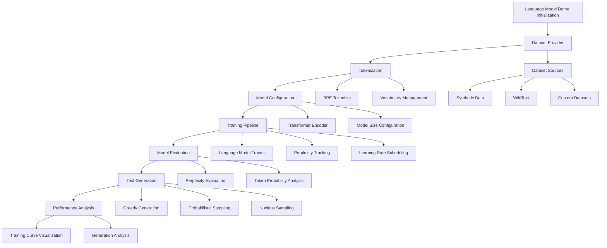

# Language Model Demo: Comprehensive Training and Evaluation Framework

## Architecture Overview


## Key Components and Workflow

### 1. Dataset Preparation
#### Dataset Provider Strategies
```python
class DatasetProvider:
    @staticmethod
    def get_synthetic_dataset(num_samples=1000, seq_length=20):
        """Generate synthetic training data"""
        vocabulary = [
            "the", "quick", "brown", "fox", "jumps", 
            "over", "lazy", "dog", "language", "model"
        ]
        texts = []
        for _ in range(num_samples):
            length = random.randint(5, seq_length)
            text = " ".join(random.choices(vocabulary, k=length))
            texts.append(text)
        return texts

    @staticmethod
    def download_wikitext(save_dir="data", dataset_name="wikitext-2-raw-v1"):
        """Download and preprocess WikiText dataset"""
        try:
            from datasets import load_dataset
            
            dataset = load_dataset(dataset_name)
            
            # Extract and preprocess texts
            train_texts = [text for text in dataset["train"]["text"] if text.strip()]
            val_texts = [text for text in dataset["validation"]["text"] if text.strip()]
            
            return {
                "train": train_texts,
                "validation": val_texts,
                "test": dataset["test"]["text"]
            }
        except ImportError:
            # Fallback to synthetic data
            return {
                "train": DatasetProvider.get_synthetic_dataset(10000, 50),
                "validation": DatasetProvider.get_synthetic_dataset(1000, 50),
                "test": DatasetProvider.get_synthetic_dataset(100, 50)
            }
```

### 2. Tokenization
#### BPE Tokenizer Configuration
```python
# Tokenizer creation and configuration
de_tokenizer = BPETokenizer.from_pretrained("models/tokenizers/de")
en_tokenizer = BPETokenizer.from_pretrained("models/tokenizers/en")

# Preprocess data with BPE tokenization
def preprocess_data_with_bpe(dataset, de_tokenizer, en_tokenizer):
    src_sequences = []
    tgt_sequences = []
    
    for src_text, tgt_text in zip(dataset.src_data, dataset.tgt_data):
        # Tokenize with BPE
        src_ids = de_tokenizer.encode(src_text)
        tgt_ids = en_tokenizer.encode(tgt_text)
        
        # Add special tokens
        src_ids = [de_tokenizer.special_tokens["bos_token_idx"]] + src_ids + 
                  [de_tokenizer.special_tokens["eos_token_idx"]]
        tgt_ids = [en_tokenizer.special_tokens["bos_token_idx"]] + tgt_ids + 
                  [en_tokenizer.special_tokens["eos_token_idx"]]
        
        src_sequences.append(src_ids)
        tgt_sequences.append(tgt_ids)
    
    return src_sequences, tgt_sequences
```

### 3. Model Configuration
#### Transformer Model Setup
```python
class ModelProvider:
    @staticmethod
    def create_model(vocab_size, config_name="small"):
        """Create a transformer model for language modeling"""
        if config_name == "small":
            config = {
                "d_model": 128,
                "num_heads": 4,
                "num_encoder_layers": 3,
                "num_decoder_layers": 3,
                "d_ff": 512,
                "dropout": 0.1,
                "max_seq_length": 128
            }
        elif config_name == "medium":
            config = {
                "d_model": 256,
                "num_heads": 8,
                "num_encoder_layers": 6,
                "num_decoder_layers": 6,
                "d_ff": 1024,
                "dropout": 0.1,
                "max_seq_length": 256
            }
        
        model = EncoderDecoderTransformer(
            src_vocab_size=vocab_size,
            tgt_vocab_size=vocab_size,
            d_model=config["d_model"],
            num_heads=config["num_heads"],
            num_encoder_layers=config["num_encoder_layers"],
            num_decoder_layers=config["num_decoder_layers"],
            d_ff=config["d_ff"],
            dropout=config["dropout"],
            max_seq_length=config["max_seq_length"],
            positional_encoding="sinusoidal",
            share_embeddings=True
        )
        
        return model
```

### 4. Training Pipeline
#### Language Model Trainer
```python
def train_language_model(
    tokenizer_path,
    train_texts,
    val_texts,
    model_config="small",
    batch_size=16,
    num_epochs=5,
    learning_rate=5e-5
):
    # Load tokenizer
    tokenizer = BPETokenizer.from_pretrained(tokenizer_path)
    
    # Create dataloaders
    train_dataloader, val_dataloader = create_lm_dataloaders(
        texts=train_texts,
        tokenizer=tokenizer,
        batch_size=batch_size,
        max_length=128
    )
    
    # Create model
    model = ModelProvider.create_model(
        vocab_size=tokenizer.vocab_size,
        config_name=model_config
    )
    
    # Create trainer
    trainer = LanguageModelTrainer(
        model=model,
        train_dataloader=train_dataloader,
        val_dataloader=val_dataloader,
        learning_rate=learning_rate,
        warmup_steps=100,
        max_grad_norm=1.0
    )
    
    # Train model
    training_stats = trainer.train(
        num_epochs=num_epochs,
        save_dir="models",
        model_name="language_model"
    )
    
    return model, training_stats
```

### 5. Evaluation and Generation
#### Text Generation Strategies
```python
def evaluate_and_generate(
    model_path,
    tokenizer_path,
    test_texts,
    prompts
):
    # Load model and tokenizer
    tokenizer = BPETokenizer.from_pretrained(tokenizer_path)
    model = ModelProvider.create_model(vocab_size=tokenizer.vocab_size)
    model.load_state_dict(torch.load(model_path)["model_state_dict"])
    
    # Create generator
    generator = TextGenerator(
        model=model,
        tokenizer=tokenizer
    )
    
    # Generate texts with different strategies
    generated_texts = []
    for prompt in prompts:
        # Greedy generation
        greedy_text = generator.generate(
            prompt=prompt,
            max_new_tokens=50,
            do_sample=False
        )
        
        # Temperature-based sampling
        temp_text = generator.generate(
            prompt=prompt,
            max_new_tokens=50,
            temperature=0.7,
            do_sample=True
        )
        
        # Nucleus sampling
        nucleus_text = generator.generate(
            prompt=prompt,
            max_new_tokens=50,
            temperature=0.7,
            top_p=0.9,
            do_sample=True
        )
        
        generated_texts.append({
            "prompt": prompt,
            "greedy": greedy_text[0],
            "temperature": temp_text[0],
            "nucleus": nucleus_text[0]
        })
    
    return generated_texts
```

## Technical Highlights
- End-to-end language model workflow
- Flexible dataset handling
- Multiple generation strategies
- Comprehensive evaluation metrics
- Modular and extensible design

## Key Technologies
- PyTorch for model implementation
- Custom transformer architecture
- BPE tokenization
- Advanced training utilities
- Probabilistic text generation

## Potential Extensions
- Multilingual support
- Domain-specific fine-tuning
- Advanced decoding techniques
- Interpretability improvements

## Performance Optimization
- Learning rate scheduling
- Gradient clipping
- Mixed precision support
- Efficient attention mechanisms

## Reproducibility Considerations
- Fixed random seed
- Detailed hyperparameter logging
- Model checkpoint saving
- Comprehensive result tracking
```

Would you like me to continue with the next script in the demos directory? I see `demos/red_teaming_demo.py` as the next script.