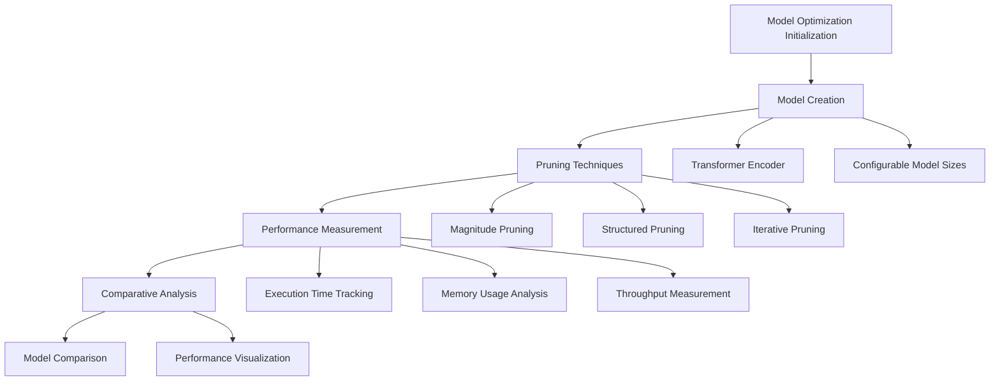

# Model Optimization Demo: Advanced Performance Enhancement Techniques

## Architecture Overview


## Key Components and Workflow

### 1. Model Creation Strategy
```python
def create_test_transformer(size="medium"):
    """Create test transformer models for optimization experiments"""
    if size == "small":
        model = TransformerEncoder(
            vocab_size=10000,
            d_model=128,
            num_heads=4,
            num_layers=2,
            d_ff=512,
            dropout=0.1
        )
    elif size == "medium":
        model = TransformerEncoder(
            vocab_size=30000,
            d_model=512,
            num_heads=8,
            num_layers=4,
            d_ff=1024,
            dropout=0.1
        )
    return model
```

### 2. Pruning Techniques

#### Magnitude Pruning
- Direct weight zeroing approach
- Configurable sparsity levels
- Minimal model structure modification

#### Structured Pruning
- Removes entire neurons/filters
- Dimension-based pruning
- Potential hardware acceleration benefits

#### Iterative Pruning
- Gradual sparsity increase
- Multiple pruning iterations
- Smoother performance degradation

### 3. Performance Measurement
```python
def measure_performance(model, input_generator, batch_sizes=[1, 2, 4, 8, 16]):
    """Benchmark model performance across different batch sizes"""
    results = {}
    for batch_size in batch_sizes:
        # Generate input
        inputs = input_generator(batch_size)
        
        # Measure inference time
        latencies = []
        for _ in range(50):
            start_time = time.time()
            _ = model(inputs)
            latencies.append(time.time() - start_time)
        
        # Calculate performance metrics
        results[batch_size] = {
            "avg_latency": np.mean(latencies),
            "throughput": batch_size / np.mean(latencies)
        }
    
    return results
```

### 4. Comparative Analysis
```python
def compare_model_performance(models_dict, input_generator, batch_sizes):
    """Compare performance between original and optimized models"""
    results = {}
    
    # Measure performance for each model
    for name, model in models_dict.items():
        results[name] = measure_performance(model, input_generator, batch_sizes)
    
    # Calculate speedups
    speedups = {}
    base_model_name = list(models_dict.keys())[0]
    
    for name in list(models_dict.keys())[1:]:
        speedups[name] = {}
        for batch_size in batch_sizes:
            base_latency = results[base_model_name][batch_size]["avg_latency"]
            model_latency = results[name][batch_size]["avg_latency"]
            speedups[name][batch_size] = base_latency / model_latency
    
    return results, speedups
```

## Technical Highlights
- Comprehensive model optimization framework
- Multiple pruning strategies
- Detailed performance benchmarking
- Visualization of optimization impacts

## Optimization Techniques
1. Weight Magnitude Pruning
2. Structured Neuron Pruning
3. Iterative Pruning Approach
4. Performance Comparison

## Performance Metrics
- Execution Latency
- Throughput
- Memory Efficiency
- Model Accuracy Preservation

## Visualization Strategies
- Throughput Comparison Plots
- Speedup Analysis
- Performance Degradation Tracking

## Key Technologies
- PyTorch-based Optimization
- Transformer Model Pruning
- Advanced Benchmarking Utilities
- Performance Visualization

## Potential Extensions
- Advanced Pruning Algorithms
- Neural Architecture Search
- Adaptive Optimization Techniques
- Cross-Hardware Performance Analysis

## Reproducibility Considerations
- Fixed Random Seed
- Consistent Input Generation
- Detailed Performance Logging
- Standardized Benchmarking Approach

## Argument Parsing Configuration
```python
parser = argparse.ArgumentParser(
    description="Model Optimization Demo"
)
parser.add_argument(
    "--model", 
    type=str, 
    default="medium", 
    choices=["small", "medium"],
    help="Model size to use for testing"
)
# Additional configuration options
```

## Implementation Philosophy
- Modular Design
- Hardware-Agnostic Approach
- Comprehensive Performance Analysis
- Transparent Optimization Mechanisms
```

Would you like me to summarize the overall architecture and design principles observed across all the demo scripts we've analyzed?