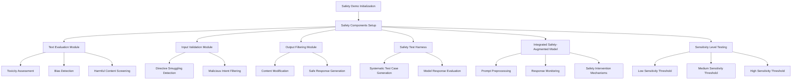

# Safety Demo Architecture: Comprehensive AI Safety Evaluation Framework

## Overview
The safety demo provides a multi-faceted approach to AI safety testing and evaluation, demonstrating various techniques for ensuring responsible AI deployment.

## Architecture Diagram


## Key Components and Modules

### 1. Safety Evaluation Infrastructure
- **SafetyEvaluator**
  - Comprehensive safety scoring mechanism
  - Multiple evaluation dimensions:
    - Toxicity
    - Bias
    - Harmful instructions
    - Personal information exposure

### 2. Safety Filtering Mechanism
- **SafetyFilter**
  - Input validation
  - Output modification
  - Blocking potentially harmful content
  - Multilevel safety thresholds

### 3. Test Harness
- **SafetyTestHarness**
  - Systematic test case generation
  - Comprehensive model response testing
  - Metrics tracking
  - Report generation

### 4. Integrated Safety Model
- **SafetyAugmentedModel**
  - Wraps base model with safety mechanisms
  - Real-time safety intervention
  - Transparent safety event logging

## Evaluation Techniques

### Text Evaluation
- Multidimensional safety scoring
- Flags potentially problematic content
- Provides granular safety metrics
- Supports various input types

### Input Validation
- Proactive content screening
- Prevents potentially harmful prompts
- Multilevel sensitivity control

### Output Filtering
- Dynamic response modification
- Safe alternative generation
- Contextual understanding

### Sensitivity Levels
- Low: Minimal intervention
- Medium: Moderate filtering
- High: Strict safety constraints

## Key Workflow
1. Initialize safety components
2. Generate test inputs
3. Evaluate text safety
4. Validate input
5. Filter outputs
6. Run comprehensive test suite
7. Generate detailed safety report

## Technical Highlights
- Modular design
- Extensible safety evaluation framework
- Support for multiple safety dimensions
- Transparent logging and reporting
- Adaptable to different model architectures

## Potential Extensions
- Machine learning-based safety scoring
- Adaptive sensitivity thresholds
- More sophisticated harm detection
- Cross-lingual safety evaluation

## Implementation Considerations
- Computationally efficient
- Minimal latency overhead
- Configurable safety parameters
- Compatible with various AI models
```

Would you like me to proceed with analyzing the next demo script in the directory? I notice `demos/demo_feed_forward.py` is the next script.