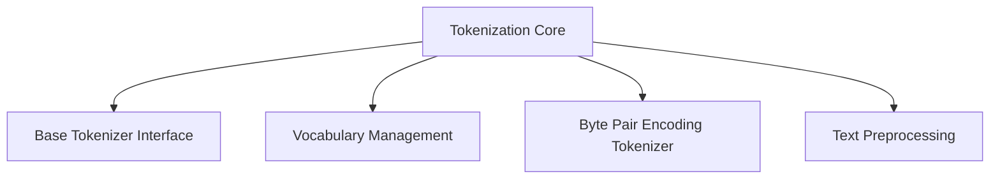

# Tokenization Subdirectory Architecture

## Overview

The tokenization subdirectory provides a comprehensive and flexible tokenization framework designed for advanced natural language processing tasks.

## Directory Structure



## Key Components

### 1. Base Tokenizer (`base_tokenizer.py`)

#### Purpose
Define a standard interface for all tokenization implementations.

#### Abstract Base Class Methods
- `tokenize(text)`: Convert text to tokens
- `encode(text)`: Convert text to token indices
- `decode(token_ids)`: Convert token indices back to text
- `batch_encode(texts)`: Encode multiple texts
- `vocab_size`: Get vocabulary size
- `special_tokens`: Retrieve special token mappings

#### Example Implementation
```python
class CustomTokenizer(BaseTokenizer):
    def __init__(self):
        self._vocab = Vocabulary()
        
    def tokenize(self, text: str) -> List[str]:
        # Custom tokenization logic
        return text.split()
    
    def encode(self, text: str) -> List[int]:
        tokens = self.tokenize(text)
        return self._vocab.tokens_to_indices(tokens)
    
    def decode(self, token_ids: List[int]) -> str:
        tokens = self._vocab.indices_to_tokens(token_ids)
        return ' '.join(tokens)
```

### 2. Vocabulary Management (`vocabulary.py`)

#### Purpose
Manage token-to-index mappings with advanced features.

#### Key Features
- Dynamic vocabulary creation
- Special token handling
- Vocabulary serialization and loading
- Frequency-based vocabulary building

#### Example Usage
```python
# Create a vocabulary
vocab = Vocabulary(
    tokens=['the', 'a', 'an'],
    pad_token='<pad>',
    unk_token='<unk>',
    bos_token='<bos>',
    eos_token='<eos>'
)

# Build vocabulary from texts
texts = ["This is a sample text", "Another example sentence"]
vocab = Vocabulary.build_from_texts(
    texts, 
    tokenizer=lambda x: x.split(),
    max_vocab_size=1000,
    min_freq=2
)

# Convert tokens to indices
indices = vocab.tokens_to_indices(['this', 'is', 'a'])
tokens = vocab.indices_to_tokens(indices)
```

### 3. BPE Tokenizer (`bpe_tokenizer.py`)

#### Purpose
Implement Byte Pair Encoding (BPE) tokenization strategy.

#### Key Features
- Subword tokenization
- Iterative token merging
- Vocabulary size control
- Frequency-based token creation

#### Example Workflow
```python
# Train BPE tokenizer
bpe_tokenizer = BPETokenizer(
    num_merges=8000,  # Target vocabulary size
    lower_case=True,  # Lowercase preprocessing
)

# Train on a corpus
training_texts = [
    "This is a sample text for training.",
    "Another example to build vocabulary."
]
bpe_tokenizer.train(
    training_texts,
    vocab_size=10000,
    min_frequency=2
)

# Tokenize and encode
tokens = bpe_tokenizer.tokenize("A new sentence to tokenize.")
encoded = bpe_tokenizer.encode("A new sentence to tokenize.")
decoded = bpe_tokenizer.decode(encoded)

# Save and load tokenizer
bpe_tokenizer.save_pretrained("path/to/tokenizer")
loaded_tokenizer = BPETokenizer.from_pretrained("path/to/tokenizer")
```

### 4. Text Preprocessing (`preprocessing.py`)

#### Purpose
Provide robust text cleaning and normalization utilities.

#### Key Functions
- `normalize_unicode`: Unicode normalization
- `clean_text`: Comprehensive text cleaning
- `segment_on_punc`: Punctuation-based segmentation

#### Example Usage
```python
# Normalize and clean text
raw_text = "This is a <b>sample</b> text with unicode characters: café"
normalized_text = normalize_unicode(raw_text)
cleaned_text = clean_text(
    normalized_text,
    lower=True,
    remove_accents=True,
    strip_html=True,
    handle_contractions=True
)

# Segment text by punctuation
segmented_text = segment_on_punc(cleaned_text)
```

## Design Principles

1. **Modularity**: Clear separation of concerns
2. **Flexibility**: Support for multiple tokenization strategies
3. **Extensibility**: Easy to add new tokenization methods
4. **Research-Oriented**: Designed for advanced NLP research

## Recommendations

1. Add more tokenization strategies (WordPiece, SentencePiece)
2. Improve error handling and validation
3. Add more preprocessing options
4. Develop more comprehensive documentation

## Anthropic Research Alignment

- Supports advanced language understanding
- Provides flexible tokenization for multimodal models
- Enables precise text preprocessing
- Supports research into subword tokenization techniques
