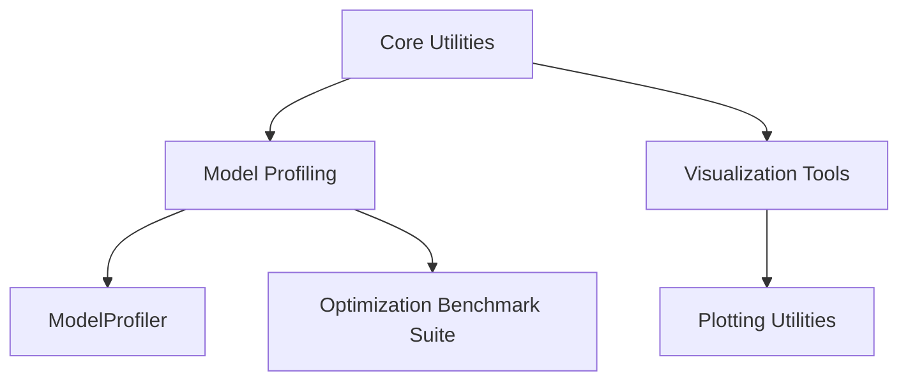

# MultiModal Insight Engine: Utilities Architecture

## Overview

The `utils` directory provides advanced utility classes and functions designed to enhance model development, performance analysis, and system introspection.

## Architecture Diagram



## Core Modules

### 1. Profiling Utilities (`profiling.py`)

#### Purpose
Provide comprehensive performance analysis and benchmarking tools for machine learning models.

#### Key Components

1. `ModelProfiler`
   - Measure model execution performance
   - Track memory usage
   - Generate detailed performance reports

#### Example Instantiation
```python
# Create a model profiler
profiler = ModelProfiler(model)

# Measure execution time
timing_metrics = profiler.measure_execution_time(
    input_data=test_input,
    iterations=10,
    warmup=2
)

# Measure memory usage
memory_metrics = profiler.measure_memory_usage(
    input_data=test_input
)

# Generate comprehensive report
report = profiler.generate_report()

# Plot performance metrics
performance_plots = profiler.plot_metrics()
```

#### Key Methods
- `measure_execution_time()`: Benchmark model inference speed
- `measure_memory_usage()`: Track memory consumption
- `generate_report()`: Create detailed performance analysis
- `plot_metrics()`: Visualize performance characteristics

2. `ModelBenchmarkSuite`
   - Compare performance across different model optimizations
   - Generate comprehensive benchmark reports

#### Example Instantiation
```python
# Create benchmark suite
benchmark = ModelBenchmarkSuite()

# Benchmark original model
benchmark.benchmark_model(
    model=original_model,
    input_generator=input_gen_fn,
    batch_sizes=[1, 4, 16, 32]
)

# Benchmark optimized models
benchmark.benchmark_model(
    model=quantized_model,
    input_generator=input_gen_fn,
    batch_sizes=[1, 4, 16, 32]
)

# Compare optimizations
comparison = benchmark.compare_optimizations()

# Generate detailed report
report = benchmark.generate_report()
```

3. Advanced Profiling Features
   - Hardware utilization tracking
   - Layer-by-layer memory analysis
   - Detailed optimization recommendations

#### Hardware Utilization Tracking
```python
# Monitor hardware during training
def training_process():
    model.train()
    # Training logic here

hardware_metrics = profiler.monitor_hardware_utilization(
    train_fn=training_process,
    duration=60,  # Monitor for 60 seconds
    interval=0.5  # Sample every 0.5 seconds
)
```

### 2. Visualization Utilities (`visualization.py`)

#### Purpose
Provide advanced visualization tools for machine learning models and experiments.

#### Current Status
The file is currently a placeholder, suggesting future development of comprehensive visualization tools.

#### Recommended Future Implementations
1. Model Architecture Visualization
2. Training Metrics Plotting
3. Attention Heatmaps
4. Model Complexity Graphs
5. Performance Comparison Charts

## Design Principles

1. **Performance-Centric**: Focus on detailed, actionable performance insights
2. **Flexibility**: Support various model types and optimization techniques
3. **Comprehensiveness**: Provide multi-dimensional performance analysis
4. **Extensibility**: Easy to add new profiling and visualization methods

## Recommendations for Future Development

1. Expand visualization capabilities
2. Add more sophisticated profiling metrics
3. Implement cross-platform hardware monitoring
4. Create more detailed optimization recommendation systems
5. Develop interactive visualization tools

## Anthropic Research Alignment

The utilities support:
- Detailed model performance analysis
- Hardware-aware optimization techniques
- Comprehensive model introspection
- Performance benchmarking across different configurations
- Systematic approach to model evaluation

## Integration with Other Components

- **Models**: Provides performance insights for model development
- **Training**: Supports optimization of training processes
- **Optimization**: Enables systematic model compression and efficiency improvements

## Example Comprehensive Workflow

```python
# Full profiling and optimization workflow
def optimize_model(model, input_generator):
    # Create profiler
    profiler = ModelProfiler(model)
    
    # Benchmark original model
    original_metrics = profiler.measure_execution_time(input_generator(32))
    
    # Apply quantization
    quantized_model = quantize_model(model)
    quantized_metrics = profiler.measure_execution_time(input_generator(32))
    
    # Compare and generate report
    benchmark = ModelBenchmarkSuite()
    benchmark.benchmark_model(model, input_generator)
    benchmark.benchmark_model(quantized_model, input_generator)
    
    report = benchmark.generate_report()
    print(report)
```

