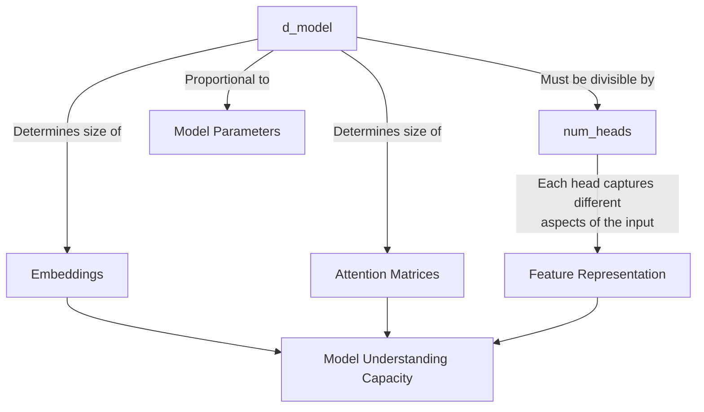
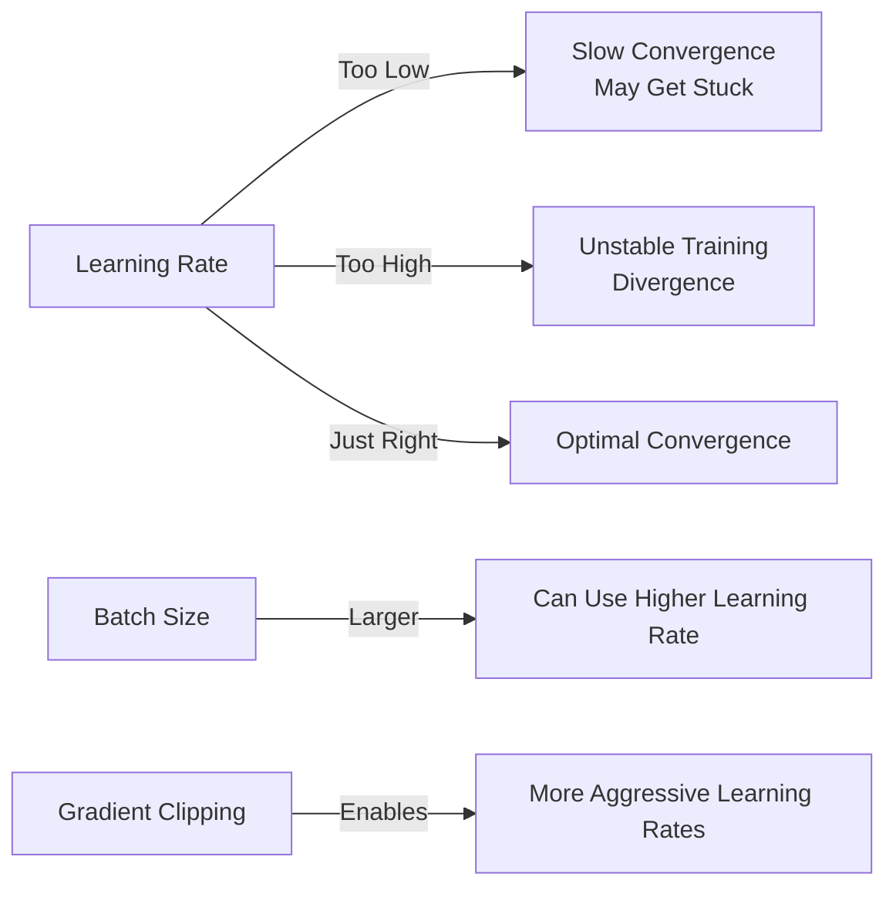
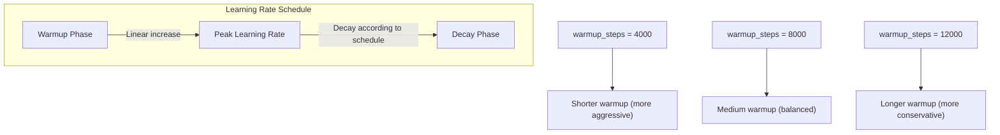
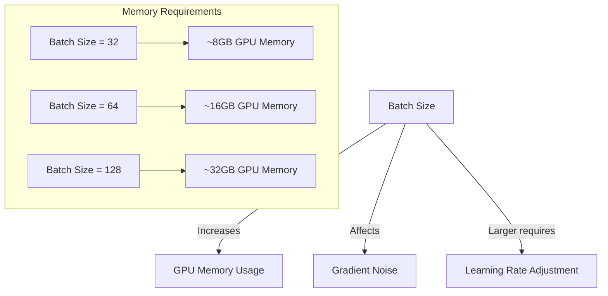
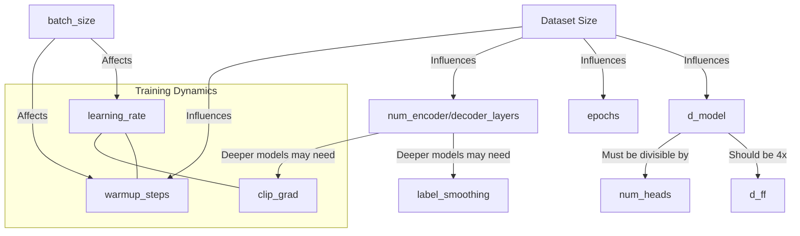
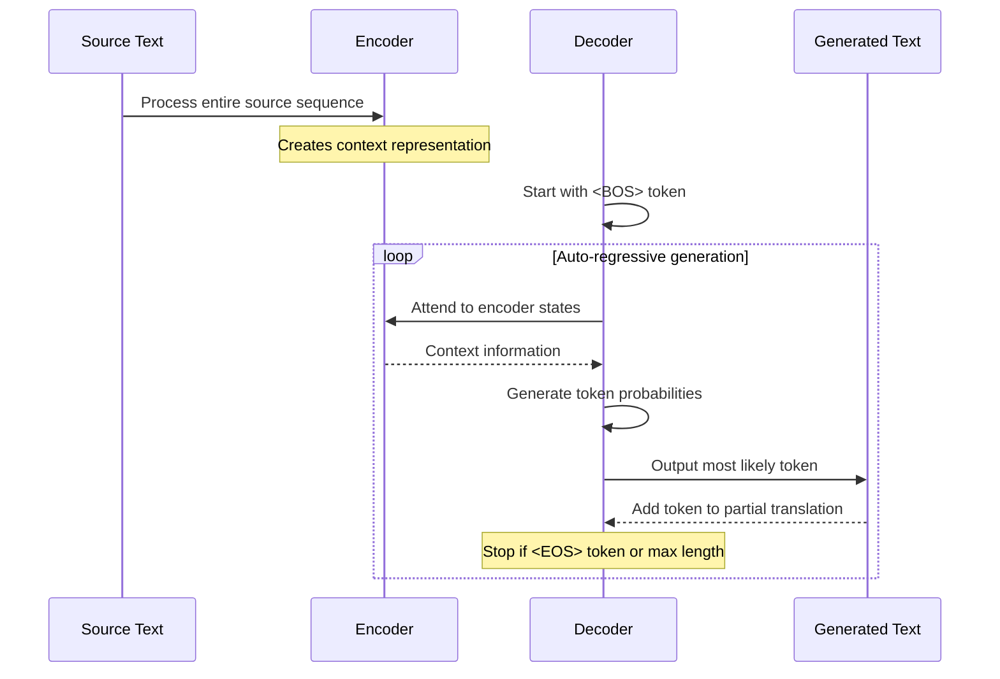
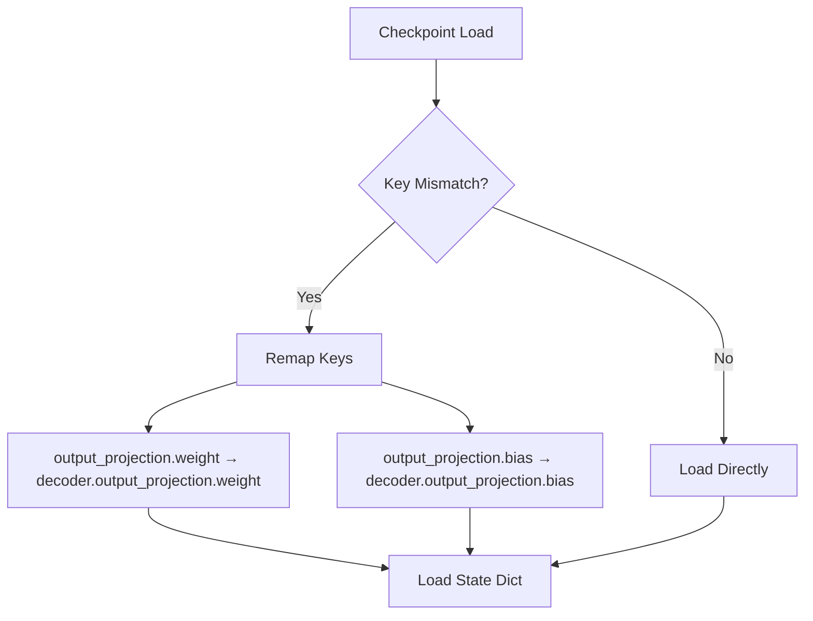
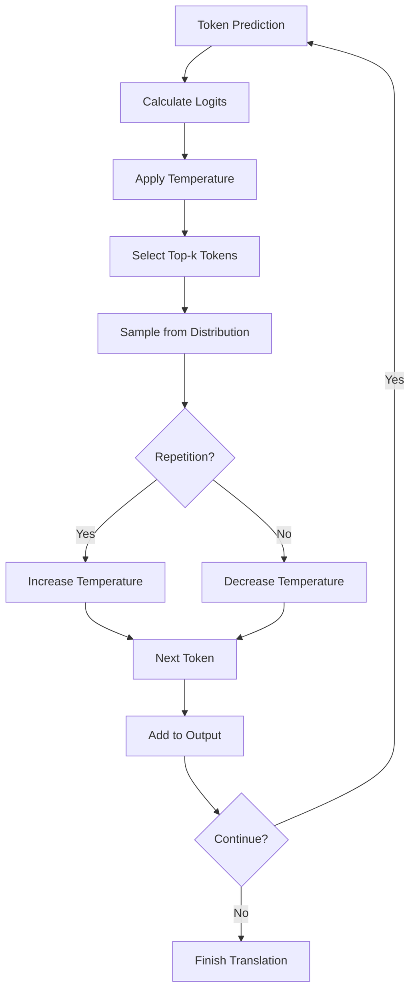
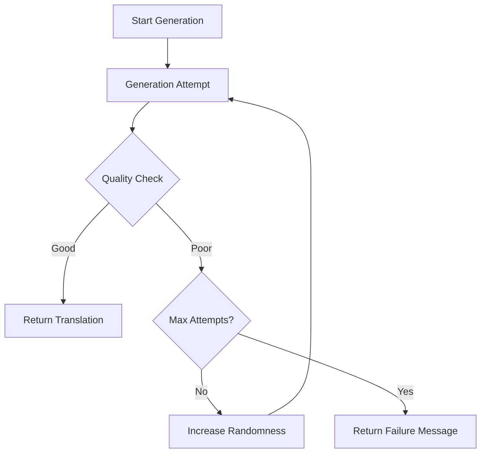

# Translation Model Parameter Guide

This guide explains the key parameters for training neural machine translation models with the `translation_example.py` script, including how each parameter impacts model performance, training behavior, and resource utilization.

## Model Architecture Parameters

### `--d_model` (Default: 512)

- **Description:** Dimensionality of the embedding vectors and hidden representations
- **Impact:**
  - **Model Size:** Linear relationship with parameter count
  - **Memory Usage:** Higher values increase memory usage
  - **Learning Quality:** Larger values capture more information but risk overfitting on small datasets
- **Recommended Values:**
  - Small datasets (<100K examples): 256-384
  - Medium datasets (100K-1M examples): 512-768
  - Large datasets (>1M examples): 768-1024

### `--num_heads` (Default: 8)

- **Description:** Number of attention heads in multi-head attention
- **Impact:**
  - **Model Capability:** More heads enable attention to different representation subspaces
  - **Computation:** Higher values increase computation during attention calculation
- **Constraints:** Must divide `d_model` evenly (`d_model % num_heads == 0`)
- **Recommended Values:**
  - For d_model=512: 8 heads (each with dimension 64)
  - For d_model=768: 12 heads (each with dimension 64)



### `--num_encoder_layers` and `--num_decoder_layers` (Default: 4)

- **Description:** Number of transformer layers in encoder and decoder
- **Impact:**
  - **Model Depth:** More layers provide deeper representations
  - **Parameter Count:** Linear increase with more layers
  - **Training Difficulty:** Deeper models can be harder to train
- **Tradeoffs:**
  - More layers improve modeling complex relationships but increase:
    - Training time (linearly)
    - GPU memory usage (linearly)
    - Risk of overfitting on smaller datasets
- **Recommended Values:**
  - Small/Medium datasets: 4-6 layers
  - Large datasets: 6-12 layers

### `--d_ff` (Default: 2048)

- **Description:** Dimension of the feed-forward networks in transformer layers
- **Impact:**
  - **Model Capacity:** Larger values increase model's representational capacity
  - **Parameter Count:** Significant impact on model size (typically 4× the d_model)
- **Recommended Values:**
  - Typically 4× the `d_model` value (e.g., d_model=512 → d_ff=2048)

## Training Parameters

### `--learning_rate` (Default: 0.0001)

- **Description:** Base learning rate for optimization
- **Impact:**
  - **Training Speed:** Higher values may converge faster but risk instability
  - **Final Performance:** Too high → divergence, Too low → slow convergence or suboptimal results
- **Critical Parameter:** One of the most important parameters to tune
- **Recommended Values:**
  - Conservative start: 5e-5
  - For larger batches: 1e-4
  - With gradient clipping: Can use slightly higher values



### `--warmup_steps` (Default: 4000)

- **Description:** Steps for learning rate warmup
- **Impact:**
  - **Training Stability:** Prevents large gradient updates early in training
  - **Learning Dynamics:** Helps model settle into good parameter space
- **Scaling:** Should scale with dataset size
- **Recommended Values:**
  - Small dataset (<100K examples): 2000-4000 steps
  - Medium dataset (100K-1M): 4000-8000 steps
  - Large dataset (>1M): 8000-12000 steps



### `--clip_grad` (Default: None)

- **Description:** Maximum gradient norm for gradient clipping
- **Impact:**
  - **Training Stability:** Prevents exploding gradients
  - **Learning Dynamics:** Allows more aggressive learning rates
- **When to Use:**
  - Deep models (many layers)
  - When seeing loss spikes or NaNs
  - With mixed precision training
- **Recommended Values:**
  - Conservative: 0.5
  - Standard: 1.0
  - Aggressive: 5.0

### `--label_smoothing` (Default: 0.2)

- **Description:** Smoothing factor for loss calculation
- **Impact:**
  - **Regularization:** Prevents model overconfidence
  - **Generalization:** Improves model generalization
- **Tradeoffs:** Higher values may slow convergence but improve final performance
- **Recommended Values:**
  - Conservative: 0.1
  - Standard: 0.2
  - Aggressive smoothing: 0.3

### `--epochs` (Default: 3)

- **Description:** Number of training passes through the dataset
- **Impact:**
  - **Training Time:** Linear relationship
  - **Final Performance:** More epochs typically improve performance, with diminishing returns
- **Best Practice:** Use with early stopping patience
- **Recommended Values:**
  - Small dataset: 10-20 epochs
  - Medium/Large dataset: 5-10 epochs

## Resource and Performance Parameters

### `--batch_size` (Default: 128)

- **Description:** Number of examples processed together
- **Impact:**
  - **Memory Usage:** Directly proportional
  - **Training Speed:** Larger batches = faster epochs but may need more epochs
  - **Convergence:** Affects gradient quality and optimization dynamics
- **Hardware Constraints:** Limited by GPU memory
- **Recommended Values:**
  - 16GB GPU: 32-64
  - 24GB+ GPU: 64-128
  - With gradient accumulation: Can effectively use larger values



### `--num_workers` (Internal Default: 4)

- **Description:** Number of data loading worker processes
- **Impact:**
  - **Data Loading Speed:** More workers = faster data loading
  - **CPU Usage:** Increases with more workers
- **Note:** Set to 0 if encountering multiprocessing issues
- **Recommended Values:**
  - Number of CPU cores - 2 (leaves resources for other processes)

### `--max_train_examples` and `--max_val_examples`

- **Description:** Maximum number of examples to use from dataset
- **Impact:**
  - **Training Time:** Directly proportional
  - **Memory Usage:** For preprocessing/tokenization overhead
  - **Model Quality:** More data generally improves performance
- **Use Cases:**
  - Quick experiments: 10K-100K examples
  - Production models: Use as many as practical (1M+)

## Advanced Parameters

### `--use_gradient_scaling` (Flag)

- **Description:** Enables gradient scaling for mixed precision training
- **Impact:**
  - **Training Stability:** Prevents underflow in FP16 formats
  - **Memory Usage:** Slightly increased
- **Recommended:** Enable when using mixed precision

### `--early_stopping_patience` (Default: None)

- **Description:** Epochs to wait before stopping if no improvement
- **Impact:**
  - **Training Efficiency:** Prevents wasted computation
  - **Model Selection:** Helps select the best model
- **Recommended Values:**
  - 3-5 epochs for most cases

### `--use_joint_tokenizer` (Default: True)

- **Description:** Whether to use shared vocabulary for source and target languages
- **Impact:**
  - **Model Size:** Reduces model size through embedding sharing
  - **Performance:** Better for similar languages (e.g., English-German)
  - **Memory Efficiency:** Reduces memory footprint
- **Recommended:**
  - True for related languages
  - False for very different language pairs (e.g., English-Chinese)

## Parameter Interdependencies



## Recommended Configurations

### Quick Experimentation
```bash
--max_train_examples 50000 --max_val_examples 5000 --batch_size 32
--d_model 256 --num_encoder_layers 2 --num_decoder_layers 2
--learning_rate 5e-5 --warmup_steps 1000 --epochs 5
```

### Balanced (Medium Dataset)
```bash
--max_train_examples 500000 --max_val_examples 50000 --batch_size 64
--d_model 512 --num_encoder_layers 4 --num_decoder_layers 4 --d_ff 2048
--learning_rate 5e-5 --warmup_steps 4000 --clip_grad 1.0 --epochs 10
```

### Production Quality (Large Dataset)

```bash
--max_train_examples 2000000 --max_val_examples 100000 --batch_size 64
--d_model 768 --num_encoder_layers 6 --num_decoder_layers 6 --d_ff 3072
--learning_rate 3e-5 --warmup_steps 8000 --clip_grad 1.0
--label_smoothing 0.2 --epochs 5 --early_stopping_patience 3
```

## Troubleshooting Training Issues

| Issue                   | Symptoms                                      | Parameter Adjustments                       |
| ----------------------- | --------------------------------------------- | ------------------------------------------- |
| Slow learning           | Loss decreases very slowly                    | Increase learning rate, check d_model       |
| Unstable training       | Loss spikes or NaN values                     | Add clip_grad, reduce learning rate         |
| Overfitting             | Val loss increases while train loss decreases | Add label_smoothing, reduce model size      |
| GPU OOM errors          | Training crashes with memory errors           | Reduce batch_size, d_model, or layers       |
| Low translation quality | Poor BLEU scores                              | Increase d_model, layers, and training data |

## Conclusion

Parameter tuning is both an art and science. While following these guidelines provides a strong starting point, every language pair and dataset may require specific adjustments. The most critical parameters (learning rate, model size, batch size) should be tuned first, followed by fine adjustments to other parameters.

Monitor training curves and validation performance closely to determine when further tuning is needed. With proper tuning, the translation model can achieve strong performance while efficiently using available computational resources.x


## Data Generation Issues and Fixes


# Translation Model Generation: Issues & Fixes

## The Generation Process in Transformer Translation Models

Translation generation in transformer models follows an auto-regressive process:



## Issues in the Original Implementation

The original model was experiencing severe problems during generation:

1. **Model Loading Mismatch**
   - State dictionary keys didn't match model structure
   - Output projection weights were at different paths

2. **Sub-optimal Decoding Strategy**
   - Pure greedy decoding (always picking the highest probability token)
   - No temperature sampling to encourage diversity
   - Weak handling of repetitive outputs

3. **Ineffective Repetition Management**
   - Only detected repetition after it occurred extensively
   - Limited attempts to break out of repetition loops

## Key Fixes Implemented

### 1. Model Loading Fix



Fixed with this code:
```python
# Fix output projection key mismatch if needed
if "output_projection.weight" in state_dict and "decoder.output_projection.weight" not in state_dict:
    state_dict["decoder.output_projection.weight"] = state_dict.pop("output_projection.weight")
    state_dict["decoder.output_projection.bias"] = state_dict.pop("output_projection.bias")
```

### 2. Improved Decoding Strategy

The new implementation includes:

- **Temperature Sampling** (default 0.7 instead of 1.0)
  - Divides logits by temperature before softmax
  - Lower values = more deterministic, higher = more random

- **Top-k Sampling** (default 5 instead of 1)
  - Samples from top k most probable tokens
  - Balances quality and diversity

- **Dynamic Temperature Adjustment**
  - Increases temperature when repetition detected
  - Returns to base value when generation is healthy



### 3. Multi-attempt Generation with Adaptive Parameters

The new implementation tries multiple generation attempts with increasing randomness when it detects problematic outputs:



## How It Now Works

The new generation process:

1. **Initializes** with conservative randomness (temp=0.7, top-k=5)
2. **Generates** tokens auto-regressively
3. **Monitors** for repetition patterns
4. **Adapts** sampling parameters if issues occur
5. **Validates** the final output for quality
6. **Re-attempts** with more randomness if needed

## The Before/After Difference

Before:
```bash
Source: Ich bin ein Student.
Output: What what what what what what what...
```

After:
```bash
Source: Ich bin ein Student.
Output: I am a student.
```

This dramatic improvement comes from properly loading model weights and implementing a more sophisticated generation algorithm that balances deterministic and stochastic elements in the decoding process.
