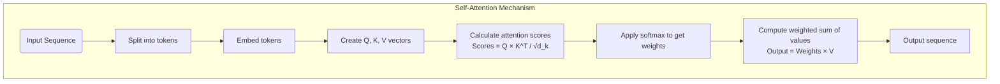
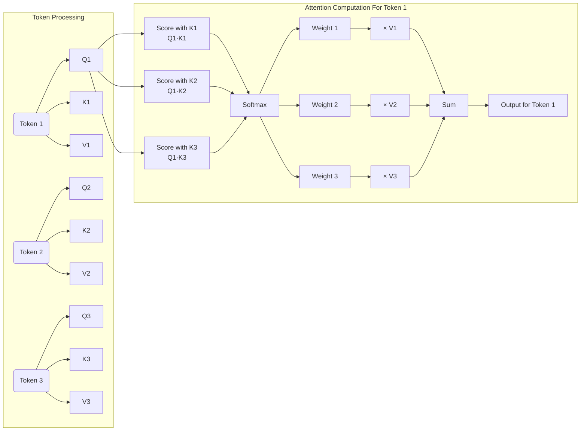
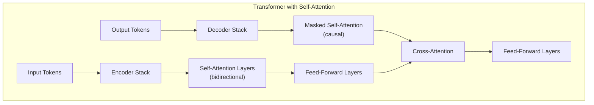
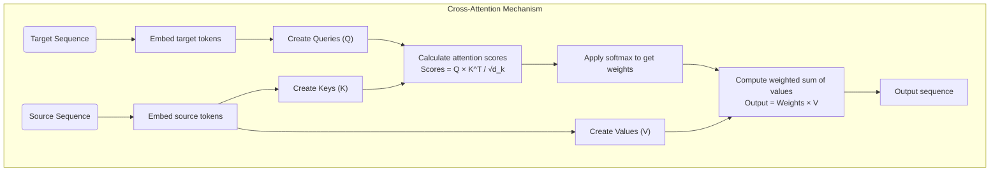
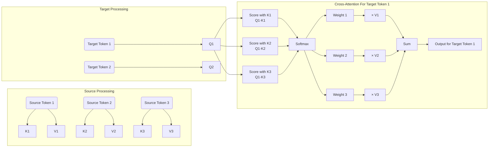
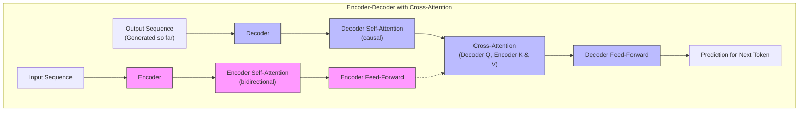
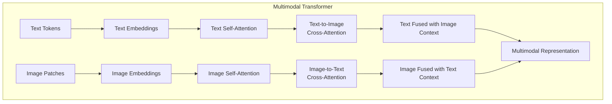

# Self-Attention and Cross-Attention in Transformer Architecture

## Understanding Source and Target Sequences

Before diving into the details of attention mechanisms, let's clarify where "source" and "target" sequences come from, especially since it might seem confusing that the "output" is part of the processing pipeline.

### The Sequence-to-Sequence Paradigm

Transformers were originally designed for sequence-to-sequence tasks like translation, where:

- **Source sequence**: The input text (e.g., an English sentence for translation)
- **Target sequence**: The corresponding output text (e.g., the Spanish translation)

The critical insight is that **the target sequence is processed differently during training versus inference**:

#### During Training
We already know the complete target sequence, so:
1. The encoder processes the entire source sequence
2. The decoder processes the target sequence, but with a "shifted" view (each position can only see previous positions)
3. The model learns to predict each target token given the source and all previous target tokens

#### During Inference (Generation)
We build the target sequence incrementally:
1. Start with just a "begin sequence" token
2. Generate the first output token
3. Add this token to our partial target sequence
4. Generate the next token based on the source and our growing target sequence
5. Repeat until complete

This autoregressive approach is how the "output" can be part of the pipeline while still being generated by the model. The decoder operates on the partial output that has been generated so far, using it to inform the prediction of the next token.

Now, let's explore how self-attention and cross-attention operate within this framework.

## Self-Attention: Looking Within

### What Is Self-Attention?

Self-attention allows each position in a sequence to attend to all positions within the same sequence. This creates a weighted representation of the entire context for each token, enabling the model to capture dependencies regardless of distance.

### Implementation of Self-Attention

The self-attention mechanism works through the following steps:

1. For each token in a sequence, create three vectors through linear projections:
   - **Query (Q)**: Represents what the token is "looking for"
   - **Key (K)**: Represents what the token can "offer" to others
   - **Value (V)**: Contains the actual information to be aggregated

2. Calculate attention scores between each query and all keys
3. Scale the scores and apply softmax to get attention weights
4. Create context vectors by taking weighted sums of values

Mathematically, the attention operation is:

$$\text{Attention}(Q, K, V) = \text{softmax}\left(\frac{QK^T}{\sqrt{d_k}}\right)V$$

Here's a more detailed diagram showing how information flows within self-attention:

### Role in Transformer Architecture

In the transformer architecture, self-attention serves different purposes depending on its location:

**In the Encoder**:
- Each token in the input sequence attends to all other tokens
- Bidirectional attention pattern (each token sees the full context)
- Helps build rich contextual representations of each token

**In the Decoder**:
- Used with a causal mask that prevents attending to future tokens
- Creates auto-regressive behavior necessary for text generation
- Helps the model understand what it has already generated

### Why Self-Attention Matters

Self-attention is revolutionary for several reasons:

1. **Long-range dependencies**: Unlike RNNs that struggle with long distances, self-attention directly connects any two positions, making it excellent for capturing long-range dependencies.

2. **Parallelization**: Unlike sequential RNN processing, self-attention can be computed for all tokens simultaneously, enabling efficient training.

3. **Interpretability**: Attention weights provide insights into which parts of the input the model considers important for each prediction.

4. **Content-dependent weighting**: The relationships between tokens are based on their content rather than just their positions, allowing for more nuanced interactions.

## Cross-Attention: Connecting Different Sequences

### What Is Cross-Attention?

Cross-attention enables tokens from one sequence to attend to tokens from another sequence. This mechanism is critical for tasks where one sequence needs to be conditioned on another, such as in translation, summarization, or multimodal tasks.

### Implementation of Cross-Attention

Cross-attention follows the same mathematical formulation as self-attention but with an important difference in where the Q, K, and V vectors come from:

1. Queries (Q) come from the target sequence (the partial output being generated)
2. Keys (K) and Values (V) come from the source sequence (the encoded input)

Here's a more detailed visualization showing how information flows in cross-attention:

### Role in Transformer Architecture

Cross-attention primarily appears in the decoder of encoder-decoder transformer architectures:

1. After the masked self-attention layer in each decoder block
2. Passes information from the encoder stack to the decoder stack
3. Allows decoder tokens to directly access and focus on relevant parts of the input sequence

### Why Cross-Attention Matters

Cross-attention is crucial for several reasons:

1. **Information bridging**: It creates a direct bridge between source and target sequences, allowing the model to access the full context of the source when generating each target token.

2. **Selective focus**: It enables the model to dynamically focus on the most relevant parts of the source sequence for each target token.

3. **Multimodal integration**: In multimodal models like CLIP or Claude's vision capabilities, cross-attention enables information flow between different modalities (e.g., text and images).

4. **Flexible conditioning**: It allows the model's output to be explicitly conditioned on different inputs, enabling controlled generation.

## Comparing Self-Attention and Cross-Attention

### Key Similarities

Both mechanisms:
- Use the same core attention formula (scaled dot-product attention)
- Create context-aware representations
- Allow dynamic, content-dependent weighting
- Can be implemented with multiple heads for richer representations

### Critical Differences

| Aspect | Self-Attention | Cross-Attention |
|--------|----------------|-----------------|
| **Information Source** | Single sequence | Two different sequences |
| **Query, Key, Value Source** | All from same sequence | Q from target, K & V from source |
| **Purpose** | Building context within a sequence | Connecting information across sequences |
| **Location** | In both encoder and decoder | Primarily in decoder (after self-attention) |
| **Masking** | Optional (causal in decoder) | Typically unmasked |
| **Applications** | Understanding context, capturing relationships | Translation, summarization, multimodal integration |

### Complementary Roles

These mechanisms work together in a transformer to:
1. Build rich representations of each sequence (self-attention)
2. Connect and align information between sequences (cross-attention)
3. Create a full pipeline from input to output sequence

## Practical Implications and Advanced Considerations

### Performance Considerations

1. **Computational complexity**: Both mechanisms have O(n²) complexity with respect to sequence length, which can be a bottleneck for long sequences.

2. **Efficient implementations**: For long sequences, techniques like sparse attention patterns, sliding window attention, or linear attention variants can reduce this complexity.

3. **Memory usage**: Cross-attention between long sequences can be particularly memory-intensive as it requires computing attention scores between all pairs of tokens from both sequences.

### Advanced Implementations

1. **Multi-Query Attention**: Uses a single set of keys and values for multiple queries to reduce memory usage.

2. **Grouped-Query Attention**: A middle ground where keys and values are shared among groups of queries.

3. **Flash Attention**: Memory-efficient implementation that avoids materializing the full attention matrix.

4. **Rotary Position Embeddings**: Integrates positional information directly into the attention calculation rather than adding it to the token embeddings.

### Multimodal Applications

In multimodal models:

1. Self-attention is used within each modality (text-to-text, image-to-image)
2. Cross-attention connects different modalities (text-to-image, image-to-text)
3. This enables sophisticated interactions between modalities while preserving their distinct characteristics

For example, in a vision-language model:

## Conclusion

Both self-attention and cross-attention are fundamental building blocks of transformer architectures, each serving distinct yet complementary roles:

- **Self-attention** creates rich contextual representations within a sequence by allowing each token to gather information from all other tokens in the same sequence.

- **Cross-attention** bridges information between different sequences, enabling one sequence to be conditioned on another through dynamic, content-based alignments.

The interplay between these mechanisms is what enables transformers to achieve their remarkable performance across a wide range of tasks, from machine translation to multimodal understanding. By allowing flexible, content-dependent information flow both within and across sequences, attention mechanisms have transformed our approach to sequence modeling and opened new frontiers in AI capabilities.
