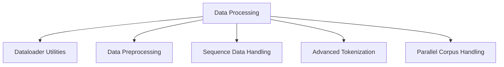

# MultiModal Insight Engine: Data Processing Architecture

## Overview

The `data` directory provides a comprehensive set of utilities for data preprocessing, loading, and tokenization, designed to support multimodal machine learning workflows.

## Directory Structure



## Core Modules

### 1. Dataloader (`dataloader.py`)

#### Purpose
Provide flexible data loading utilities for multimodal machine learning tasks.

#### Key Classes
1. `MultimodalDataset`
   - Handles datasets with multiple input modalities
   - Ensures consistent data handling across different data types

#### Example Instantiation
```python
# Create a multimodal dataset
data_dict = {
    'text': torch.tensor(text_embeddings),
    'image': torch.tensor(image_embeddings),
    'labels': torch.tensor(labels)
}
dataset = MultimodalDataset(data_dict)

# Create a dataloader
dataloader = create_dataloader(
    dataset,
    batch_size=32,
    shuffle=True,
    num_workers=4
)
```

### 2. Preprocessing (`preprocessing.py`)

#### Purpose
Provide data preprocessing utilities with flexible configuration options.

#### Key Classes
1. `DataPreprocessor`
   - Handles data scaling and normalization
   - Supports multiple scaling strategies

#### Example Instantiation
```python
# Create a data preprocessor
preprocessor = DataPreprocessor(method='standard')

# Fit and transform data
train_data = torch.randn(1000, 10)
preprocessor.fit(train_data)
normalized_data = preprocessor.transform(train_data)

# Create sequences and split data
sequences, targets = create_sequences(normalized_data, seq_length=5)
train_data, val_data, test_data = split_data(sequences)
```

### 3. Sequence Data (`sequence_data.py`)

#### Purpose
Provide utilities for handling sequence-based data, especially for transformer models.

#### Key Components
1. `TransformerDataset`
   - Specialized dataset for sequence-to-sequence tasks
   - Handles tokenization, padding, and masking

2. `TransformerCollator`
   - Manages batching for transformer input data
   - Handles variable-length sequences

#### Example Instantiation
```python
# Create a transformer dataset for machine translation
source_sequences = [[1, 2, 3], [4, 5, 6]]
target_sequences = [[7, 8, 9], [10, 11, 12]]

dataset = TransformerDataset(
    source_sequences, 
    target_sequences,
    max_src_len=10,
    max_tgt_len=10,
    pad_idx=0,
    bos_idx=1,
    eos_idx=2
)

# Create a dataloader with custom collation
collator = TransformerCollator(pad_idx=0)
dataloader = DataLoader(
    dataset, 
    batch_size=2, 
    collate_fn=collator
)
```

### 4. Europarl Dataset (`europarl_dataset.py`)

#### Purpose
Handle parallel text corpora for machine translation tasks.

#### Key Features
- Flexible loading of Europarl corpus
- Multiple file structure support
- Data filtering and preprocessing

#### Example Instantiation
```python
# Load Europarl dataset for German-English translation
dataset = EuroparlDataset(
    data_dir="data/europarl",
    src_lang="de",
    tgt_lang="en",
    max_examples=10000,
    random_seed=42
)

# Access source and target texts
src_texts = dataset.src_data
tgt_texts = dataset.tgt_data
```

## Tokenization Subdirectory

### Overview
The `tokenization` subdirectory provides advanced text tokenization capabilities with a focus on flexibility and research-oriented design.

### Key Components
1. `base_tokenizer.py`
   - Abstract base class for all tokenizers
   - Defines standard tokenization interface

2. `vocabulary.py`
   - Manages token-to-index mappings
   - Supports special tokens and vocabulary building

3. `bpe_tokenizer.py`
   - Byte Pair Encoding (BPE) tokenization implementation
   - Supports advanced tokenization strategies

4. `preprocessing.py`
   - Text cleaning and normalization utilities
   - Handles Unicode normalization, HTML stripping, etc.

### Example Tokenization Workflow
```python
# Create a BPE tokenizer
tokenizer = BPETokenizer(num_merges=8000)

# Train on a corpus
texts = ["This is a sample text.", "Another example sentence."]
tokenizer.train(texts)

# Tokenize and encode text
encoded = tokenizer.encode("A new sentence to tokenize.")
decoded = tokenizer.decode(encoded)
```

## Design Principles

1. **Modularity**: Separate concerns for different data processing tasks
2. **Flexibility**: Support for multiple data types and preprocessing strategies
3. **Extensibility**: Easy to add new dataset types or preprocessing techniques
4. **Research-Oriented**: Designed with machine learning research workflows in mind

## Recommendations

1. Expand support for more dataset types
2. Add more advanced data augmentation techniques
3. Implement more tokenization strategies
4. Develop comprehensive data validation utilities

## Future Work

1. Add more multimodal dataset support
2. Implement advanced data sampling techniques
3. Develop more sophisticated preprocessing pipelines
4. Create more robust error handling for data loading
