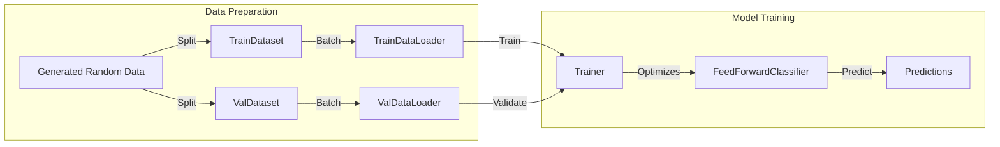

# Feed Forward Classifier Demo

## Purpose

Demonstrates the setup, training, evaluation, and usage of a Feed Forward Neural Network (classifier) using PyTorch, ideal for basic classification tasks.

## Detailed Architecture



## Data Flow Explained

- **Data Generation:** Creates synthetic datasets for quick experimentation and validation.
- **DataLoader:** Batches input data for efficient model training and evaluation.
- **Trainer:** Manages training loop, validation, and early stopping criteria.
- **FeedForwardClassifier:** Neural network model configured for classification tasks, trained and evaluated by the Trainer.

## Component Configurations

### Data Generation

- Samples: Configurable (default: 1,000,000 samples)
- Input Size: Configurable (default: 20 features)
- Classes: Configurable (default: 10 classes)

Example data generation:

```python
num_samples = 1000000
input_size = 20
num_classes = 10

X = torch.randn(num_samples, input_size)
y = torch.randint(0, num_classes, (num_samples,))
```

### DataLoader

- Batch Size: 32 (configurable)
- Shuffle: True for training set

DataLoader setup:

```python
train_dataloader = DataLoader(train_dataset, batch_size=32, shuffle=True)
val_dataloader = DataLoader(val_dataset, batch_size=32)
```

### FeedForwardClassifier

- Hidden Layers: Configurable (default: [128, 64])
- Activation: ReLU (configurable)
- Dropout: Configurable (default: 0.2)
- Layer Normalization: Optional

Model initialization example:

```python
model = FeedForwardClassifier(
    input_size=input_size,
    hidden_sizes=[128, 64],
    num_classes=num_classes,
    activation="relu",
    dropout=0.2,
    use_layer_norm=True,
)
```

### Trainer

- Optimizer: Adam
- Learning Rate: Configurable (default: 0.001)
- Epochs: Configurable (default: 10)
- Early Stopping Patience: Configurable (default: 3 epochs)

Training example:

```python
history = train_model(
    model=model,
    train_dataloader=train_dataloader,
    val_dataloader=val_dataloader,
    epochs=10,
    learning_rate=0.001,
    early_stopping_patience=3,
)
```

## Running Instructions

### Step 1: Environment setup

```shell
pip install -r requirements.txt
```

### Step 2: Execute feed-forward training demo

```shell
python demos/demo_feed_forward.py
```

### Step 3: Model Saving

Trained models are saved to:

```
models/feed_forward_classifier.pt
```

### Step 4: Making Predictions

Example:

```python
with torch.no_grad():
    predictions = model.predict(X_val[:5])
    probabilities = model.predict_proba(X_val[:5])
```

## Extensibility

Easily customizable for different datasets, layer sizes, or activation functions directly within the script:

```python
model = FeedForwardClassifier(input_size=30, hidden_sizes=[256, 128], num_classes=5)
```

## Integration

- Designed for seamless integration with PyTorch-based data processing and model training workflows.