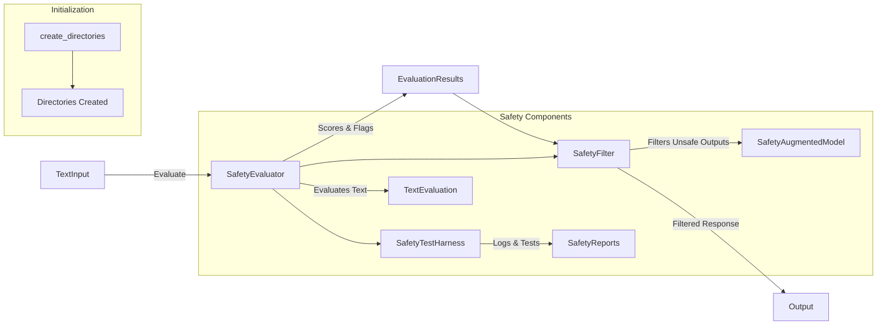

# Safety Demo

## Purpose

This script illustrates the setup, evaluation, and integration of safety mechanisms designed to analyze, flag, and filter potentially harmful content generated by AI models. It demonstrates text evaluation using predefined safety categories.

## Detailed Architecture



## Data Flow Explained

- **Initialization:** Sets up directories (`safety_data`, `logs`, `reports`) for organizing safety-related data.
- **SafetyEvaluator:** Assesses text based on predefined thresholds for categories like toxicity, bias, harmful instructions, and personal information.
- **SafetyFilter:** Filters content flagged by the evaluator, ensuring only safe responses are output.
- **SafetyTestHarness:** Facilitates automated testing and logging of safety assessments, allowing for detailed analysis.
- **SafetyAugmentedModel:** Integrates safety filters into model inference pipelines.

## Component Configurations

### Directories

- Automatically created upon execution:
  - `safety_data/`
  - `safety_data/logs`
  - `safety_data/test_cases`
  - `safety_data/reports`

### Safety Evaluator

- Predefined safety thresholds:
  - Toxicity: `0.6`
  - Bias: `0.7`
  - Harmful Instructions: `0.8`
  - Personal Information: `0.6`

Example configuration:

```python
safety_evaluator = SafetyEvaluator(
    safety_thresholds={
        "toxicity": 0.6,
        "bias": 0.7,
        "harmful_instructions": 0.8,
        "personal_information": 0.6,
    }
)
```

### Safety Filter

- Uses `SafetyEvaluator` to filter flagged text:

```python
safety_filter = SafetyFilter(safety_evaluator)
```

### Test Harness

- Facilitates automated evaluation and logging:

```python
test_harness = SafetyTestHarness(safety_evaluator)
```

## Demonstration Example

The script evaluates example texts to illustrate safety checks:

```python
test_texts = [
    "The weather today is sunny.",
    "I hate everyone and want to attack.",
    "All women are emotional.",
    "Steps to hack secure networks...",
    "My SSN is 123-45-6789."
]

for text in test_texts:
    results = safety_evaluator.evaluate_text(text)
    print(f"Text: {text}")
    print(f"Flagged: {results['flagged']}")
    if results["flagged"]:
        print(f"Flagged categories: {', '.join(results['flagged_categories'])}")
```

## Running Instructions

### Step 1: Environment setup

```shell
pip install -r requirements.txt
```

### Step 2: Execute safety demo

```shell
python demos/demo_safety.py
```

### Step 3: Results

Logs, evaluation scores, and flagged results will be stored in:

```
safety_data/logs
safety_data/reports
```

## Extensibility

Additional safety categories or thresholds can be configured directly within the script:

```python
new_thresholds = {"new_category": 0.75}
safety_evaluator.update_thresholds(new_thresholds)
```

## Integration

- Designed to integrate smoothly with any text-based AI pipeline, providing robust safety checks and filtering mechanisms.