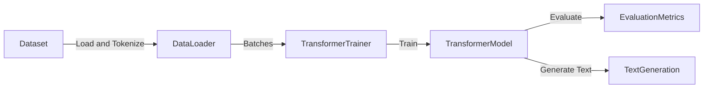

# Language Model Demo

## Purpose
Demonstrates training and evaluating a transformer-based language model, including text generation.

## Architecture



## Data Flow
- **Dataset**: Text data loaded and tokenized
- **DataLoader**: Batches data for efficient training
- **Trainer**: Conducts training and manages model updates
- **Transformer Model**: Applies attention and positional embeddings to learn text patterns
- **Evaluation Metrics**: Measures model performance using perplexity
- **Text Generation**: Demonstrates model predictions and text sampling

## Configurations
| Component         | Configuration                                |
|-------------------|----------------------------------------------|
| **Dataset**       | Custom text corpus, tokenized with BPE       |
| **Vocabulary Size**| Typically 8,000 or 32,000 tokens             |
| **Model Parameters**| Layers=6, Heads=8, Hidden Size=512, FFN=2048|
| **Tokenizer**     | Byte-Pair Encoding (BPE)                     |
| **Trainer**       | TransformerTrainer, LR Scheduler with Warmup |
| **Metrics**       | Perplexity, Accuracy                         |

## Configuration and Running Instructions

### Step 1: Set up environment
```shell
pip install -r requirements.txt
```

### Step 2: Configure training parameters in `configs/language_model_config.json`
```json
{
    "vocab_size": 8000,
    "num_layers": 6,
    "num_heads": 8,
    "hidden_dim": 512,
    "ffn_dim": 2048,
    "batch_size": 32,
    "learning_rate": 1e-4,
    "warmup_steps": 4000,
    "max_epochs": 10
}
```

### Step 3: Run the demo
```shell
python demos/language_model_demo.py
```

### Step 4: Inspect evaluation and generated text
Results are logged in `models/language_model/logs`.
