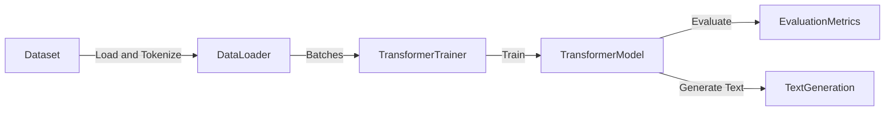

# Language Model Demo

## Purpose
Demonstrates training and evaluating a transformer-based language model, including text generation.

## Architecture



## Data Flow
- **Dataset**: Text data loaded and tokenized
- **DataLoader**: Batches data for efficient training
- **Trainer**: Conducts training and manages model updates
- **Transformer Model**: Applies attention and positional embeddings to learn text patterns
- **Evaluation Metrics**: Measures model performance using perplexity
- **Text Generation**: Demonstrates model predictions and text sampling

## Configurations
| Component         | Configuration                                |
|-------------------|----------------------------------------------|
| **Dataset**       | Custom text corpus, tokenized with BPE       |
| **Vocabulary Size**| Typically 8,000 or 32,000 tokens             |
| **Model Parameters**| Layers=6, Heads=8, Hidden Size=512, FFN=2048|
| **Tokenizer**     | Byte-Pair Encoding (BPE)                     |
| **Trainer**       | TransformerTrainer, LR Scheduler with Warmup |
| **Metrics**       | Perplexity, Accuracy                         |

## Configuration and Running Instructions

### Step 1: Set up environment
```shell
pip install -r requirements.txt
```

### Step 2: Configure training parameters in `configs/language_model_config.json`
```json
{
    "vocab_size": 8000,
    "num_layers": 6,
    "num_heads": 8,
    "hidden_dim": 512,
    "ffn_dim": 2048,
    "batch_size": 32,
    "learning_rate": 1e-4,
    "warmup_steps": 4000,
    "max_epochs": 10
}
```

### Step 3: Run the demo
```shell
python demos/language_model_demo.py
```

### Step 4: Inspect evaluation and generated text
Results are logged in `models/language_model/logs`.


---

## Extended Dataset & Tokenizer Details

### Dataset and DataLoader
- `MultimodalDataset`: Organizes multimodal data (text tokens, images, etc.).
- PyTorch DataLoader compatible.

**Example Initialization:**
```python
from torch.utils.data import DataLoader
from src.data.dataloader import MultimodalDataset

data_dict = {
    'text': tokenized_text_tensor,
    'images': image_tensor
}

dataset = MultimodalDataset(data_dict)
loader = DataLoader(dataset, batch_size=32, shuffle=True)
```

### Preprocessing
- Methods: StandardScaler (zero mean, unit variance), MinMaxScaler.
- Easy integration with model pipelines.

**Example:**
```python
from src.data.preprocessing import DataPreprocessor

preprocessor = DataPreprocessor(method='standard')
scaled_data = preprocessor.fit_transform(raw_data)
```

### Tokenizer (BPE)
- Byte Pair Encoding tokenizer for robust subword segmentation.
- Vocabulary size typically 8,000 or 32,000 tokens.

**Initialization and Usage Example:**
```python
from src.data.tokenization.bpe_tokenizer import BPETokenizer

tokenizer = BPETokenizer(vocab_size=8000)
tokenizer.train(corpus)
tokens = tokenizer.encode("Example text for BPE tokenizer.")
```

### Vocabulary
- Manages token-index mappings efficiently.
- Special tokens included (`<pad>`, `<unk>`, `<sos>`, `<eos>`).

**Usage Example:**
```python
from src.data.tokenization.vocabulary import Vocabulary

tokens = ["this", "is", "a", "test"]
vocab = Vocabulary(tokens)
index = vocab.token_to_idx("test")
token = vocab.idx_to_token(index)
```

### Text Preprocessing
- Unicode normalization and text cleaning (lowercasing, removing accents, special characters).

**Example Usage:**
```python
from src.data.tokenization.preprocessing import clean_text

raw_text = "Café & crème brûlée!"
cleaned_text = clean_text(raw_text, lower=True, remove_accents=True)
# Output: "cafe & creme brulee!"
```
