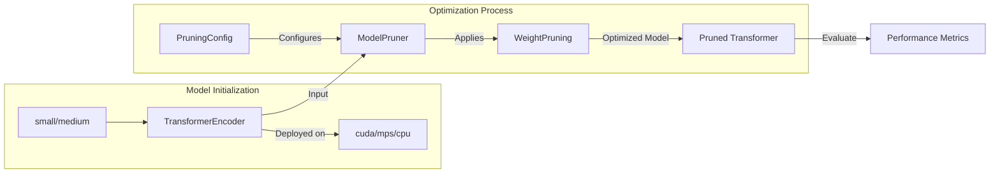

# Model Optimization Demo

## Purpose

This demo illustrates techniques for optimizing Transformer models, particularly focusing on weight pruning for performance and efficiency enhancement.

## Detailed Architecture



## Data Flow Explained

- **Transformer Encoder:** Initializes Transformer models (configurable small or medium sizes) with standard parameters like vocabulary size, embedding dimensions, attention heads, and positional encoding.
- **Model Pruner:** Conducts weight pruning based on specified configurations to reduce model complexity.
- **Performance Evaluation:** Assesses the performance and efficiency of the pruned model.

## Component Configurations

### TransformerEncoder

Two model configurations:

- **Small:**
  - Vocab size: 10,000
  - Embedding dimension (d_model): 128
  - Attention Heads: 4
  - Layers: 2
  - Feed-Forward Dimension (d_ff): 512
- **Medium:**
  - Vocab size: 30,000
  - Embedding dimension (d_model): 512
  - Attention Heads: 8
  - Layers: 4
  - Feed-Forward Dimension (d_ff): 1024

Example Initialization:

```python
model = TransformerEncoder(
    vocab_size=30000,
    d_model=512,
    num_heads=8,
    num_layers=4,
    d_ff=1024,
    dropout=0.1,
    max_seq_length=256,
    positional_encoding="sinusoidal"
)
```

### Device Setup

- Automatically selects best available device (CUDA, MPS, or CPU).

```python
device = get_device()
model.to(device)
```

### Model Pruning (ModelPruner)

- Implements magnitude-based weight pruning to remove less impactful weights.
- Pruning Configuration (`PruningConfig`):
  - Sparsity Level: Configurable (default ~50%)
  - Pruning Method: Direct magnitude-based pruning

Example setup:

```python
pruning_config = PruningConfig(
    method="magnitude",
    sparsity=0.5
)
pruner = ModelPruner(pruning_config)
pruned_model = pruner.prune(model)
```

## Running Instructions

### Step 1: Environment setup

```shell
pip install -r requirements.txt
```

### Step 2: Execute optimization demo

```shell
python demos/model_optimization_demo.py --size medium
```

### Step 3: Evaluate performance

Output will display:

- Model parameter count
- Pruning effectiveness
- Performance metrics post-optimization

## Extensibility

- Easily extendable for various pruning methods or model architectures by adjusting the `PruningConfig` or model initialization.

Example:

```python
pruning_config = PruningConfig(method="structured", sparsity=0.3)
```

## Integration

- Designed for smooth integration into Transformer model workflows, aiding in efficient model deployment and inference optimization.