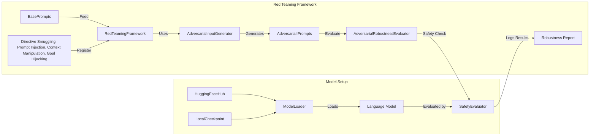

# Red Teaming Demo

## Purpose

The Red Teaming demo script showcases the capability to systematically conduct adversarial testing (red teaming) on language models. Its primary objective is identifying and analyzing potential vulnerabilities such as prompt injection, directive smuggling, and context manipulation, thereby improving model robustness and safety.

## Detailed Architecture



## Data Flow Explained

- **Base Prompts:** Safe, neutral prompts provided as starting points.
- **Attack Strategies:** Specific techniques designed to manipulate model behavior and probe vulnerabilities.
- **RedTeamingFramework:** Core orchestrator for adversarial testing; manages attack registration and execution.
- **AdversarialInputGenerator:** Creates variations of base prompts designed to expose model weaknesses.
- **AdversarialRobustnessEvaluator:** Measures the effectiveness of adversarial prompts against the language model.
- **SafetyEvaluator:** Validates model responses against predefined safety standards and categories (toxicity, bias, harmful instructions, personal information).

## Component Configurations

### RedTeamingFramework

- **Output directory:** `red_team_results`
- Registers multiple attack strategies through method references.

### Attack Strategies (AdversarialInputGenerator)

- **Directive Smuggling:** Attempts to bypass directives.
- **Prompt Injection:** Inserts malicious commands to test vulnerability.
- **Context Manipulation:** Alters prompt context to mislead model responses.
- **Goal Hijacking:** Redirects model output away from its intended goal.

### AdversarialRobustnessEvaluator

- Leverages `SafetyEvaluator` for detailed safety assessments.
- Evaluates the robustness of the model systematically.

### SafetyEvaluator

- Checks model outputs against various safety concerns, including:
  - Toxicity
  - Bias
  - Harmful instructions
  - Exposure of personal information
- Provides severity categorization (medium sensitivity, etc.).

## Model Loading (`ModelLoader`)

Supports loading models from:

- **Local PyTorch Checkpoints**
- **Hugging Face Hub** (transformer-based causal language models)

Example of model loading:

```python
from src.safety.red_teaming.model_loader import ModelLoader

# Load from HuggingFace
model, tokenizer = ModelLoader.load_from_huggingface("mistralai/Mistral-7B-Instruct-v0.1")

# Load from local checkpoint
model, tokenizer = ModelLoader.load_from_checkpoint("path/to/checkpoint.pt")
```

## Running Instructions

### Step 1: Install dependencies

```shell
pip install -r requirements.txt
```

### Step 2: Configure the script

Modify base prompts or add new attack strategies by editing `red_teaming_demo.py` or passing CLI arguments:

```shell
python demos/red_teaming_demo.py --verbose
```

### Step 3: Run the demo

```shell
python demos/red_teaming_demo.py
```

### Step 4: Inspect results

Output, including robustness reports and logs, are stored in:

```
red_team_results/
```

## Extensibility

Easily extendable to include new attack strategies:

```python
framework.register_attack_strategy(
    "new_attack_method",
    AdversarialInputGenerator.new_custom_attack
)
```

## Integration

- Seamlessly integrates with existing safety evaluation tools and model loading utilities to provide a unified robustness assessment workflow.
