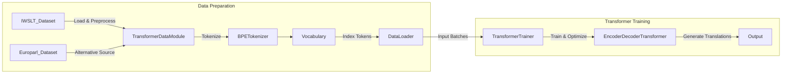

# Translation Demo

## Purpose

This script demonstrates the training and evaluation of a Transformer-based translation model, specifically for tasks like English-to-German translation using standard translation datasets such as IWSLT and Europarl.

## Detailed Architecture



## Data Flow Explained

- **Datasets (IWSLT, Europarl):** Provide parallel text for source-target language pairs.
- **DataModule:** Manages dataset splitting, loading, and preprocessing.
- **BPETokenizer & Vocabulary:** Byte-Pair Encoding for subword segmentation, creating consistent mappings between text and indices.
- **DataLoader:** Prepares data batches, applying masks (padding, causal) for Transformer compatibility.
- **TransformerTrainer:** Conducts model training, validation, and optimization processes.
- **EncoderDecoderTransformer:** Core model applying attention mechanisms for sequence-to-sequence translation tasks.

## Component Configurations

### Dataset (`IWSLTDataset` & `EuroparlDataset`)

- Languages: Configurable (default: English→German)
- Year: Configurable dataset version (default: 2017 for IWSLT)
- Splits: train, valid, test
- Data Path: `data/iwslt`, `data/europarl`

Example initialization:

```python
dataset = IWSLTDataset(src_lang="en", tgt_lang="de", split="train")
```

### Tokenization

- **Tokenizer:** Byte-Pair Encoding (`BPETokenizer`)
- **Vocabulary:** Custom `Vocabulary` class to handle token-to-index mappings.
- Vocabulary Size: Typically between 8,000 and 32,000 tokens.

Tokenizer example:

```python
tokenizer = BPETokenizer(vocab_size=8000)
tokenizer.train(dataset.src_data + dataset.tgt_data)
```

### Transformer Model (`EncoderDecoderTransformer`)

- Layers: Configurable (default 6 encoder, 6 decoder)
- Attention Heads: 8 per layer
- Hidden Dimension: 512
- Feed-Forward Dimension: 2048

Model initialization example:

```python
model = EncoderDecoderTransformer(
    num_encoder_layers=6,
    num_decoder_layers=6,
    num_heads=8,
    hidden_dim=512,
    ffn_dim=2048
)
```

### Training (`TransformerTrainer`)

- Optimizer: Adam
- Learning Rate: Configurable (default `1e-4`)
- Scheduler: Learning rate warmup and decay
- Batch Size: Configurable (default `32`)

Example training setup:

```python
trainer = TransformerTrainer(model=model, learning_rate=1e-4)
trainer.train(data_loader, epochs=10)
```

## Running Instructions

### Step 1: Environment setup

```shell
pip install -r requirements.txt
```

### Step 2: Dataset preparation

Data downloads automatically:

```shell
python demos/translation_example.py
```

### Step 3: Execute translation training demo

```shell
python demos/translation_example.py
```

### Step 4: Results

Generated translations and training logs will be output and can be assessed directly through the logs or saved model checkpoints.

## Extensibility

Easily adaptable for other language pairs or additional datasets:

```python
dataset = EuroparlDataset(src_lang="fr", tgt_lang="en")
```

## Integration

- Fully compatible with existing `src` modules (data loading, tokenization, model training utilities), offering straightforward scalability for various translation tasks.