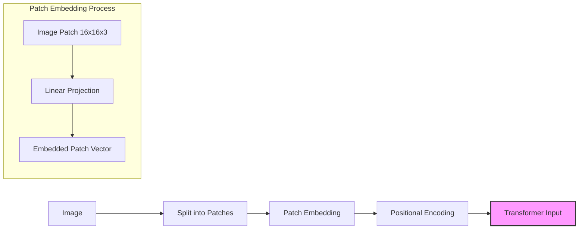

# Image Processing Foundation: Comprehensive Guide

This guide covers the essential theoretical concepts for image processing in deep learning, building the foundation for extending your transformer model to handle visual data as you begin the Multimodal Extension Phase of your project.

## 1. Image Representation for Deep Learning

### What It Is
Images in deep learning are represented as multi-dimensional tensors. A standard color image is typically represented as a 3D tensor with dimensions (height × width × channels), where channels usually represent the RGB color components. For batched processing, this becomes a 4D tensor (batch_size × height × width × channels), though some frameworks like PyTorch use (batch_size × channels × height × width) format.

### How It's Used
In your project, you'll need to add image representation handling to your existing transformer architecture:

```python
# Example image representation in your project
class ImageProcessor:
    """Handles image loading, preprocessing, and conversion to tensors."""
    
    def __init__(self, image_size=(224, 224), normalize=True, 
                 mean=[0.485, 0.456, 0.406], std=[0.229, 0.224, 0.225]):
        self.image_size = image_size
        self.normalize = normalize
        self.mean = mean
        self.std = std
        
        # Define image transformations
        self.transforms = [
            transforms.Resize(image_size),
            transforms.ToTensor(),
        ]
        
        if normalize:
            self.transforms.append(transforms.Normalize(mean=mean, std=std))
        
        self.transform_pipeline = transforms.Compose(self.transforms)
    
    def preprocess(self, image_path_or_tensor):
        """Convert an image to tensor representation."""
        if isinstance(image_path_or_tensor, str):
            # Load image from path
            try:
                image = Image.open(image_path_or_tensor).convert('RGB')
            except Exception as e:
                raise ValueError(f"Error loading image: {e}")
        elif isinstance(image_path_or_tensor, torch.Tensor):
            # Already a tensor, but verify format
            if image_path_or_tensor.ndim not in [3, 4]:
                raise ValueError(f"Expected image tensor with 3 or 4 dimensions, got {image_path_or_tensor.ndim}")
            return image_path_or_tensor
        elif isinstance(image_path_or_tensor, Image.Image):
            # Already a PIL image
            image = image_path_or_tensor
        else:
            raise TypeError(f"Unsupported input type: {type(image_path_or_tensor)}")
            
        # Apply transformations
        tensor = self.transform_pipeline(image)
        return tensor
    
    def batch_process(self, image_paths):
        """Process a batch of images into a single tensor."""
        tensors = [self.preprocess(path) for path in image_paths]
        return torch.stack(tensors)
```

### Why It's Important
Understanding image representation is foundational for working with visual data. The way images are represented affects every part of model design from preprocessing to architecture choices. For multimodal systems like those at Anthropic, properly handling image representations ensures visual information can be effectively processed alongside text. The consistent representation of images as tensors also enables the use of efficient batch processing and GPU acceleration.


## 2. Convolutional Neural Networks (CNNs)

### What It Is
Convolutional Neural Networks are specialized neural networks designed for processing grid-like data such as images. They use convolutional layers that apply filters (kernels) across the input, capturing spatial relationships through local connectivity and parameter sharing. Key components include:

- **Convolutional layers**: Apply learned filters to input features
- **Pooling layers**: Downsample feature maps to reduce dimensionality
- **Activation functions**: Introduce non-linearity (ReLU is common)
- **Batch normalization**: Stabilizes training by normalizing activations

### How It's Used
While your project focuses on transformers, CNNs can provide valuable feature extraction for images before passing to transformer blocks:

```python
# A simple CNN feature extractor for your project
class CNNFeatureExtractor(nn.Module):
    """Extracts features from images using a CNN backbone."""
    
    def __init__(self, output_dim=512):
        super().__init__()
        # Define a simple CNN backbone
        self.features = nn.Sequential(
            # Conv block 1
            nn.Conv2d(3, 64, kernel_size=3, padding=1),
            nn.BatchNorm2d(64),
            nn.ReLU(inplace=True),
            nn.MaxPool2d(kernel_size=2),
            
            # Conv block 2
            nn.Conv2d(64, 128, kernel_size=3, padding=1),
            nn.BatchNorm2d(128),
            nn.ReLU(inplace=True),
            nn.MaxPool2d(kernel_size=2),
            
            # Conv block 3
            nn.Conv2d(128, 256, kernel_size=3, padding=1),
            nn.BatchNorm2d(256),
            nn.ReLU(inplace=True),
            nn.MaxPool2d(kernel_size=2),
            
            # Conv block 4
            nn.Conv2d(256, 512, kernel_size=3, padding=1),
            nn.BatchNorm2d(512),
            nn.ReLU(inplace=True),
            nn.AdaptiveAvgPool2d((1, 1))  # Global average pooling
        )
        
        # Projection layer to get desired output dimension
        self.projection = nn.Linear(512, output_dim)
        
    def forward(self, x):
        # Extract features using CNN
        x = self.features(x)  # Shape: [batch_size, 512, 1, 1]
        x = x.view(x.size(0), -1)  # Flatten: [batch_size, 512]
        x = self.projection(x)  # Project to desired dimension
        return x
```

### Why It's Important
While transformers have shown impressive results in vision tasks, CNNs remain important for their efficiency in capturing local patterns and hierarchical features in images. They can be used as feature extractors before transformer layers or in hybrid architectures. For Anthropic's multimodal systems, CNNs provide a computationally efficient way to process visual information before integrating it with language understanding. Understanding CNNs helps you make informed decisions about the trade-offs between different vision backbone architectures.


## 3. Vision Transformers (ViT)

### What It Is
Vision Transformers (ViT) adapt the transformer architecture for image processing by:
1. Splitting images into patches (like tokens in text)
2. Linearly embedding these patches
3. Adding positional embeddings
4. Processing through standard transformer encoder blocks

This approach treats image understanding as a sequence modeling problem, similar to text, which makes it particularly suitable for multimodal integration.

### How It's Used
Here's how you might implement the core components of a Vision Transformer for your project:

```python
class VisionTransformer(nn.Module):
    """Implements Vision Transformer for image processing."""
    
    def __init__(self, img_size=224, patch_size=16, in_channels=3, 
                 embed_dim=768, depth=12, num_heads=12, mlp_ratio=4.0,
                 dropout=0.1, attn_dropout=0.0):
        super().__init__()
        # Calculate number of patches
        self.patch_size = patch_size
        num_patches = (img_size // patch_size) ** 2
        
        # Patch embedding layer (similar to token embedding in NLP)
        self.patch_embed = nn.Conv2d(
            in_channels, embed_dim, 
            kernel_size=patch_size, stride=patch_size
        )
        
        # Class token and positional embeddings
        self.cls_token = nn.Parameter(torch.zeros(1, 1, embed_dim))
        self.pos_embed = nn.Parameter(torch.zeros(1, num_patches + 1, embed_dim))
        
        # Transformer encoder blocks
        encoder_layers = nn.TransformerEncoderLayer(
            d_model=embed_dim,
            nhead=num_heads,
            dim_feedforward=int(embed_dim * mlp_ratio),
            dropout=dropout,
            activation='gelu'
        )
        self.transformer = nn.TransformerEncoder(
            encoder_layers, num_layers=depth
        )
        
        # Layer normalization and projection
        self.norm = nn.LayerNorm(embed_dim)
        
        # Initialize weights
        self._init_weights()
        
    def _init_weights(self):
        # Initialize patch embedding
        nn.init.xavier_uniform_(self.patch_embed.weight)
        
        # Initialize positional embedding
        nn.init.trunc_normal_(self.pos_embed, std=0.02)
        nn.init.trunc_normal_(self.cls_token, std=0.02)
    
    def forward(self, x):
        # Create patches and embed
        B, C, H, W = x.shape
        x = self.patch_embed(x)  # [B, embed_dim, H//patch_size, W//patch_size]
        x = x.flatten(2).transpose(1, 2)  # [B, num_patches, embed_dim]
        
        # Add class token
        cls_tokens = self.cls_token.expand(B, -1, -1)
        x = torch.cat((cls_tokens, x), dim=1)  # [B, 1+num_patches, embed_dim]
        
        # Add positional embedding
        x = x + self.pos_embed
        
        # Apply transformer blocks
        x = self.transformer(x)
        
        # Apply layer norm
        x = self.norm(x)
        
        # Extract class token as image representation
        cls_output = x[:, 0]  # [B, embed_dim]
        
        return cls_output
```

### Why It's Important
Vision Transformers are crucial for your project as they:
1. Use the same core architecture as your language transformer, enabling unified processing
2. Provide strong performance on vision tasks while maintaining architectural consistency
3. Make cross-modal attention more natural as both modalities use the same operating principles
4. Align with Anthropic's likely approach to multimodal processing in Claude

The patch-based approach creates a direct parallel between image "tokens" (patches) and text tokens, making multimodal integration more straightforward. This is a key step toward building a unified architecture for your MultiModal Insight Engine.


## 4. Image Preprocessing and Augmentation

### What It Is
Image preprocessing and augmentation involve transforming raw images to make them more suitable for model training. This includes operations like:
- **Resizing**: Standardizing image dimensions for batch processing
- **Normalization**: Scaling pixel values, typically to mean=0, std=1
- **Augmentation**: Creating variations (rotations, flips, color shifts) to improve model robustness
- **Cropping/Padding**: Handling aspect ratio differences

Augmentation helps prevent overfitting by artificially expanding the dataset with reasonable variations.

### How It's Used
Here's an example of how you might implement preprocessing and augmentation for your project:

```python
class ImagePreprocessor:
    """Handles image preprocessing and augmentation for training and inference."""
    
    def __init__(self, image_size=224, mean=[0.485, 0.456, 0.406], 
                 std=[0.229, 0.224, 0.225], augment=True):
        self.image_size = image_size
        self.mean = mean
        self.std = std
        
        # Define training transforms with augmentation
        if augment:
            self.train_transforms = transforms.Compose([
                transforms.RandomResizedCrop(image_size),
                transforms.RandomHorizontalFlip(),
                transforms.ColorJitter(brightness=0.2, contrast=0.2, saturation=0.2),
                transforms.RandomAffine(degrees=15, translate=(0.1, 0.1)),
                transforms.ToTensor(),
                transforms.Normalize(mean=mean, std=std)
            ])
        else:
            # Minimal transforms for training if augmentation is disabled
            self.train_transforms = transforms.Compose([
                transforms.Resize((image_size, image_size)),
                transforms.ToTensor(),
                transforms.Normalize(mean=mean, std=std)
            ])
            
        # Inference transforms (no augmentation)
        self.val_transforms = transforms.Compose([
            transforms.Resize((image_size, image_size)),
            transforms.ToTensor(),
            transforms.Normalize(mean=mean, std=std)
        ])
    
    def preprocess_for_training(self, image):
        """Apply training transforms with augmentation."""
        return self.train_transforms(image)
    
    def preprocess_for_inference(self, image):
        """Apply inference transforms without augmentation."""
        return self.val_transforms(image)
    
    def batch_process(self, images, is_training=False):
        """Process a batch of images with appropriate transforms."""
        transform_fn = self.preprocess_for_training if is_training else self.preprocess_for_inference
        return torch.stack([transform_fn(img) for img in images])
```

### Why It's Important
Proper preprocessing and augmentation are essential for training effective vision models:
1. **Normalization** ensures stable gradients during training
2. **Augmentation** significantly improves generalization by exposing the model to variations
3. **Consistent sizing** is necessary for batch processing

For multimodal systems like Claude, proper preprocessing ensures images are handled consistently and can be reliably integrated with text information. In real-world applications, robust preprocessing helps models handle the variability of user-uploaded images.


## 5. Image Embeddings

### What It Is
Image embeddings are dense vector representations of images that capture their semantic content. In the context of vision transformers and multimodal systems, there are several key approaches:

1. **Patch Embeddings**: Linear projections of image patches
2. **Global Image Embeddings**: Single vectors representing an entire image (e.g., CLS token)
3. **Local Feature Embeddings**: Sets of vectors representing different regions/features of an image
4. **Joint Text-Image Embeddings**: Vectors in a shared semantic space with text (e.g., CLIP)

### How It's Used
Here's how you might implement patch embeddings for your vision transformer:

```python
class PatchEmbedding(nn.Module):
    """Creates patch embeddings for Vision Transformers."""
    
    def __init__(self, img_size=224, patch_size=16, in_channels=3, embed_dim=768):
        super().__init__()
        self.img_size = img_size
        self.patch_size = patch_size
        self.num_patches = (img_size // patch_size) ** 2
        
        # Create patch embedding layer (linear projection of patches)
        self.projection = nn.Conv2d(
            in_channels, embed_dim,
            kernel_size=patch_size, stride=patch_size
        )
    
    def forward(self, x):
        """Convert image to patch embeddings.
        
        Args:
            x: Image tensor of shape [B, C, H, W]
            
        Returns:
            Patch embeddings of shape [B, num_patches, embed_dim]
        """
        B, C, H, W = x.shape
        assert H == W == self.img_size, f"Input image size ({H}*{W}) doesn't match expected size ({self.img_size}*{self.img_size})"
        
        # Project patches and reshape
        x = self.projection(x)  # [B, embed_dim, H//patch_size, W//patch_size]
        x = x.flatten(2)  # [B, embed_dim, num_patches]
        x = x.transpose(1, 2)  # [B, num_patches, embed_dim]
        
        return x
```

### Why It's Important
Image embeddings are the bridge between visual input and your transformer architecture. They convert raw images into a representation that can be processed alongside or integrated with text. Choosing the right embedding approach is crucial for effective multimodal integration. 

For Anthropic's multimodal systems, sophisticated image embeddings likely enable Claude to reason about visual content in relation to text. Understanding these embeddings is essential for your project's evolution from language-only to multimodal capabilities.



## 6. Self-Supervised Learning for Vision

### What It Is
Self-supervised learning (SSL) enables models to learn useful representations from unlabeled images by solving pretext tasks. Popular approaches include:

1. **Contrastive Learning** (SimCLR, MoCo): Learns by pulling similar examples (augmentations of same image) together and pushing different examples apart
2. **Masked Image Modeling** (MAE, BEiT): Predicts masked or corrupted portions of images
3. **Teacher-Student Methods** (DINO, BYOL): Uses a teacher network to provide targets for a student network

### How It's Used
Here's a simplified implementation of masked image modeling for your project:

```python
class MaskedImageModeling(nn.Module):
    """Implements Masked Image Modeling for self-supervised learning."""
    
    def __init__(self, encoder, decoder, mask_ratio=0.75):
        super().__init__()
        self.encoder = encoder  # Vision Transformer encoder
        self.decoder = decoder  # Lightweight decoder to reconstruct pixels
        self.mask_ratio = mask_ratio
        
    def random_masking(self, x, mask_ratio):
        """Randomly mask patches."""
        N, L, D = x.shape  # batch, sequence length, embedding dim
        
        # Number of patches to keep
        len_keep = int(L * (1 - mask_ratio))
        
        # Generate random noise for masking
        noise = torch.rand(N, L, device=x.device)  # noise in [0, 1]
        
        # Sort noise for each sample
        ids_shuffle = torch.argsort(noise, dim=1)  # ascend: small is keep, large is remove
        ids_restore = torch.argsort(ids_shuffle, dim=1)  # restore indices
        
        # Keep the first len_keep elements
        ids_keep = ids_shuffle[:, :len_keep]
        x_masked = torch.gather(x, dim=1, index=ids_keep.unsqueeze(-1).repeat(1, 1, D))
        
        # Generate the mask
        mask = torch.ones([N, L], device=x.device)
        mask[:, :len_keep] = 0
        mask = torch.gather(mask, dim=1, index=ids_restore)
        
        return x_masked, mask, ids_restore
    
    def forward(self, imgs):
        # Create patch embeddings
        patches = self.encoder.patch_embed(imgs)
        
        # Add positional embeddings
        patches = patches + self.encoder.pos_embed[:, 1:, :]
        
        # Apply masking
        patches_masked, mask, ids_restore = self.random_masking(patches, self.mask_ratio)
        
        # Pass through encoder
        latent = self.encoder.blocks(patches_masked)
        latent = self.encoder.norm(latent)
        
        # Pass through decoder to predict pixels
        pred = self.decoder(latent, ids_restore)
        
        # Calculate reconstruction loss
        loss = F.mse_loss(pred, imgs)
        
        return loss, pred, mask
```

### Why It's Important
Self-supervised learning is crucial for multimodal systems for several reasons:

1. **Data Efficiency**: Enables learning from large amounts of unlabeled images
2. **Robust Representations**: Models learn features that generalize well to downstream tasks
3. **Multimodal Alignment**: Can learn alignments between different modalities without explicit labels

For Anthropic's research, self-supervised techniques likely play a key role in developing models that understand visual content without extensive labeled data. These approaches are particularly valuable for multimodal systems where paired text-image data might be limited for certain domains or languages.


## 7. Multimodal Fusion Strategies

### What It Is
Multimodal fusion strategies determine how information from different modalities (like text and images) is combined. The main approaches include:

1. **Early Fusion**: Combining raw inputs before processing
2. **Late Fusion**: Processing modalities separately and combining the outputs
3. **Hybrid Fusion**: Combining at multiple levels throughout the network
4. **Attention-Based Fusion**: Using attention mechanisms to dynamically weight information from different modalities

### How It's Used
Here's an implementation of a cross-attention fusion module for your project:

```python
class CrossModalFusion(nn.Module):
    """Implements cross-modal fusion between text and image features."""
    
    def __init__(self, embed_dim=512, num_heads=8, dropout=0.1):
        super().__init__()
        self.embed_dim = embed_dim
        self.num_heads = num_heads
        
        # Cross-attention layer where text attends to image
        self.text_to_image_attention = nn.MultiheadAttention(
            embed_dim=embed_dim,
            num_heads=num_heads,
            dropout=dropout
        )
        
        # Cross-attention layer where image attends to text
        self.image_to_text_attention = nn.MultiheadAttention(
            embed_dim=embed_dim,
            num_heads=num_heads,
            dropout=dropout
        )
        
        # Feed-forward networks for each modality
        self.text_ffn = nn.Sequential(
            nn.Linear(embed_dim, embed_dim * 4),
            nn.GELU(),
            nn.Dropout(dropout),
            nn.Linear(embed_dim * 4, embed_dim)
        )
        
        self.image_ffn = nn.Sequential(
            nn.Linear(embed_dim, embed_dim * 4),
            nn.GELU(),
            nn.Dropout(dropout),
            nn.Linear(embed_dim * 4, embed_dim)
        )
        
        # Layer normalization
        self.norm1_text = nn.LayerNorm(embed_dim)
        self.norm2_text = nn.LayerNorm(embed_dim)
        self.norm1_image = nn.LayerNorm(embed_dim)
        self.norm2_image = nn.LayerNorm(embed_dim)
    
    def forward(self, text_features, image_features, text_mask=None, image_mask=None):
        """
        Args:
            text_features: Tensor of shape [seq_len, batch_size, embed_dim]
            image_features: Tensor of shape [num_patches, batch_size, embed_dim]
            text_mask: Attention mask for text
            image_mask: Attention mask for image
            
        Returns:
            Fused text and image features
        """
        # Text attending to image (cross-attention)
        text_norm = self.norm1_text(text_features)
        image_norm = self.norm1_image(image_features)
        
        # Text features attend to image features
        text_updated, _ = self.text_to_image_attention(
            query=text_norm,
            key=image_norm,
            value=image_norm,
            key_padding_mask=image_mask
        )
        text_features = text_features + text_updated
        
        # FFN for text
        text_norm = self.norm2_text(text_features)
        text_features = text_features + self.text_ffn(text_norm)
        
        # Image attending to text (cross-attention)
        text_norm = self.norm1_text(text_features)
        image_norm = self.norm1_image(image_features)
        
        # Image features attend to text features
        image_updated, _ = self.image_to_text_attention(
            query=image_norm,
            key=text_norm,
            value=text_norm,
            key_padding_mask=text_mask
        )
        image_features = image_features + image_updated
        
        # FFN for image
        image_norm = self.norm2_image(image_features)
        image_features = image_features + self.image_ffn(image_norm)
        
        return text_features, image_features
```

### Why It's Important
The choice of fusion strategy dramatically impacts how well a multimodal model integrates information across modalities. Effective fusion enables:

1. **Modality Interaction**: Allowing information to flow between modalities
2. **Context-Aware Processing**: Processing one modality in the context of another
3. **Dynamic Weighting**: Emphasizing the most relevant modality for a given task

For Anthropic's Claude, sophisticated fusion mechanisms likely enable it to reason about text and images in relation to each other. This capability is central to your project's goal of building a multimodal system with integrated understanding.


## 8. Cross-Modal Attention Mechanisms

### What It Is
Cross-modal attention mechanisms enable models to attend from elements in one modality (e.g., text tokens) to elements in another modality (e.g., image regions). They are a specialized form of attention where the queries come from one modality and the keys/values from another.

### How It's Used
Here's an implementation of a cross-modal attention mechanism for your project:

```python
class CrossModalAttention(nn.Module):
    """Implements cross-modal attention where one modality attends to another."""
    
    def __init__(self, query_dim, key_dim, embed_dim, num_heads=8, dropout=0.1):
        super().__init__()
        self.num_heads = num_heads
        self.embed_dim = embed_dim
        self.head_dim = embed_dim // num_heads
        assert self.head_dim * num_heads == embed_dim, "embed_dim must be divisible by num_heads"
        
        # Projection layers for queries, keys, and values
        self.query_proj = nn.Linear(query_dim, embed_dim)
        self.key_proj = nn.Linear(key_dim, embed_dim)
        self.value_proj = nn.Linear(key_dim, embed_dim)
        
        # Output projection
        self.output_proj = nn.Linear(embed_dim, query_dim)
        
        # Dropout
        self.dropout = nn.Dropout(dropout)
        
        # Scaling factor for dot product attention
        self.scale = self.head_dim ** -0.5
    
    def forward(self, query, key_value, mask=None):
        """
        Args:
            query: Tensor from first modality [batch_size, query_length, query_dim]
            key_value: Tensor from second modality [batch_size, kv_length, key_dim]
            mask: Optional attention mask [batch_size, query_length, kv_length]
            
        Returns:
            Updated query tensor with information from key_value modality
        """
        batch_size, query_length, _ = query.shape
        _, kv_length, _ = key_value.shape
        
        # Project queries, keys, and values
        queries = self.query_proj(query)  # [batch_size, query_length, embed_dim]
        keys = self.key_proj(key_value)   # [batch_size, kv_length, embed_dim]
        values = self.value_proj(key_value)  # [batch_size, kv_length, embed_dim]
        
        # Reshape for multi-head attention
        queries = queries.view(batch_size, query_length, self.num_heads, self.head_dim)
        queries = queries.permute(0, 2, 1, 3)  # [batch_size, num_heads, query_length, head_dim]
        
        keys = keys.view(batch_size, kv_length, self.num_heads, self.head_dim)
        keys = keys.permute(0, 2, 1, 3)  # [batch_size, num_heads, kv_length, head_dim]
        
        values = values.view(batch_size, kv_length, self.num_heads, self.head_dim)
        values = values.permute(0, 2, 1, 3)  # [batch_size, num_heads, kv_length, head_dim]
        
        # Compute attention scores
        attention_scores = torch.matmul(queries, keys.transpose(-2, -1))  # [batch_size, num_heads, query_length, kv_length]
        attention_scores = attention_scores * self.scale
        
        # Apply mask if provided
        if mask is not None:
            # Expand mask for multi-head attention
            expanded_mask = mask.unsqueeze(1).expand(-1, self.num_heads, -1, -1)
            attention_scores = attention_scores.masked_fill(expanded_mask == 0, float('-inf'))
        
        # Apply softmax and dropout
        attention_probs = F.softmax(attention_scores, dim=-1)
        attention_probs = self.dropout(attention_probs)
        
        # Apply attention to values
        context_layer = torch.matmul(attention_probs, values)  # [batch_size, num_heads, query_length, head_dim]
        
        # Reshape output
        context_layer = context_layer.permute(0, 2, 1, 3)  # [batch_size, query_length, num_heads, head_dim]
        context_layer = context_layer.reshape(batch_size, query_length, self.embed_dim)
        
        # Project to output dimension
        output = self.output_proj(context_layer)
        
        return output
```

### Why It's Important
Cross-modal attention is the key mechanism that enables deep integration between different modalities in your MultiModal Insight Engine. It allows:

1. **Grounding Language in Vision**: Text tokens can attend to relevant image regions
2. **Contextual Visual Processing**: Visual features can be processed in the context of language
3. **Multimodal Reasoning**: The model can combine evidence from both modalities

For Anthropic's Claude, cross-modal attention likely enables capabilities like visual question answering and image-aware text generation. These mechanisms form the foundation of truly integrated multimodal understanding rather than treating each modality in isolation.


## 9. Multimodal Architectures

### What It Is
Multimodal architectures combine multiple modalities (text, images, audio, etc.) within a single model. Several influential architectures include:

1. **CLIP**: Contrastive Language-Image Pre-training for joint understanding
2. **DALL-E**: Text-to-image generation using autoregressive transformers
3. **Flamingo**: Few-shot visual reasoning by extending language models
4. **BLIP**: Bootstrapping Language-Image Pre-training for unified vision-language understanding

### How It's Used
Here's an architectural overview for your MultiModal Insight Engine:

```python
class MultiModalTransformer(nn.Module):
    """Unified transformer architecture for multimodal understanding."""
    
    def __init__(self, text_vocab_size=30000, img_size=224, patch_size=16, 
                 embed_dim=768, depth=12, num_heads=12, mlp_ratio=4.0, 
                 dropout=0.1):
        super().__init__()
        
        # Text embedding components
        self.token_embedding = nn.Embedding(text_vocab_size, embed_dim)
        self.text_pos_embedding = nn.Parameter(torch.zeros(1, 512, embed_dim))
        
        # Image embedding components
        self.patch_embedding = PatchEmbedding(
            img_size=img_size, 
            patch_size=patch_size, 
            in_channels=3, 
            embed_dim=embed_dim
        )
        num_patches = (img_size // patch_size) ** 2
        self.img_pos_embedding = nn.Parameter(torch.zeros(1, num_patches, embed_dim))
        
        # Special tokens
        self.cls_token = nn.Parameter(torch.zeros(1, 1, embed_dim))
        
        # Modality type embeddings
        self.modality_type_embeddings = nn.Embedding(2, embed_dim)  # 0: text, 1: image
        
        # Unified transformer encoder
        encoder_layer = nn.TransformerEncoderLayer(
            d_model=embed_dim,
            nhead=num_heads,
            dim_feedforward=int(embed_dim * mlp_ratio),
            dropout=dropout,
            activation='gelu'
        )
        self.transformer = nn.TransformerEncoder(
            encoder_layer, num_layers=depth
        )
        
        # Cross-modal fusion layers
        self.fusion_layers = nn.ModuleList([
            CrossModalFusion(embed_dim=embed_dim, num_heads=num_heads, dropout=dropout)
            for _ in range(3)  # Add fusion at several layers
        ])
        
        # Output heads
        self.text_prediction_head = nn.Linear(embed_dim, text_vocab_size)
        self.image_feature_head = nn.Linear(embed_dim, embed_dim)
        
        # Layer normalization
        self.norm = nn.LayerNorm(embed_dim)
        
        # Initialize weights
        self._init_weights()
    
    def _init_weights(self):
        # Initialize embeddings
        nn.init.normal_(self.text_pos_embedding, std=0.02)
        nn.init.normal_(self.img_pos_embedding, std=0.02)
        nn.init.normal_(self.cls_token, std=0.02)
    
    def embed_text(self, text_tokens):
        """Embed text tokens with positional and type embeddings."""
        token_embeds = self.token_embedding(text_tokens)
        
        # Add positional embeddings
        seq_length = text_tokens.size(1)
        pos_embeds = self.text_pos_embedding[:, :seq_length, :]
        
        # Add modality type embedding (0 for text)
        type_embeds = self.modality_type_embeddings(
            torch.zeros_like(text_tokens)
        )
        
        # Combine embeddings
        text_embeds = token_embeds + pos_embeds + type_embeds
        return text_embeds
    
    def embed_image(self, images):
        """Embed images with patch, positional, and type embeddings."""
        # Create patch embeddings
        patch_embeds = self.patch_embedding(images)
        
        # Add positional embeddings
        pos_embeds = self.img_pos_embedding
        
        # Add modality type embedding (1 for image)
        batch_size, num_patches, _ = patch_embeds.shape
        type_embeds = self.modality_type_embeddings(
            torch.ones(batch_size, num_patches, device=images.device, dtype=torch.long)
        )
        
        # Combine embeddings
        image_embeds = patch_embeds + pos_embeds + type_embeds
        return image_embeds
    
    def forward(self, text_tokens=None, images=None):
        """Process text and/or image inputs through the multimodal transformer."""
        batch_size = text_tokens.size(0) if text_tokens is not None else images.size(0)
        
        # Prepare inputs based on available modalities
        if text_tokens is not None and images is not None:
            # Both modalities present
            text_embeds = self.embed_text(text_tokens)
            image_embeds = self.embed_image(images)
            
            # Add CLS token
            cls_tokens = self.cls_token.expand(batch_size, -1, -1)
            
            # Concatenate for unified processing
            # The order is: [CLS, text tokens, image patches]
            concat_embeds = torch.cat([cls_tokens, text_embeds, image_embeds], dim=1)
            
            # Create appropriate attention mask
            # (Allow everything to attend to everything for now)
            attn_mask = None
            
            # Pass through transformer
            outputs = self.transformer(concat_embeds, mask=attn_mask)
            
            # Apply normalization
            outputs = self.norm(outputs)
            
            # Split outputs back to modalities
            text_length = text_tokens.size(1)
            cls_output = outputs[:, 0]  # CLS token output
            text_outputs = outputs[:, 1:1+text_length]
            image_outputs = outputs[:, 1+text_length:]
            
            # Apply output heads
            text_preds = self.text_prediction_head(text_outputs)
            image_features = self.image_feature_head(image_outputs)
            
            return {
                "cls_output": cls_output,
                "text_outputs": text_outputs,
                "image_outputs": image_outputs,
                "text_predictions": text_preds,
                "image_features": image_features
            }
            
        elif text_tokens is not None:
            # Text-only processing
            text_embeds = self.embed_text(text_tokens)
            
            # Add CLS token
            cls_tokens = self.cls_token.expand(batch_size, -1, -1)
            inputs = torch.cat([cls_tokens, text_embeds], dim=1)
            
            # Process through transformer
            outputs = self.transformer(inputs)
            outputs = self.norm(outputs)
            
            # Apply text prediction head
            text_outputs = outputs[:, 1:]
            text_preds = self.text_prediction_head(text_outputs)
            
            return {
                "cls_output": outputs[:, 0],
                "text_outputs": text_outputs,
                "text_predictions": text_preds
            }
            
        elif images is not None:
            # Image-only processing
            image_embeds = self.embed_image(images)
            
            # Add CLS token
            cls_tokens = self.cls_token.expand(batch_size, -1, -1)
            inputs = torch.cat([cls_tokens, image_embeds], dim=1)
            
            # Process through transformer
            outputs = self.transformer(inputs)
            outputs = self.norm(outputs)
            
            # Apply image feature head
            image_outputs = outputs[:, 1:]
            image_features = self.image_feature_head(image_outputs)
            
            return {
                "cls_output": outputs[:, 0],
                "image_outputs": image_outputs,
                "image_features": image_features
            }
        
        else:
            raise ValueError("At least one of text_tokens or images must be provided")
```

### Why It's Important
Understanding multimodal architectures is essential for your project as it provides:

1. **Design Patterns**: Proven approaches for integrating modalities
2. **Performance Insights**: Knowledge of what works well in practice
3. **Architectural Trade-offs**: Understanding the pros and cons of different integration strategies

For Anthropic, sophisticated multimodal architectures enable Claude to process and reason about visual content alongside text. These architectures are the culmination of all the previous concepts, bringing together embedding, attention, and fusion strategies into a cohesive system.


## 10. Evaluation of Visual Systems

### What It Is
Evaluation of visual and multimodal systems involves a range of metrics and benchmarks to assess different aspects of performance:

1. **Classification Metrics**: Accuracy, precision, recall, F1 score
2. **Object Detection Metrics**: Mean Average Precision (mAP), Intersection over Union (IoU)
3. **Generation Metrics**: FID, IS for image generation quality
4. **Visual Reasoning**: Visual Question Answering (VQA) accuracy, NLVR2 
5. **Robustness Metrics**: Performance under distribution shift or adversarial attack

### How It's Used
Here's an evaluation framework for your multimodal system:

```python
class MultimodalEvaluator:
    """Evaluation suite for multimodal transformer models."""
    
    def __init__(self, model, tokenizer, device='cuda'):
        self.model = model
        self.tokenizer = tokenizer
        self.device = device
        self.model.to(device)
        self.model.eval()
    
    def evaluate_classification(self, dataloader, num_classes):
        """Evaluate image classification performance."""
        correct = 0
        total = 0
        all_preds = []
        all_labels = []
        
        with torch.no_grad():
            for batch in dataloader:
                images = batch['images'].to(self.device)
                labels = batch['labels'].to(self.device)
                
                # Forward pass
                outputs = self.model(images=images)
                cls_output = outputs['cls_output']
                
                # Get predictions
                predictions = torch.argmax(cls_output, dim=1)
                
                # Track statistics
                total += labels.size(0)
                correct += (predictions == labels).sum().item()
                
                # Store for metrics
                all_preds.extend(predictions.cpu().numpy())
                all_labels.extend(labels.cpu().numpy())
        
        # Calculate metrics
        accuracy = correct / total
        precision, recall, f1, _ = precision_recall_fscore_support(
            all_labels, all_preds, average='weighted'
        )
        
        return {
            'accuracy': accuracy,
            'precision': precision,
            'recall': recall,
            'f1': f1
        }
    
    def evaluate_vqa(self, vqa_dataloader):
        """Evaluate Visual Question Answering performance."""
        correct = 0
        total = 0
        
        with torch.no_grad():
            for batch in vqa_dataloader:
                images = batch['images'].to(self.device)
                questions = batch['questions'].to(self.device)
                answers = batch['answers']
                
                # Forward pass
                outputs = self.model(text_tokens=questions, images=images)
                predictions = outputs['text_predictions']
                
                # Decode predictions
                predicted_answers = self.decode_predictions(predictions)
                
                # Calculate accuracy (exact match)
                for pred_ans, true_ans in zip(predicted_answers, answers):
                    if pred_ans.strip().lower() == true_ans.strip().lower():
                        correct += 1
                    total += 1
        
        vqa_accuracy = correct / total
        return {'vqa_accuracy': vqa_accuracy}
    
    def evaluate_robustness(self, clean_dataloader, perturbed_dataloader):
        """Evaluate model robustness to perturbations."""
        # Evaluate on clean data
        clean_metrics = self.evaluate_classification(clean_dataloader)
        
        # Evaluate on perturbed data
        perturbed_metrics = self.evaluate_classification(perturbed_dataloader)
        
        # Calculate robustness as ratio of accuracies
        robustness = perturbed_metrics['accuracy'] / clean_metrics['accuracy']
        
        return {
            'clean_accuracy': clean_metrics['accuracy'],
            'perturbed_accuracy': perturbed_metrics['accuracy'],
            'robustness_ratio': robustness
        }
    
    def decode_predictions(self, predictions):
        """Decode token predictions to text."""
        # Get the most likely token at each position
        token_ids = torch.argmax(predictions, dim=-1)
        
        # Convert to lists
        token_ids = token_ids.cpu().numpy()
        
        # Decode each sequence
        decoded = []
        for seq in token_ids:
            # Convert to list of tokens and decode
            text = self.tokenizer.decode(seq)
            decoded.append(text)
            
        return decoded
```

### Why It's Important
Rigorous evaluation is essential for developing effective multimodal systems:

1. **Performance Measurement**: Quantifies how well the model performs on different tasks
2. **Diagnostic Insights**: Reveals strengths and weaknesses in specific capabilities
3. **Safety Assessment**: Ensures the model behaves appropriately across modalities
4. **Development Guidance**: Informs which aspects of the model need improvement

For Anthropic, comprehensive evaluation likely guides the development of Claude's multimodal capabilities, ensuring it meets high standards for accuracy, robustness, and safety. As you build your MultiModal Insight Engine, robust evaluation will help you track progress and identify areas for improvement.


## Conclusion: Building Your Image Processing Foundation

As you enter Week 5 of your project, these image processing foundations provide the groundwork for extending your transformer model to handle visual data. Each concept builds upon your existing language modeling capabilities to create a unified architecture that can process and reason about both text and images.

This phase is particularly aligned with Anthropic's approach to multimodal systems like Claude, which need to seamlessly integrate visual understanding with their existing language capabilities. By implementing these components, you're creating a strong foundation for the more advanced multimodal integration in Week 6 and beyond.

Key implementation priorities for Week 5 should be:

1. **Image Representation & Preprocessing**: Creating robust pipelines to convert images into tensor representations
2. **Vision Encoder**: Implementing either a CNN or Vision Transformer for processing images
3. **Image Embeddings**: Developing patch-based or feature-based embeddings for visual content
4. **Architectural Planning**: Designing how the vision components will integrate with your existing transformer

With these foundations in place, your MultiModal Insight Engine will be prepared for the deeper integration challenges of the coming weeks, putting you on track for building a comprehensive system aligned with Anthropic's multimodal research direction.
