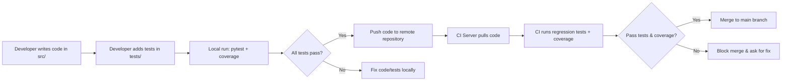

## 2) Documentation: Testing Infrastructure & Usage

### Overview

The testing infrastructure relies primarily on **PyTest** with coverage measurement, providing:

- **Unit Tests** (fast checks of individual classes/functions).
- **Integration Tests** (multiple modules working together).
- **Automated Regression Tests** (run before merging to main, ensuring no code breaks existing functionality).
- **Coverage Enforcement** (no untested modules slip through).
- **Machine-Readable Reports** (for CI dashboards).

### Architecture



1. **Local Testing**
   - Developers create or modify functionality in `src/`.
   - They add or update corresponding test files in `tests/` to ensure coverage.
   - They run `pytest` (with coverage) locally to confirm correctness.
2. **Continuous Integration**
   - On pushing to a feature branch or opening a pull request, the CI server checks out the code.
   - The CI pipeline runs the same `pytest` command (optionally with extra flags to generate JUnit XML or JSON reports).
   - The pipeline fails if any test fails or coverage is below the configured threshold, preventing the merge.

### Implementation Details

- **PyTest Structure**

  - Each major module in `src/` gets a corresponding `test_*.py` in `tests/`.

  - Tests typically follow a pattern:

    ```python
    def test_some_functionality():
        # setup
        # call function from src
        # assert expected results
    ```

  - Use fixtures (`@pytest.fixture`) to share setup code across multiple tests if needed.

- **Coverage Configuration** (`.coveragerc`)

  - Indicate which paths to include (e.g., `src/`) and exclude (e.g., `tests/`, `demos/`):

    ```
    [run]
    source = src
    omit =
        */__init__.py
        */tests/*
        */demos/*
    ```

  - Set thresholds with the plugin or in CI arguments (e.g., `--cov-fail-under=50` for an overall 50% coverage target initially).

- **Reporting**

  - For JUnit XML (recognized by most CI systems):

    ```bash
    pytest --junitxml=test_results.xml --cov=src --cov-report=xml
    ```

  - For JSON (using a plugin like `pytest-json-report`):

    ```bash
    pytest --json-report --json-report-file=report.json
    ```

- **Regression Script**

  - A single file or shell script (e.g., `run_tests.sh` or `scripts/run_ci_tests.sh`) containing:

    ```bash
    #!/usr/bin/env bash
    set -e  # fail on error
    
    # Install dependencies if needed
    # pip install -r requirements.txt
    
    # Run tests with coverage + fail under threshold
    pytest --cov=src --cov-report=term-missing --cov-fail-under=XX \
           --junitxml=reports/results.xml
    ```

  - Called automatically by CI and also used by devs locally.

### Maintenance & Usage

- **Maintenance**
  - Update your `.coveragerc` whenever you add or reorganize submodules.
  - Keep test data minimal: rely on small, synthetic examples so tests run quickly.
  - If you add or refactor major functionality, create/adjust test files accordingly.
  - Revisit coverage thresholds periodically as you improve or expand coverage.
- **Usage**
  - **Local**: run `pytest` in the project root. Optionally add coverage or other flags.
  - **CI**: set up your chosen CI tool (GitHub Actions, GitLab CI, Jenkins, etc.) to execute `pytest --cov=src` plus your chosen coverage thresholds and output formats.
  - Ensure the pipeline blocks merges to main if any tests fail or coverage is inadequate.

This approach ensures a clean, consistent testing environment that enforces code quality and prevents regressions.

