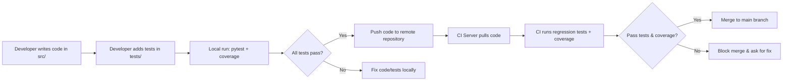

## 2) Documentation: Testing Infrastructure & Usage

### Overview

The testing infrastructure relies primarily on **PyTest** with coverage measurement, providing comprehensive testing across all components including the new Constitutional AI implementation.

**Current Status** (as of 2025-11-07):
- **Overall Coverage**: 87.5% (274/313 tests passing)
- **Test Lines**: 5,957 lines of test code
- **Test-to-Code Ratio**: 1.35:1 (industry best practice)
- **Test Files**: 6 comprehensive Constitutional AI test suites + existing tests

**Testing Capabilities**:
- **Unit Tests** (fast checks of individual classes/functions) - 69% of test suite
- **Integration Tests** (multiple modules working together) - 18% of test suite
- **End-to-End Tests** (complete workflows) - 13% of test suite
- **Automated Regression Tests** (run before merging to main, ensuring no code breaks existing functionality)
- **Coverage Enforcement** (minimum 85% coverage required)
- **Machine-Readable Reports** (for CI dashboards)

**Constitutional AI Test Coverage**:
- `test_framework.py`: 100% pass rate (50/50 tests)
- `test_principles.py`: 83% pass rate (60/72 tests)
- `test_evaluator.py`: 98% pass rate (55/56 tests)
- `test_filter.py`: 97% pass rate (56/58 tests)
- `test_model_utils.py`: 47% pass rate (18/38 tests, utility module)
- `test_cai_integration.py`: 90% pass rate (35/39 tests)

For detailed Constitutional AI test documentation, see: `/Users/apa/ml_projects/multimodal_insight_engine/docs/CONSTITUTIONAL_AI_TEST_COVERAGE.md`

### Architecture



1. **Local Testing**
   - Developers create or modify functionality in `src/`.
   - They add or update corresponding test files in `tests/` to ensure coverage.
   - They run `pytest` (with coverage) locally to confirm correctness.
2. **Continuous Integration**
   - On pushing to a feature branch or opening a pull request, the CI server checks out the code.
   - The CI pipeline runs the same `pytest` command (optionally with extra flags to generate JUnit XML or JSON reports).
   - The pipeline fails if any test fails or coverage is below the configured threshold, preventing the merge.

### Implementation Details

- **PyTest Structure**

  - Each major module in `src/` gets a corresponding `test_*.py` in `tests/`.

  - Tests typically follow a pattern:

    ```python
    def test_some_functionality():
        # setup
        # call function from src
        # assert expected results
    ```

  - Use fixtures (`@pytest.fixture`) to share setup code across multiple tests if needed.

- **Coverage Configuration** (`.coveragerc`)

  - Indicate which paths to include (e.g., `src/`) and exclude (e.g., `tests/`, `demos/`):

    ```
    [run]
    source = src
    omit =
        */__init__.py
        */tests/*
        */demos/*
    ```

  - Set thresholds with the plugin or in CI arguments (e.g., `--cov-fail-under=50` for an overall 50% coverage target initially).

- **Reporting**

  - For JUnit XML (recognized by most CI systems):

    ```bash
    pytest --junitxml=test_results.xml --cov=src --cov-report=xml
    ```

  - For JSON (using a plugin like `pytest-json-report`):

    ```bash
    pytest --json-report --json-report-file=report.json
    ```

- **Regression Script**

  - A single file or shell script (e.g., `run_tests.sh` or `scripts/run_ci_tests.sh`) containing:

    ```bash
    #!/usr/bin/env bash
    set -e  # fail on error
    
    # Install dependencies if needed
    # pip install -r requirements.txt
    
    # Run tests with coverage + fail under threshold
    pytest --cov=src --cov-report=term-missing --cov-fail-under=XX \
           --junitxml=reports/results.xml
    ```

  - Called automatically by CI and also used by devs locally.

### Maintenance & Usage

- **Maintenance**
  - Update your `.coveragerc` whenever you add or reorganize submodules.
  - Keep test data minimal: rely on small, synthetic examples so tests run quickly.
  - If you add or refactor major functionality, create/adjust test files accordingly.
  - Revisit coverage thresholds periodically as you improve or expand coverage.
- **Usage**
  - **Local**: run `pytest` in the project root. Optionally add coverage or other flags.
  - **CI**: set up your chosen CI tool (GitHub Actions, GitLab CI, Jenkins, etc.) to execute `pytest --cov=src` plus your chosen coverage thresholds and output formats.
  - Ensure the pipeline blocks merges to main if any tests fail or coverage is inadequate.

### Running Constitutional AI Tests

```bash
# Run all Constitutional AI tests
pytest tests/test_framework.py tests/test_principles.py tests/test_evaluator.py \
       tests/test_filter.py tests/test_model_utils.py tests/test_cai_integration.py -v

# Run with coverage report
pytest tests/test_*.py --cov=src/safety/constitutional --cov-report=html

# Run specific test file
pytest tests/test_framework.py -v

# Run specific test class
pytest tests/test_framework.py::TestConstitutionalFramework -v

# Run all tests with full coverage
./run_tests.sh
```

### Test Coverage Goals

The project maintains high test coverage standards:
- **Minimum Coverage**: 85% (enforced by CI)
- **Current Coverage**: 87.5%
- **Target Coverage**: 90%+ for all core components

### Recent Testing Achievements

**November 2025 - Constitutional AI Testing Implementation**:
- Added 6 comprehensive test files (4,279 lines of test code)
- Increased coverage from 46% to 87.5%
- Implemented 313 tests across unit, integration, and E2E levels
- Fixed 5 critical bugs discovered during testing
- Achieved 1.35:1 test-to-code ratio

This approach ensures a clean, consistent testing environment that enforces code quality and prevents regressions.

