# Architecture Diagrams

Visual representations of the MultiModal Insight Engine architecture.

---

## Current Architecture (As-Is)

### System Overview

```mermaid
graph TD
    A[Application Layer<br/>30+ Demo Files] --> B[Orchestration Layer<br/>8 Trainer Types]
    B --> C[Domain Layer<br/>Models + Losses + Optimization]
    C --> D[Data Layer<br/>24+ Dataset Types]
    D --> E[Infrastructure<br/>Config + Utils + Safety]

    style B fill:#ffcccc
    style C fill:#ffffcc

    note1[⚠️ multimodal_trainer.py: 2,927 lines]
    note2[⚠️ 21 loss classes with duplication]

    B -.-> note1
    C -.-> note2
```



### Loss Function Architecture (Current - Problematic)


### Trainer Architecture (Current - God Object)

```mermaid
classDiagram
    class MultimodalTrainer {
        -model
        -optimizer
        -scheduler
        -loss_fn
        -train_dataloader
        -val_dataloader
        -checkpoint_dir
        -log_dir
        -metrics_tracker
        -early_stopping
        +train()
        +evaluate()
        +_log_metrics()
        +_save_checkpoint()
        +_load_checkpoint()
        +_validate()
        +_compute_metrics()
        +_balance_gradients()
        +_visualize_embeddings()
        ... 30+ more methods
        2,927 LINES!
    }

    class TransformerTrainer {
        ... similar structure
        1,025 lines
    }

    class VisionTransformerTrainer {
        ... similar structure
        454 lines
    }

    class LanguageModelTrainer {
        ... similar structure
        437 lines
    }

    note for MultimodalTrainer "❌ Violates SRP\n❌ No inheritance\n❌ 60% duplication\n❌ Hard to test"
```



### Configuration Management (Current - Chaos)


---

## Proposed Architecture (To-Be)

### System Overview (Improved)


### Loss Function Architecture (Proposed)


### Trainer Architecture (Proposed - Template Method)

```mermaid
classDiagram
    class BaseTrainer {
        <<abstract>>
        -model
        -optimizer
        -device
        -checkpointer
        -logger
        +train() Template Method
        +train_epoch()* abstract
        +validate_epoch()* abstract
        #on_epoch_begin()
        #on_epoch_end()
        #should_stop_early()
    }

    class MultimodalTrainer {
        -loss_fn
        -modality_balancer
        +train_epoch()
        +validate_epoch()
        ~500 lines
    }

    class TransformerTrainer {
        -sequence_processor
        +train_epoch()
        +validate_epoch()
        ~400 lines
    }

    class CheckpointManager {
        +save()
        +load()
        +get_best()
    }

    class MetricsLogger {
        +log()
        +plot()
        +export()
    }

    class TrainingScheduler {
        +update_lr()
        +check_early_stop()
    }

    BaseTrainer <|-- MultimodalTrainer
    BaseTrainer <|-- TransformerTrainer

    BaseTrainer --> CheckpointManager : uses
    BaseTrainer --> MetricsLogger : uses
    BaseTrainer --> TrainingScheduler : uses

    note for BaseTrainer "✅ Template method pattern\n✅ 60% less duplication\n✅ Consistent interface"
    note for CheckpointManager "✅ Single Responsibility\n✅ Testable in isolation"
```



### Configuration Management (Proposed - Unified)

```mermaid
graph TD
    A[SystemConfig<br/>Pydantic BaseSettings] --> B[ModelConfig]
    A --> C[TrainingConfig]
    A --> D[DataConfig]
    A --> E[LossConfig]

    F[Environment Variables] --> A
    G[YAML/JSON Files] --> A
    H[CLI Arguments] --> A

    A --> I{Validation}
    I -->|Valid| J[Immutable Config Object]
    I -->|Invalid| K[Error with clear message]

    J --> L[Model Creation]
    J --> M[Trainer Creation]
    J --> N[Loss Creation]

    style A fill:#ccffcc
    style J fill:#ccffcc

    note1[✅ Single source of truth<br/>✅ Type-safe<br/>✅ Immutable<br/>✅ Validated]
    A -.-> note1
```



---

## Dependency Architecture

### Current Dependencies (Tightly Coupled)


### Proposed Dependencies (Loosely Coupled)

```mermaid
graph TD
    A[Application Layer] --> B[Interface Layer]
    B --> C[Domain Layer]
    C --> D[Infrastructure Layer]

    subgraph "Interface Layer"
        E[TrainerInterface]
        F[LossInterface]
        G[DataRepositoryInterface]
    end

    subgraph "Domain Layer"
        H[Trainers]
        I[Losses]
        J[Models]
    end

    subgraph "Infrastructure Layer"
        K[Config]
        L[Logging]
        M[Checkpointing]
    end

    H -.->|implements| E
    I -.->|implements| F
    J -.->|uses| G

    H --> F
    H --> G

    style E fill:#ccffcc
    style F fill:#ccffcc
    style G fill:#ccffcc

    note1[✅ Dependency Inversion<br/>✅ Testable with mocks<br/>✅ No circular dependencies]
```



---

## Data Flow Architecture

### Training Pipeline Flow


### Multi-Stage Training Flow


---

## Testing Architecture

### Current Testing Structure

```mermaid
graph TD
    A[tests/] --> B[test_models/]
    A --> C[test_training/]
    A --> D[test_data/]

    E[Source Code] -.->|~60% coverage| A

    style A fill:#ffffcc

    note1[⚠️ Coverage below target<br/>⚠️ No integration tests<br/>⚠️ Limited mocking]
```



### Proposed Testing Structure


---

## Deployment Architecture

### Training Infrastructure

```mermaid
graph TD
    A[Training Script] --> B{Device Selection}

    B -->|Single GPU| C[CUDA Training]
    B -->|Multi GPU| D[Distributed Training]
    B -->|CPU/MPS| E[CPU/Apple Silicon]

    C --> F[Mixed Precision]
    D --> F

    F --> G[Gradient Accumulation]
    G --> H[Checkpoint Saving]

    H --> I[(Model Registry)]

    J[TensorBoard] -.->|monitors| F
    K[Weights & Biases] -.->|monitors| F

    style D fill:#ffffcc
    note1[⚠️ Not yet implemented]
    D -.-> note1
```



### Model Serving (Future)

```mermaid
graph LR
    A[Client] --> B[API Gateway]
    B --> C[Model Server]

    C --> D[(Model Cache)]
    C --> E[Inference Engine]

    E --> F[Preprocessing]
    E --> G[Model Forward]
    E --> H[Postprocessing]

    I[(Checkpoint Storage)] -.->|loads| C

    style B fill:#ffffcc
    style C fill:#ffffcc
    style E fill:#ffffcc

    note1[🔵 Future enhancement]
```



---

## Component Interaction Map


---

## Migration Path Visualization

### Phase 1: Foundation (Weeks 1-2)


### Phase 2: Consolidation (Weeks 3-5)


### Phase 3: Enhancement (Weeks 6-8)


---

## Success Metrics Dashboard

```mermaid
graph LR
    A[Code Metrics] --> A1[File Size]
    A --> A2[Duplication]
    A --> A3[Complexity]

    A1 -.->|Current: 2927 lines| B1[❌]
    A1 -.->|Target: <800 lines| C1[Target]

    A2 -.->|Current: 35%| B2[❌]
    A2 -.->|Target: <10%| C2[Target]

    A3 -.->|Current: >50| B3[❌]
    A3 -.->|Target: <15| C3[Target]

    D[Quality Metrics] --> D1[Test Coverage]
    D --> D2[Code Review Time]
    D --> D3[Bug Rate]

    D1 -.->|Current: 60%| E1[⚠️]
    D1 -.->|Target: >85%| F1[Target]

    D2 -.->|Current: 2 hours| E2[⚠️]
    D2 -.->|Target: <30 min| F2[Target]

    style B1 fill:#ff6666
    style B2 fill:#ff6666
    style B3 fill:#ff6666
    style E1 fill:#ffcc66
    style E2 fill:#ffcc66
```

---

## Glossary

| Symbol | Meaning |
|--------|---------|
| ✅ | Implemented and working well |
| ⚠️ | Partially implemented or needs improvement |
| ❌ | Not implemented or problematic |
| 🔴 | Critical priority |
| 🟡 | High priority |
| 🟢 | Medium priority |
| 🔵 | Low priority / Future |

---

**Last Updated**: 2025-11-07
**See Also**:
- `ARCHITECTURE_REVIEW.md` - Detailed analysis
- `ARCHITECTURE_QUICK_FIXES.md` - Action items
- `docs/adr/` - Architecture decisions
