# Mermaid Diagrams - Complete Reference

**Purpose**: Exportable, styled versions of all architecture diagrams
**Format**: Ready for copying, rendering, and presentations
**Last Updated**: 2025-11-07

---

## Diagram 1: Repository Structure (Copy-Paste Ready)

### Usage
- Copy the code block below
- Paste into any Mermaid viewer (mermaid.live, GitHub, etc.)
- Export as PNG/SVG for presentations

### Styled Version
```mermaid
%%{init: {'theme': 'default', 'themeVariables': { 'primaryColor': '#e1f5ff', 'fontSize': '12px'}}}%%
graph TD
    ROOT["🏗️ MultiModal Insight Engine<br/>Root Directory<br/>(18 directories, 120+ files)"]

    ROOT -->|Core Code| SRC["📁 src/<br/>Core Application Code<br/>8 major modules"]
    ROOT -->|Testing| TESTS["📁 tests/<br/>Test Suite<br/>35+ test files"]
    ROOT -->|Documentation| DOCS["📁 docs/<br/>Documentation<br/>20+ guides"]
    ROOT -->|Prototypes| DEMOS["📁 demos/<br/>Example Scripts<br/>24 demos"]

    SRC -->|Config| CONFIGS["⚙️ configs/<br/>Training configs<br/>4 files"]
    SRC -->|Data| DATA["📊 data/<br/>Datasets & Preprocessing<br/>27 modules"]
    SRC -->|Models| MODELS["🧠 models/<br/>Neural Architectures<br/>14 files"]
    SRC -->|Training| TRAINING["🏋️ training/<br/>Training Logic<br/>20+ files, 21 losses"]
    SRC -->|Safety| SAFETY["🛡️ safety/<br/>Constitutional AI<br/>5 modules"]
    SRC -->|Evaluation| EVALUATION["📈 evaluation/<br/>Metrics & Evaluation<br/>3 files"]
    SRC -->|Optimization| OPTIMIZATION["⚡ optimization/<br/>Pruning, Quantization<br/>4 files"]
    SRC -->|Utilities| UTILS["🔧 utils/<br/>Helpers & Logging<br/>11 files"]

    DATA -->|Loaders| "WMT Dataset"
    DATA -->|Loaders| "Flickr30K Dataset"
    DATA -->|Loaders| "OpenSubtitles"
    DATA -->|Processing| "Tokenization (BPE)"
    DATA -->|Processing| "Augmentation Pipeline"

    MODELS -->|Components| "Attention Mechanisms"
    MODELS -->|Components| "Feed Forward Layers"
    MODELS -->|Components| "Transformer Stack"
    MODELS -->|Components| "Embeddings"

    TRAINING -->|Losses| "Contrastive Losses"
    TRAINING -->|Losses| "InfoNCE"
    TRAINING -->|Losses| "VICReg"
    TRAINING -->|Losses| "BarlowTwins"
    TRAINING -->|Trainers| "Multimodal Trainer"
    TRAINING -->|Trainers| "Vision Trainer"

    TESTS -->|Coverage| "Model Tests: 70%"
    TESTS -->|Coverage| "Data Tests: 65%"
    TESTS -->|Coverage| "Loss Tests: 55%"
    TESTS -->|Coverage| "Training Tests: 45%"

    style ROOT fill:#263238,color:#fff
    style SRC fill:#e1f5ff
    style TESTS fill:#f3e5f5
    style DOCS fill:#e8f5e9
    style DEMOS fill:#fff3e0
    style DATA fill:#fce4ec
    style MODELS fill:#f1f8e9
    style TRAINING fill:#ffe0b2
    style SAFETY fill:#c8e6c9
```

---

## Diagram 2: Current Architecture (Copy-Paste Ready)


---

## Diagram 3: Problem Areas Heat Map (Copy-Paste Ready)

```mermaid
%%{init: {'theme': 'base', 'themeVariables': { 'primaryColor': '#ffebee', 'primaryBorderColor': '#c62828'}}}%%
graph TD
    SCORE["⚠️ Architecture Quality Score: 5.5/10<br/>FUNCTIONAL BUT NEEDS REFACTORING"]

    SCORE --> LOSS_ISSUE["🔴 CRITICAL: Loss Functions<br/>—————————————————<br/>• 21 classes in 20 files<br/>• 35% code duplication<br/>• Duplicated DecoupledContrastiveLoss<br/>• SimpleContrastiveLoss in factory<br/>• No inheritance hierarchy<br/>• 240KB of code<br/><br/>IMPACT: 4-hour cost per new loss"]

    SCORE --> TRAINER_ISSUE["🔴 CRITICAL: Trainer God Object<br/>—————————————————<br/>• multimodal_trainer.py: 2,927 lines<br/>• 8 trainers with 60% duplication<br/>• No base trainer class<br/>• Mixed responsibilities<br/>• Violates SRP<br/><br/>IMPACT: Difficult to understand, maintain"]

    SCORE --> CONFIG_ISSUE["🟠 HIGH: Configuration Chaos<br/>—————————————————<br/>• 4 different approaches<br/>• Dataclasses + argparse + dicts<br/>• No single source of truth<br/>• Config mutations throughout<br/>• Inconsistent naming<br/><br/>IMPACT: Configuration bugs, parameter mismatches"]

    SCORE --> DUP_ISSUE["🟠 HIGH: Code Duplication<br/>—————————————————<br/>• 35-60% duplication<br/>• Copy-paste implementations<br/>• Weak base classes<br/>• Similar patterns everywhere<br/>• Hard to maintain consistency<br/><br/>IMPACT: Changes propagate slowly"]

    LOSS_ISSUE --> FIX1["✅ Fix Available<br/>Time: 3-4 days<br/>Effort: Moderate<br/>Impact: 67% reduction<br/>Priority: CRITICAL"]

    TRAINER_ISSUE --> FIX2["✅ Fix Available<br/>Time: 4-5 days<br/>Effort: High<br/>Impact: 60% reduction<br/>Priority: CRITICAL"]

    CONFIG_ISSUE --> FIX3["✅ Fix Available<br/>Time: 2-3 days<br/>Effort: Moderate<br/>Impact: Consistency<br/>Priority: HIGH"]

    DUP_ISSUE --> FIX4["✅ Fix Available<br/>Time: 5-7 days<br/>Effort: High<br/>Impact: Maintainability<br/>Priority: HIGH"]

    FIX1 --> ROADMAP["📊 8-WEEK REFACTORING ROADMAP<br/>—————————————————<br/>Phase 1 (Week 1): Foundation (40h)<br/>Phase 2 (Weeks 2-3): Consolidation (120h)<br/>Phase 3 (Weeks 4-5): Enhancement (80h)<br/>Phase 4 (Weeks 6-8): Stabilization (40h)<br/><br/>TOTAL: 260 hours | ROI: 270% Year 1"]

    FIX2 --> ROADMAP
    FIX3 --> ROADMAP
    FIX4 --> ROADMAP

    ROADMAP --> METRICS["📈 PROJECTED IMPROVEMENTS<br/>—————————————————<br/>Largest file: 2,927 → <800 lines<br/>Duplication: 35% → <10%<br/>Test coverage: 60% → 85%<br/>Complexity: >50 → <15<br/>Add feature: 4h → 30min<br/>Code review: 2h → 20min<br/>Onboarding: 2-3w → 3-5d"]

    style SCORE fill:#ffebee
    style LOSS_ISSUE fill:#c62828,color:#fff
    style TRAINER_ISSUE fill:#c62828,color:#fff
    style CONFIG_ISSUE fill:#f57c00,color:#fff
    style DUP_ISSUE fill:#f57c00,color:#fff
    style FIX1 fill:#4caf50,color:#fff
    style FIX2 fill:#4caf50,color:#fff
    style FIX3 fill:#4caf50,color:#fff
    style FIX4 fill:#4caf50,color:#fff
    style ROADMAP fill:#2196f3,color:#fff
    style METRICS fill:#a5d6a7
```



---

## Diagram 4: Timeline Gantt (Copy-Paste Ready)


---

## Diagram 5: Proposed Architecture (Copy-Paste Ready)

```mermaid
%%{init: {'theme': 'default'}}%%
graph LR
    INPUT["📥 Input Data<br/>Text | Images | Sequences"]

    INPUT --> PIPE["🔄 Pipeline<br/>Orchestrator<br/>Coordinates stages"]

    PIPE --> DATA_REPO["💾 Data Repository<br/>Abstraction Layer"]

    DATA_REPO --> LOADER["📂 Loader Strategy<br/>load_wmt()<br/>load_flickr30k()<br/>load_opensubtitles()"]

    DATA_REPO --> PREPROC["🔧 Preprocessing<br/>Chain Pattern<br/>Composable steps"]

    LOADER --> FEAT["⚙️ Features<br/>Repository<br/>Embeddings, IDs"]

    PREPROC --> FEAT

    FEAT --> MODEL["🧠 Model Layer<br/>Unified Interface"]

    MODEL --> BASEMODEL["📋 BaseModel<br/>Template Methods<br/>Shared Logic<br/>~200 lines"]

    BASEMODEL --> ENC["🔀 Encoder<br/>Text + Image<br/>Attention Stack"]

    BASEMODEL --> FUSION["🔗 Fusion<br/>Cross-Modal<br/>Projection"]

    BASEMODEL --> DEC["📤 Decoder<br/>Output Head<br/>Generation"]

    ENC --> TRAIN["🏋️ Training Layer<br/>Unified Interface"]

    FUSION --> TRAIN

    DEC --> TRAIN

    TRAIN --> BASETRAINER["📋 BaseTrainer<br/>Template Method<br/>Shared Training<br/>~300 lines"]

    BASETRAINER --> SPECIFIC["🎯 Specific Trainers<br/>MultimodalTrainer<br/>LanguageTrainer<br/>VisionTrainer<br/><500 lines each"]

    ENC --> LOSS["💣 Loss Layer<br/>Inheritance Tree"]

    FUSION --> LOSS

    LOSS --> BASELOSS["📋 BaseLoss<br/>Abstract Base<br/>Shared Interface"]

    BASELOSS --> CONTLOSS["🔗 ContrastiveLossBase<br/>Shared Logic<br/>~100 lines"]

    CONTLOSS --> SPECLOSS["🎯 Specialized Losses<br/>InfoNCE<br/>VICReg<br/>BarlowTwins<br/>Decoupled<br/>~50 lines each"]

    SPECIFIC --> LOSS

    LOSS --> OPTIM["⚙️ Optimization<br/>Strategy Pattern"]

    OPTIM --> OPT["🎯 Optimizer<br/>Strategies<br/>AdamW | SGD<br/>RAdam | Others"]

    OPT --> BACKWARD["🔙 Backward<br/>Gradient<br/>Management"]

    BACKWARD --> EVAL["📊 Evaluation<br/>Repository"]

    EVAL --> METRICS["📈 Metrics<br/>Repository<br/>Tracking"]

    METRICS --> CONFIG["⚙️ Configuration<br/>Pydantic Models<br/>Single Source<br/>Type-Safe"]

    CONFIG --> SAFETY["🛡️ Safety<br/>Callback Pattern<br/>Hooks"]

    SAFETY --> CHECKS["🔐 Safety Checks<br/>Evaluator<br/>Filter<br/>Harness"]

    CHECKS --> OUTPUT["📤 Output<br/>Trained Model<br/>Artifacts"]

    style INPUT fill:#e3f2fd
    style OUTPUT fill:#e3f2fd
    style BASEMODEL fill:#c8e6c9,stroke:#2e7d32,stroke-width:2px
    style BASETRAINER fill:#fff9c4,stroke:#f57f17,stroke-width:2px
    style BASELOSS fill:#ffccbc,stroke:#bf360c,stroke-width:2px
    style CONTLOSS fill:#ffccbc,stroke:#bf360c,stroke-width:2px
    style SPECLOSS fill:#ffccbc,stroke:#bf360c
    style SPECIFIC fill:#fff9c4
    style DATA_REPO fill:#f3e5f5
    style CONFIG fill:#b3e5fc
    style SAFETY fill:#f8bbd0
```



---

## Diagram 6: Data Flow (Copy-Paste Ready)

```mermaid
%%{init: {'theme': 'default'}}%%
graph TD
    START["🟢 START<br/>Raw Dataset<br/>Files | Streams | APIs"]

    START --> SELECT["🔍 Select Source<br/>WMT | Flickr30K<br/>OpenSubtitles | Wikipedia<br/>Custom Dataset"]

    SELECT --> LOAD["📂 Load Data<br/>DataLoader Class<br/>Read files<br/>Batch preparation"]

    LOAD --> CACHE["💾 Cache Check<br/>Avoid reprocessing<br/>Speed up iteration"]

    CACHE --> TOKENIZE["🔤 Tokenization<br/>BPE Tokenizer<br/>Text → Token IDs<br/>Vocabulary build"]

    TOKENIZE --> CHECKLEN{"Token Count<br/>Valid?"}

    CHECKLEN -->|Too Long| TRUNC["✂️ Truncate<br/>Max sequence<br/>length"]

    CHECKLEN -->|Too Short| PAD["➕ Pad<br/>Add pad tokens<br/>Attention masks"]

    CHECKLEN -->|OK| DONE1["✅ Tokens"]

    TRUNC --> DONE1
    PAD --> DONE1

    DONE1 --> ENCODE["🔗 Encoding<br/>Create embeddings<br/>Position IDs<br/>Segment IDs"]

    ENCODE --> AUGMENT["🎨 Augmentation<br/>Random crops<br/>Color jitter<br/>Text perturbation<br/>Mixup"]

    AUGMENT --> CURRK["📚 Curriculum<br/>Easy → Hard<br/>Progressive difficulty<br/>Sample reweighting"]

    CURRK --> BATCH["📦 Batching<br/>Group samples<br/>Tensor prep<br/>GPU transfer"]

    BATCH --> FWD["⬜ Forward Pass<br/>Text Encoder<br/>+ Image Encoder<br/>+ Fusion Module<br/>+ Projection"]

    FWD --> LOSS_CALC["💣 Loss Compute<br/>Select loss:<br/>InfoNCE | VICReg<br/>Contrastive | etc<br/>Calculate scalar loss"]

    LOSS_CALC --> CHECKVAL{"Loss<br/>Valid?"}

    CHECKVAL -->|NaN/Inf| DBG["🐛 Debug<br/>Check gradients<br/>Log stats<br/>Diagnose issue"]

    DBG --> CHECKVAL

    CHECKVAL -->|OK| BWD["⬅️ Backward<br/>Compute gradients<br/>Gradient clip<br/>Accumulation"]

    BWD --> OPT["🔧 Optimizer Step<br/>Update params<br/>LR schedule<br/>Weight decay"]

    OPT --> METRIK["📊 Update Metrics<br/>Track loss<br/>Accuracy<br/>Custom metrics"]

    METRIK --> EPCHECK{"Epoch<br/>Complete?"}

    EPCHECK -->|No| BATCH
    EPCHECK -->|Yes| VAL["✅ Validation<br/>Disable grad<br/>Full val set<br/>Compute metrics"]

    VAL --> VAL_MET["📈 Val Metrics<br/>Val loss<br/>Val accuracy<br/>Compare baseline"]

    VAL_MET --> CKPT_CHK{"New Best<br/>Checkpoint?"}

    CKPT_CHK -->|Yes| SAVE["💾 Save<br/>Model weights<br/>Optimizer state<br/>Metrics"]

    CKPT_CHK -->|No| SAFE_CHK

    SAVE --> SAFE_CHK["🛡️ Safety Check<br/>Constitutional AI<br/>Run evaluator<br/>Check principles<br/>Filter output"]

    SAFE_CHK --> STOP_CHK{"Early Stop<br/>Triggered?"}

    STOP_CHK -->|Yes| TRAIN_END

    STOP_CHK -->|No| FINAL_CHK{"All Epochs<br/>Complete?"}

    FINAL_CHK -->|No| BATCH
    FINAL_CHK -->|Yes| TRAIN_END["🟢 END<br/>Model Ready<br/>Checkpoints Saved<br/>Metrics Logged"]

    style START fill:#c8e6c9
    style TRAIN_END fill:#c8e6c9
    style FWD fill:#c8e6c9
    style LOSS_CALC fill:#ffccbc
    style BWD fill:#ffccbc
    style OPT fill:#d1c4e9
    style VAL fill:#fff9c4
    style SAFE_CHK fill:#f8bbd0
    style BATCH fill:#fce4ec
    style TOKENIZE fill:#f3e5f5
```



---

## Diagram 7: Testing Coverage Map (Copy-Paste Ready)

```mermaid
%%{init: {'theme': 'default'}}%%
graph TD
    OVERVIEW["🧪 Testing Coverage Analysis<br/>Current: 60% | Target: 85% | Effort: 60h"]

    OVERVIEW --> DATA["📊 Data Layer<br/>Coverage: 65%<br/>✅ Loaders tested<br/>✅ Preprocessing tested<br/>❌ Augmentation gaps<br/>❌ Edge cases<br/>🎯 Target: 85%"]

    OVERVIEW --> MODELS["🧠 Models<br/>Coverage: 70%<br/>✅ Attention: 90%<br/>✅ Feed Forward: 85%<br/>✅ Transformer: 80%<br/>❌ Fusion gaps<br/>❌ Integration gaps<br/>🎯 Target: 90%"]

    OVERVIEW --> LOSSES["💣 Losses<br/>Coverage: 55% ⚠️<br/>✅ Basic tests exist<br/>❌ All 21 losses not tested<br/>❌ Edge cases<br/>❌ Gradient checks<br/>❌ Numerical stability<br/>🎯 Target: 90%"]

    OVERVIEW --> TRAINERS["🏋️ Trainers<br/>Coverage: 45% ⚠️<br/>❌ Integration gaps<br/>❌ Multi-stage untested<br/>❌ Checkpoint tests<br/>❌ Error recovery<br/>🎯 Target: 85%"]

    OVERVIEW --> SAFETY["🛡️ Safety<br/>Coverage: 80%<br/>✅ Evaluator: 85%<br/>✅ Filter: 80%<br/>✅ Principles: 90%<br/>❌ Integration gaps<br/>🎯 Target: 90%"]

    OVERVIEW --> OPTIM["⚡ Optimization<br/>Coverage: 60%<br/>✅ Optimizers: 70%<br/>❌ Mixed precision<br/>❌ Quantization<br/>❌ Pruning<br/>🎯 Target: 80%"]

    OVERVIEW --> UTILS["🔧 Utils<br/>Coverage: 75%<br/>✅ Config: 80%<br/>✅ Logging: 75%<br/>❌ Profiling<br/>❌ Visualization<br/>🎯 Target: 85%"]

    DATA --> DATA_PLAN["📋 Action Plan<br/>1. Augmentation edge cases (4h)<br/>2. Tokenizer stress tests (3h)<br/>3. Combined datasets (3h)<br/>4. Curriculum learning (4h)<br/>📈 Gain: +20%"]

    MODELS --> MODEL_PLAN["📋 Action Plan<br/>1. Fusion module (5h)<br/>2. Cross-modal attention (3h)<br/>3. Multi-stage integration (4h)<br/>4. Gradient validation (3h)<br/>📈 Gain: +20%"]

    LOSSES --> LOSS_PLAN["📋 Action Plan<br/>1. All 21 loss tests (10h)<br/>2. Gradient checks (5h)<br/>3. Stability tests (4h)<br/>4. Batch size tests (3h)<br/>📈 Gain: +35% ⭐"]

    TRAINERS --> TRAIN_PLAN["📋 Action Plan<br/>1. Full integration (8h)<br/>2. Checkpoint tests (4h)<br/>3. Multi-stage pipeline (6h)<br/>4. Error recovery (3h)<br/>📈 Gain: +40% ⭐"]

    SAFETY --> SAFE_PLAN["📋 Action Plan<br/>1. Integration tests (4h)<br/>2. End-to-end tests (3h)<br/>3. Edge case principles (3h)<br/>📈 Gain: +10%"]

    OPTIM --> OPT_PLAN["📋 Action Plan<br/>1. Mixed precision (5h)<br/>2. Quantization (4h)<br/>3. Pruning verification (3h)<br/>📈 Gain: +20%"]

    UTILS --> UTIL_PLAN["📋 Action Plan<br/>1. Profiling suite (3h)<br/>2. Visualization tests (2h)<br/>3. Error handling (2h)<br/>📈 Gain: +10%"]

    DATA_PLAN --> TIMELINE["⏱️ Implementation<br/>Week 1-2: Data + Models (20h)<br/>Week 3-4: Losses + Trainers (30h)<br/>Week 5: Safety + Utils (10h)<br/>Total: 4-5 weeks<br/>2-3 hours/day"]

    MODEL_PLAN --> TIMELINE
    LOSS_PLAN --> TIMELINE
    TRAIN_PLAN --> TIMELINE
    SAFE_PLAN --> TIMELINE
    OPT_PLAN --> TIMELINE
    UTIL_PLAN --> TIMELINE

    TIMELINE --> RESULT["✅ Result<br/>Coverage: 60% → 85%<br/>+25% improvement<br/>60 hours effort<br/>ROI: Faster development"]

    style OVERVIEW fill:#f3e5f5
    style DATA fill:#fff9c4
    style MODELS fill:#c8e6c9
    style LOSSES fill:#ffccbc
    style TRAINERS fill:#ffe0b2
    style SAFETY fill:#f8bbd0
    style OPTIM fill:#d1c4e9
    style UTILS fill:#b3e5fc
    style LOSS_PLAN fill:#ffccbc,stroke:#bf360c,stroke-width:2px
    style TRAIN_PLAN fill:#ffe0b2,stroke:#e65100,stroke-width:2px
    style RESULT fill:#a5d6a7
```



---

## Quick Reference: Rendering & Exporting

### Render Online
1. Visit: [Mermaid Live Editor](https://mermaid.live)
2. Copy any diagram from above
3. Paste into editor
4. Export as PNG/SVG

### GitHub Integration
These diagrams render automatically in GitHub markdown files.

### PowerPoint/Presentations
1. Render in Mermaid Live Editor
2. Right-click → Save as image
3. Insert into PowerPoint
4. Recommended: Use SVG format for best quality

### Documentation
Copy entire markdown blocks into:
- Confluence
- Notion
- GitHub Wiki
- Any Mermaid-compatible platform

### Custom Styling
Edit the `%%{init: {...}}%%` block at the start of any diagram:

```mermaid
%%{init: {
  'theme': 'default',           // Options: default, dark, forest, neutral
  'themeVariables': {
    'primaryColor': '#e1f5ff',
    'fontSize': '12px',
    'fontFamily': 'arial'
  }
}}}%%
```

---

## Theme Options

### Default Theme
```
'theme': 'default'
primaryColor: '#e1f5ff'
```

### Dark Theme
```
'theme': 'dark'
primaryColor: '#1a1a1a'
```

### Forest Theme
```
'theme': 'forest'
primaryColor: '#2b6b2d'
```

### Neutral Theme
```
'theme': 'neutral'
primaryColor: '#f0f0f0'
```

---

## Size & Resolution Tips

### For Screen Display
- Use theme: 'default'
- Font size: 12-14px
- Optimal width: 1200px

### For Printing
- Use theme: 'neutral'
- Font size: 11px
- Render at 300 DPI

### For Presentations
- Use theme: 'dark'
- Font size: 14-16px
- Consider contrast with slide background

---

## Integration Examples

### In Markdown Files
```markdown
## Architecture Overview

```mermaid
[Copy diagram code here]
```

### In GitHub Issues
```
[Paste diagram markdown directly into comment]
```

### In Confluence
1. Use Mermaid for Confluence plugin
2. Paste diagram code into plugin
3. Plugin renders automatically

---

## Diagram Summary Table

| # | Name | Type | Complexity | Best For |
|---|------|------|-----------|----------|
| 1 | Repository Structure | Graph | Low | Understanding codebase layout |
| 2 | Current Architecture | Flow | Medium | Component relationships |
| 3 | Problem Areas | Heat Map | Medium | Identifying issues |
| 4 | Gantt Timeline | Gantt | High | Project planning |
| 5 | Proposed Architecture | Flow | High | Future state design |
| 6 | Data Flow | Flow | Very High | Pipeline understanding |
| 7 | Testing Coverage | Graph | Medium | Testing strategy |

---

## Maintenance Notes

**Last Generated**: 2025-11-07
**Based on**: ARCHITECTURE_SUMMARY.md, ARCHITECTURE_QUICK_FIXES.md
**Next Update**: After refactoring Phase 1 completion

To update diagrams:
1. Edit the `.md` files with new data
2. Regenerate diagrams
3. Update this reference document
4. Commit all changes

---

## Support & Questions

For questions about:
- **Rendering**: See "Quick Reference" section
- **Customization**: See "Theme Options" section
- **Integration**: See "Integration Examples" section
- **Architecture**: See VISUAL_ARCHITECTURE_DIAGRAMS.md

All diagrams are maintained in:
- `/docs/VISUAL_ARCHITECTURE_DIAGRAMS.md` (full versions)
- `/docs/MERMAID_DIAGRAMS_REFERENCE.md` (this file, styled versions)

---

**Document Purpose**: Provide copy-paste ready, styled Mermaid diagrams for easy rendering and presentation
**Format**: Markdown with embedded Mermaid code blocks
**Audience**: Technical team, project managers, stakeholders
