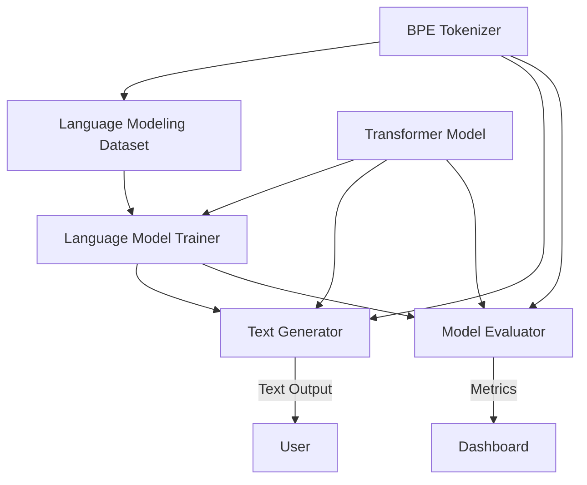
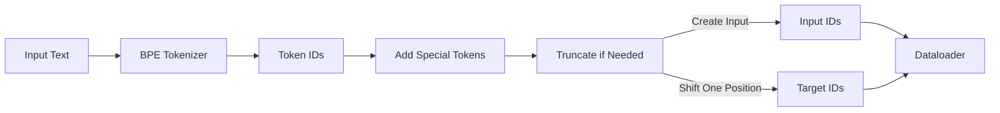
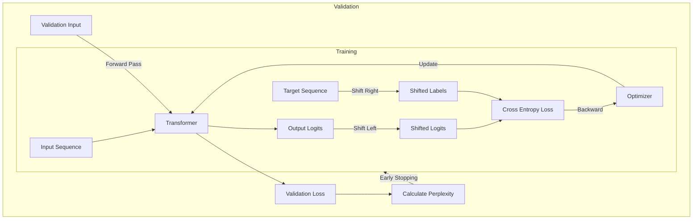
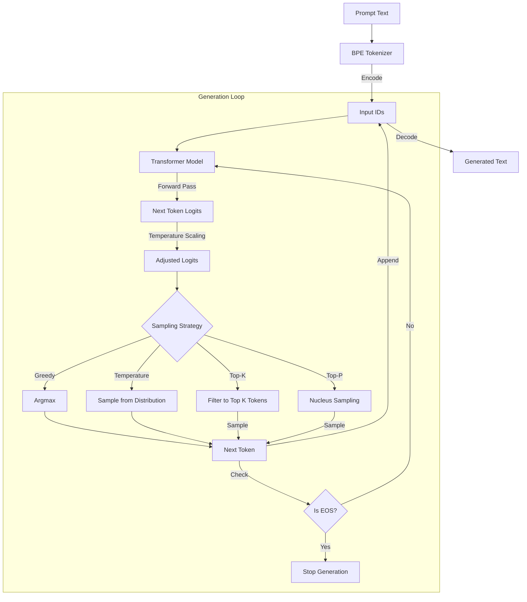
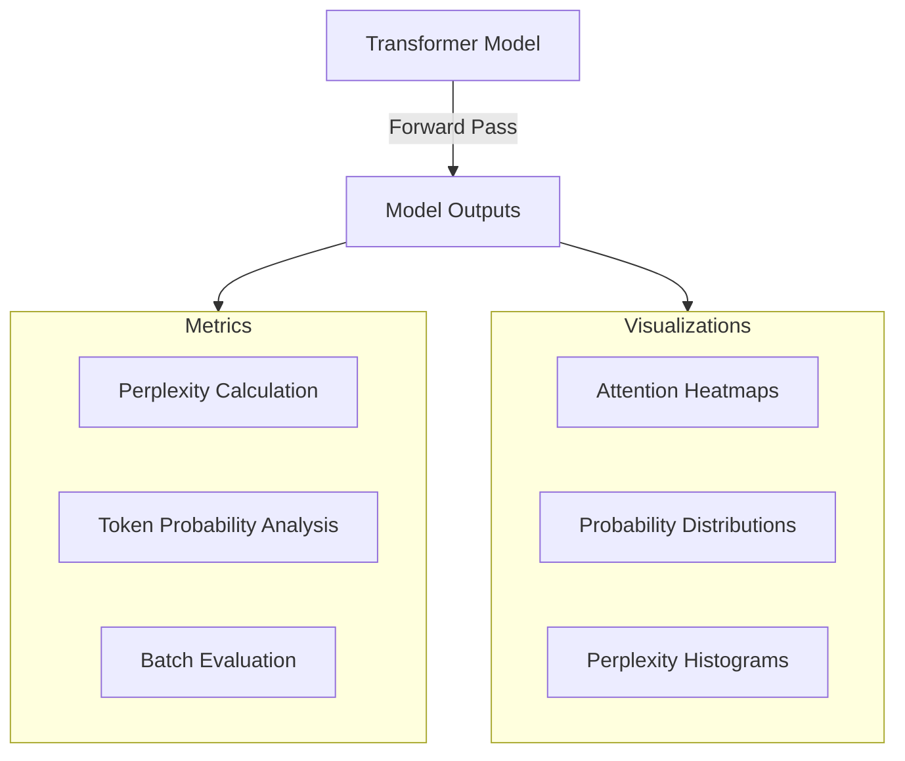

# Week 4: Language Model Training & Generation

## Executive Summary

In Week 4 of our ML transition journey, we expanded our transformer architecture to handle language modeling tasks. We implemented a complete training pipeline for next-token prediction, created a robust text generation system with various sampling strategies, and developed comprehensive evaluation tools for assessing model performance. These components form the textual foundation of our MultiModal Insight Engine, preparing us for multimodal integration in Week 5.

## Architecture Overview

Our language modeling system consists of four primary components working together to enable training, generation, and evaluation:



These components work together to deliver a complete language modeling system that builds upon our transformer implementation from previous weeks.

## Key Components

### 1. Language Modeling Dataset

We implemented a specialized dataset handler that prepares text data for language modeling by creating input/target pairs for next-token prediction.



The key innovation in our dataset handler is the creation of input/target pairs through sequence shifting, which establishes the next-token prediction objective central to language modeling:

```python
# Create input sequence (all tokens except the last)
input_ids = token_ids[:-1]

# Create target sequence (all tokens except the first)
# This creates the next-token prediction task
labels = token_ids[1:]
```

### 2. Language Model Trainer

We built a specialized trainer for language models that efficiently handles the causal language modeling objective, including learning rate scheduling, gradient clipping, and validation.



The trainer implements key features for effective transformer training:

1. **Learning Rate Scheduling**: Linear warmup followed by linear decay helps stabilize training
2. **Gradient Clipping**: Prevents gradient explosions common in transformer training
3. **Early Stopping**: Monitors validation loss to avoid overfitting
4. **Perplexity Calculation**: Provides a standard metric for language model performance

### 3. Text Generation Pipeline

We implemented a robust text generation system that supports multiple sampling strategies for controlling the quality and diversity of generated text.



Our generator supports multiple sampling strategies:

1. **Greedy Decoding**: Always selects the most probable next token
2. **Temperature Sampling**: Controls randomness by scaling logits before sampling
3. **Top-K Sampling**: Restricts sampling to the K most likely tokens
4. **Top-P (Nucleus) Sampling**: Samples from the smallest set of tokens whose cumulative probability exceeds P

We also implemented key optimizations:

1. **KV-Caching**: Significantly speeds up generation by reusing previously computed key-value pairs
2. **Batch Generation**: Enables efficient processing of multiple prompts in parallel

### 4. Evaluation Framework

We built a comprehensive evaluation framework for assessing language model performance with multiple metrics and visualizations.



The evaluation framework provides:

1. **Perplexity Calculation**: Measures how well the model predicts a sample at token, sequence, and dataset levels
2. **Token Probability Analysis**: Identifies which parts of a text are most predictable
3. **Attention Visualization**: Provides insights into how the model processes text
4. **Dataset Evaluation**: Enables systematic assessment of model performance on a corpus

## Demo Application

We created a complete, modular demo application that showcases all components working together, allowing easy configuration of:

1. **Datasets**: Switch between synthetic data, WikiText, or custom text files
2. **Model Sizes**: Choose small, medium, or large transformer configurations
3. **Training Parameters**: Adjust batch size, sequence length, learning rate, etc.
4. **Evaluation**: Generate text with different sampling strategies and visualize model performance

## Design Decisions

Throughout this implementation, we prioritized several key design principles:

1. **Separation of Concerns**: Each component has a well-defined responsibility, enabling modular development and testing
2. **Efficiency Optimizations**: We implemented techniques like KV-caching and batch processing to optimize inference speed
3. **Comprehensive Evaluation**: Rather than focusing only on perplexity, we built a suite of evaluation tools for deeper understanding
4. **Flexible Sampling Strategies**: Multiple text generation methods provide control over output quality and diversity
5. **Interpretability Focus**: Following Anthropic's emphasis on model interpretability, we included extensive visualization tools

## Connection to Anthropic's Research

Our language model implementation aligns with several key areas of Anthropic's research:

1. **Interpretability**: The attention visualization tools help understand model decision-making
2. **Safety**: Structured evaluation enables systematic assessment of model outputs
3. **Scalable Oversight**: Comprehensive evaluation framework provides tools for model monitoring
4. **Empirical Approach**: Our design enables experimentation with different architectures and parameters

## Next Steps

With the language model foundation complete, we'll proceed to:

1. **Implement quantization techniques** for the Week 4 bonus assignment (INT8, FP16)
2. **Explore model pruning methods** for reducing model size
3. **Prepare for Week 5: Image Processing Foundation** by researching vision transformer architectures and image encoding approaches
4. **Develop integration points** between the language model and upcoming image components

This prepares us for the multimodal extension phase where we'll combine text and image processing capabilities into a unified system.

## Conclusion

Week 4's language model implementation provides a robust textual foundation for our MultiModal Insight Engine. By implementing training, generation, and evaluation components, we've created a system that can not only generate text but also provide insights into its behavior. This aligns perfectly with Anthropic's focus on interpretable, safe AI systems and prepares us for multimodal integration in the coming weeks.