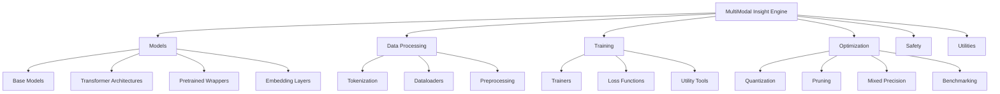

# MultiModal Insight Engine: Source Code Architecture

## Overall Architecture Overview

The source code is structured into modular components that follow a clean, extensible design philosophy:

## Detailed Module Analysis

### 1. Models Directory (`src/models/`)
#### Core Design Principles
- Modular, composable architecture
- Separation of concerns
- Extensible base classes
- Hardware-agnostic design

Key Components:
- `base_model.py`: Provides a foundational `BaseModel` class with:
  - Common model saving/loading methods
  - Parameter counting
  - Device management
  - Consistent interface for all model types

- `transformer.py`: Comprehensive transformer implementation
  - Full encoder-decoder transformer architecture
  - Supports multiple positional encoding strategies
  - Flexible configuration options
  - Implements generation methods
  - Supports multimodal extensions

- `attention.py`: Advanced attention mechanisms
  - Scaled Dot-Product Attention
  - Multi-Head Attention
  - Grouped Query Attention
  - Rotary Position Embeddings
  - Flexible attention implementations

- `layers.py`: Foundational neural network layers
  - Configurable linear layers
  - Feed-forward blocks with various activation options
  - Support for layer normalization and dropout

- `pretrained/` Subdirectory:
  - Model wrappers for pretrained models
  - Adapter mechanisms
  - Model registry for easy model management
  - Support for transfer learning and fine-tuning

### 2. Data Processing (`src/data/`)
#### Design Philosophy
- Flexible data handling
- Support for multiple data types
- Tokenization abstraction
- Preprocessing utilities

Key Components:
- `tokenization/`:
  - Base tokenizer interfaces
  - BPE (Byte Pair Encoding) tokenizer
  - Vocabulary management
  - Text preprocessing utilities

- `dataloader.py`: 
  - Multimodal dataset support
  - Flexible data loading
  - Support for different input types

- `sequence_data.py`:
  - Specialized data handling for sequence models
  - Transformer-specific data processing
  - Collate functions for batching

### 3. Training (`src/training/`)
#### Design Principles
- Flexible training loops
- Comprehensive metrics tracking
- Support for different model types

Key Components:
- `transformer_trainer.py`: 
  - Advanced training utilities
  - Learning rate scheduling
  - Early stopping
  - Metrics visualization

- `language_model_trainer.py`:
  - Specialized language model training
  - Perplexity tracking
  - Generation capabilities

- `losses.py`: 
  - Custom loss function implementations
  - Label smoothing
  - Advanced loss calculation strategies

### 4. Optimization (`src/optimization/`)
#### Core Focus
- Model compression techniques
- Performance enhancement
- Hardware-aware optimization

Key Components:
- `quantization.py`: Dynamic and static quantization
- `pruning.py`: Weight pruning strategies
- `mixed_precision.py`: Mixed precision training
- `benchmarking.py`: Performance measurement tools

### 5. Safety (`src/safety/`)
#### Design Principles
- Proactive safety evaluation
- Adversarial testing
- Model robustness assessment

(Note: Full safety module contents not visible in current view)

### 6. Utilities (`src/utils/`)
- `profiling.py`: Advanced model profiling
- `visualization.py`: Visualization tools

## Architectural Strengths
1. Modular and extensible design
2. Hardware-agnostic implementation
3. Support for multiple model types
4. Comprehensive optimization techniques
5. Built-in safety and evaluation mechanisms

## Potential Improvements
1. More extensive type hinting
2. Enhanced documentation
3. Increased test coverage
4. More flexible configuration management

## Technology Stack
- PyTorch as primary deep learning framework
- Support for MPS (Apple Silicon)
- CUDA acceleration
- Comprehensive preprocessing and data handling

## Future Extension Points
- Easy addition of new model architectures
- Pluggable optimization techniques
- Expandable safety evaluation framework
- Multimodal model integration

