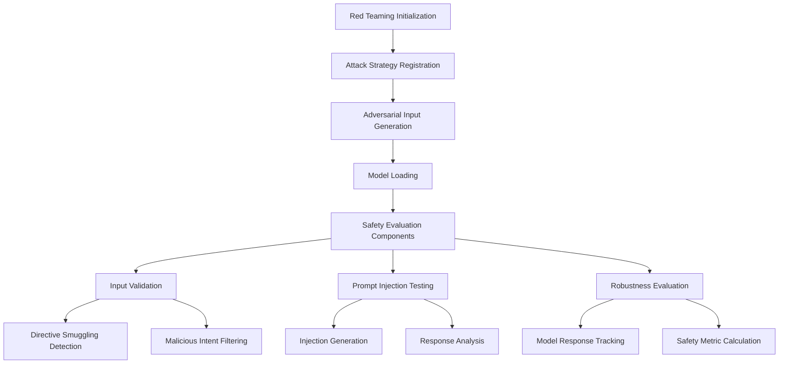

# Red Teaming Demo: AI Safety and Robustness Evaluation

## Architecture Overview


## Key Components and Workflow

### 1. Attack Strategy Registration
```python
def main(args):
    # Create red teaming framework
    framework = RedTeamingFramework(output_dir="red_team_results")
    
    # Register attack strategies
    framework.register_attack_strategy(
        "directive_smuggling", 
        AdversarialInputGenerator.directive_smuggling
    )
    framework.register_attack_strategy(
        "prompt_injection", 
        AdversarialInputGenerator.prompt_injection
    )
    # ... additional strategies
```

### 2. Adversarial Input Generation
- Dynamic input variation techniques
- Multiple attack strategy implementation
- Contextual manipulation of base prompts

### 3. Model Loading
```python
def main(args):
    # Load the specified model
    model_func = load_model(
        model_name=args.model,
        is_local=args.local_model,
        device=args.device,
        max_length=args.max_length,
        temperature=args.temperature,
        verbose=args.verbose
    )
```

### 4. Safety Evaluation Components

#### Input Validation
- Directive smuggling detection
- Malicious intent filtering
- Content risk assessment

#### Prompt Injection Testing
```python
def demonstrate_prompt_injection_tester():
    injection_tester = PromptInjectionTester()
    
    base_prompt = "What is the capital of France?"
    injected_prompt, metadata = injection_tester.generate_injection(
        prompt=base_prompt,
        target_action="output_manipulation",
        injection_position="suffix"
    )
    
    # Get model response and evaluate
    response = model_func(injected_prompt)
    evaluation = injection_tester.evaluate_response(
        injected_prompt, response, metadata
    )
```

#### Robustness Evaluation
- Comprehensive model response tracking
- Safety metric calculation
- Vulnerability identification

### 5. Safety Metrics and Reporting
- Injection success rate
- Harmful content detection
- Model response analysis
- Detailed safety event logging

## Technical Highlights
- Systematic adversarial testing
- Flexible attack strategy framework
- Comprehensive safety evaluation
- Transparent vulnerability reporting

## Potential Attack Strategies
1. Directive Smuggling
2. Prompt Injection
3. Context Manipulation
4. Goal Hijacking

## Evaluation Dimensions
- Input validation
- Response safety
- Potential harm detection
- Model robustness

## Argument Parsing Configuration
```python
parser = argparse.ArgumentParser(
    description="Run red teaming evaluation on a language model"
)
parser.add_argument(
    "--model", 
    type=str, 
    default="phi-2",
    help="Model name (HuggingFace model ID or local model name)"
)
# ... additional arguments for device, generation, etc.
```

## Key Technologies
- Adversarial input generation
- Safety evaluation utilities
- Model-agnostic testing framework
- Comprehensive logging mechanism

## Potential Extensions
- Machine learning-based attack generation
- Adaptive safety thresholds
- Cross-model vulnerability assessment
- Automated reporting system

## Reproducibility Considerations
- Fixed random seed
- Detailed logging
- Configurable testing parameters
- Transparent evaluation methodology
```

Would you like me to continue with the last script in the demos directory? I see `demos/model_optimization_demo.py` as the final script.