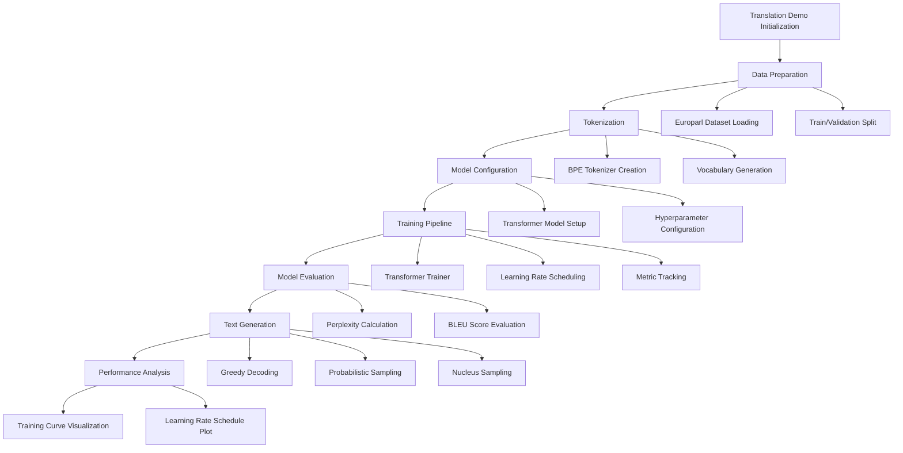

# Machine Translation Demo: German to English Translation Pipeline

## Architecture Overview


## Key Components and Workflow

### 1. Data Preparation
- **Dataset**: Europarl Parallel Corpus
  - Source Language: German
  - Target Language: English
- Preprocessing Steps:
  - Text cleaning
  - Filtering
  - Train/validation split

### 2. Tokenization
- **BPE (Byte Pair Encoding) Tokenization**
  - Vocabulary creation
  - Subword tokenization
  - Handling out-of-vocabulary words
- Separate tokenizers for source and target languages

### 3. Model Configuration
- **Transformer Encoder-Decoder Architecture**
  - Configurable model size
  - Flexible hyperparameters
  - Support for different embedding strategies
- Key Configuration Parameters:
  - Vocabulary sizes
  - Model dimensions
  - Number of layers
  - Attention heads
  - Dropout rates

### 4. Training Pipeline
- **Custom Transformer Trainer**
  - Learning rate warmup
  - Label smoothing
  - Gradient clipping
  - Early stopping
- Metric Tracking:
  - Loss
  - Perplexity
  - Learning rate progression

### 5. Model Evaluation
- **Comprehensive Evaluation Techniques**
  - Perplexity calculation
  - BLEU score assessment
  - Test set translation
  - Performance metrics

### 6. Text Generation
- **Multiple Decoding Strategies**
  1. Greedy Decoding
     - Deterministic output
     - Always selects most probable token
  2. Temperature-based Sampling
     - Introduces randomness
     - Controls output diversity
  3. Nucleus (Top-p) Sampling
     - Dynamic token selection
     - Balances quality and creativity

### 7. Performance Analysis
- Training History Visualization
  - Loss curves
  - Perplexity progression
- Learning Rate Schedule Plot
- Model Performance Metrics

## Technical Highlights
- End-to-end machine translation workflow
- Modular and extensible design
- Support for multiple generation strategies
- Comprehensive performance tracking

## Implementation Considerations
- Hardware-agnostic (CUDA/MPS support)
- Flexible model configuration
- Detailed logging and reporting
- Visualization of training dynamics

## Potential Extensions
- Multilingual translation support
- Advanced decoding techniques
- Domain adaptation
- Continual learning strategies

## Key Technologies
- PyTorch for model implementation
- Custom transformer architecture
- BPE tokenization
- Advanced training utilities

## Sample Translation Scenarios
- Technical documentation
- Academic texts
- Conversational language
- Diverse linguistic contexts

## Performance Optimization
- Learning rate scheduling
- Gradient clipping
- Mixed precision support
- Efficient attention mechanisms

## Reproducibility
- Fixed random seed
- Detailed hyperparameter logging
- Model checkpoint saving
- Comprehensive result tracking
```

Would you like me to continue with the next script in the demos directory? I see `demos/hardware_profiling_demo.py` as the next script.