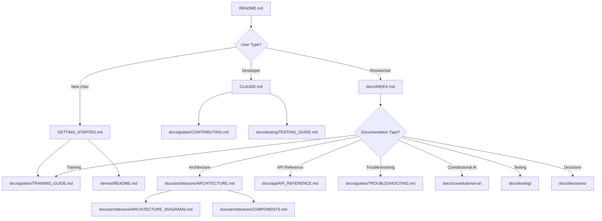

# MultiModal Insight Engine - Documentation Improvement Plan

**Version**: 1.0
**Date**: 2025-11-07
**Status**: 🔴 Action Required
**Estimated Total Effort**: 120-160 hours (3-4 weeks)

---

## Executive Summary

The MultiModal Insight Engine has grown to **25,287 lines of code** across **194 classes** and **230 functions**, with extensive ML capabilities spanning transformers, constitutional AI, and multimodal learning. However, documentation has not kept pace with code growth, resulting in:

- **21 root-level markdown files** creating navigation confusion
- **No unified architecture documentation** explaining the system
- **No API reference documentation** for the codebase
- **Scattered training guidance** across demos and SDS files
- **Missing troubleshooting guide** and decision records

This plan provides a **comprehensive roadmap** to transform documentation from fragmented to world-class, with prioritized tasks, effort estimates, and measurable success criteria.

---

## Table of Contents

1. [Current Documentation State](#1-current-documentation-state)
2. [Gap Analysis](#2-gap-analysis)
3. [Documentation Hierarchy Strategy](#3-documentation-hierarchy-strategy)
4. [Priority Documentation Tasks](#4-priority-documentation-tasks)
5. [Quality Improvements](#5-quality-improvements)
6. [Implementation Roadmap](#6-implementation-roadmap)
7. [Success Metrics](#7-success-metrics)
8. [Appendices](#8-appendices)

---

## 1. Current Documentation State

### 1.1 Documentation Inventory

#### Root Level (21 files - Too Many!)

```
/home/user/multimodal_insight_engine/
├── README.md                          ✅ Good - Main overview
├── CRITICAL_README.md                 ✅ Good - Important distinctions
├── CLAUDE.md                          ✅ Good - Dev guidelines
├── GETTING_STARTED.md                 ✅ Good - Setup guide
├── ARCHITECTURE_REVIEW.md             ⚠️ Technical - Problem-focused
├── ARCHITECTURE_SUMMARY.md            ⚠️ Brief summary
├── ARCHITECTURE_QUICK_FIXES.md        ⚠️ Tactical fixes
├── SECURITY_AUDIT_REPORT.md           ⚠️ Audit report
├── DX_AUDIT_REPORT.md                 ⚠️ Audit report
├── DX_IMPROVEMENTS_SUMMARY.md         ⚠️ Improvement notes
├── README_DX_IMPROVEMENTS.md          ⚠️ More improvements
├── MERGE_READINESS_ASSESSMENT.md      ⚠️ Assessment report
├── AUDIT_FINDINGS.md                  ⚠️ Audit findings
├── code_quality_assessment.md         ⚠️ Quality metrics
├── current_test_status.md             ⚠️ Test status
├── test_implementation_plan.md        ⚠️ Test plan
├── project_architecture.md            ⚠️ Architecture notes
├── README_tokenization.md             ⚠️ Specialized topic
├── metadata_prompt.md                 ⚠️ Metadata notes
├── claude-context.md                  ⚠️ Context file
└── Multimodal Training Challenge.md   ⚠️ Challenge notes
```

**Issues**:
- ❌ Too many entry points - confusing for new users
- ❌ Unclear which docs are canonical vs supplementary
- ❌ Multiple overlapping architecture docs
- ❌ Audit reports mixed with guides
- ❌ No clear document hierarchy

#### docs/ Directory (13 files - Well Organized)

```
/home/user/multimodal_insight_engine/docs/
├── INDEX.md                                    ✅ Excellent navigation
├── ARCHITECTURE_DIAGRAMS.md                    ✅ Excellent Mermaid diagrams
├── CONSTITUTIONAL_AI_ARCHITECTURE.md           ✅ Good system design
├── CONSTITUTIONAL_AI_IMPLEMENTATION_SPEC.md    ✅ Good implementation
├── CONSTITUTIONAL_AI_TEST_COVERAGE.md          ✅ Good test docs
├── PPO_IMPLEMENTATION_GUIDE.md                 ✅ Good algorithm guide
├── PPO_IMPLEMENTATION_SUMMARY.md               ✅ Good summary
├── PPO_VERIFICATION.md                         ✅ Good verification
├── REWARD_MODEL_IMPLEMENTATION_SUMMARY.md      ✅ Good summary
├── DEMO_GUIDE.md                               ✅ Good demo guide
├── PROMPT_GENERATION_GUIDE.md                  ✅ Good prompt guide
├── TESTING_QUICK_REFERENCE.md                  ✅ Good test reference
├── VERIFICATION_REPORT.md                      ✅ Good verification
├── COMPONENT_2_VERIFICATION_CHECKLIST.md       ⚠️ Specialized
├── DOCUMENTATION_UPDATE_SUMMARY.md             ⚠️ Meta-doc
└── archive/                                    ✅ Good archiving
    └── constitutional-ai-dev/                  ✅ 8 archived docs
```

**Strengths**:
- ✅ Well-organized by topic
- ✅ Clear naming conventions
- ✅ Comprehensive Constitutional AI coverage
- ✅ Archive directory for old docs
- ✅ INDEX.md provides navigation

**Issues**:
- ⚠️ No general architecture documentation
- ❌ No API reference
- ❌ No training guide (general)
- ❌ No troubleshooting guide
- ❌ No contributor guide beyond CLAUDE.md

#### doc/ Directory (50+ files - Historical/Legacy)

```
/home/user/multimodal_insight_engine/doc/
├── SDS/                               ⚠️ Software Design Specs (12 files)
│   ├── models_architecture_doc.md
│   ├── training_architecture_doc.md
│   ├── tokenization_architecture_doc.md
│   └── ... 9 more architecture docs
├── demos/                             ⚠️ Demo documentation (8 files)
├── lessons/                           ⚠️ Learning materials (7 files)
├── misc/                              ⚠️ Miscellaneous (3 files)
├── python_refs/                       ⚠️ Code references
└── test_documentation.md              ⚠️ Test docs
```

**Status**: Appears to be legacy/historical documentation

**Issues**:
- ⚠️ Unclear if these are current or outdated
- ⚠️ Duplicates content in docs/
- ⚠️ SDS files may be valuable but unclear status

### 1.2 Source Code Documentation

#### Code Documentation Quality: ✅ GOOD

**Sample Analysis** (transformer.py):
```python
"""
MODULE: transformer.py
PURPOSE: Implements transformer models for sequence processing tasks.
KEY COMPONENTS:
- TransformerEncoderLayer: Implements a single transformer encoder layer.
- TransformerEncoder: Implements the encoder part of the transformer.
- Transformer: Implements a complete transformer model with encoder only.
...
DEPENDENCIES: torch, torch.nn, typing, base_model, attention, layers, positional, embeddings
SPECIAL NOTES: This module follows the architecture described in "Attention is All You Need" (Vaswani et al., 2017).
"""
```

**Strengths**:
- ✅ Module-level docstrings with PURPOSE and KEY COMPONENTS
- ✅ Google-style docstrings for classes and functions
- ✅ Type hints throughout
- ✅ Inline comments explaining complex logic

**Coverage**:
- 194 classes documented
- 230 functions documented
- Consistent style following CLAUDE.md guidelines

### 1.3 Documentation Categories Assessment

| Category | Status | Files | Quality | Issues |
|----------|--------|-------|---------|--------|
| **Getting Started** | ✅ Good | GETTING_STARTED.md, README.md | High | None |
| **Architecture Overview** | ❌ Missing | ARCHITECTURE_REVIEW.md (problems-focused) | Low | No unified system explanation |
| **API Reference** | ❌ Missing | None | N/A | No auto-generated API docs |
| **Training Guides** | ⚠️ Scattered | SDS/training_architecture_doc.md, demos | Medium | No unified training guide |
| **Contributor Guide** | ⚠️ Partial | CLAUDE.md | Medium | Missing workflow, PR process |
| **Troubleshooting** | ❌ Missing | None | N/A | Common issues not documented |
| **ADRs** | ❌ Missing | None | N/A | No decision records |
| **Constitutional AI** | ✅ Excellent | docs/CONSTITUTIONAL_AI_*.md | High | Well documented |
| **Testing** | ✅ Good | docs/TESTING_QUICK_REFERENCE.md | High | Good coverage |
| **Demos** | ✅ Good | docs/DEMO_GUIDE.md | High | Well explained |

---

## 2. Gap Analysis

### 2.1 Critical Gaps (Must Address)

#### Gap 1: No Unified Architecture Documentation
**Current State**:
- ARCHITECTURE_REVIEW.md focuses on problems (2,927-line god object, 21 loss classes, etc.)
- ARCHITECTURE_SUMMARY.md is brief (50 lines)
- project_architecture.md is notes
- doc/SDS/ has component-level docs but no system view

**Impact**:
- New developers cannot understand the system
- Onboarding takes 2-3x longer than necessary
- Architecture decisions are unclear

**Need**: **ARCHITECTURE.md** - Comprehensive system architecture
- High-level system design
- Component interactions
- Design patterns used
- Data flow diagrams
- Deployment architecture
- Technology stack rationale

**Priority**: 🔴 CRITICAL
**Effort**: 24-32 hours

---

#### Gap 2: No API Reference Documentation
**Current State**:
- Source code has good docstrings
- No generated API documentation
- Users must read source code to understand APIs

**Impact**:
- Hard to discover available functionality
- No search functionality for APIs
- Cannot see inheritance hierarchies
- No usage examples for each API

**Need**: **API_REFERENCE.md** + auto-generated docs
- Sphinx or pdoc3 generated documentation
- All public classes, functions, methods
- Inheritance diagrams
- Usage examples
- Cross-references

**Priority**: 🔴 CRITICAL
**Effort**: 16-20 hours (setup + initial generation)

---

#### Gap 3: No Unified Training Guide
**Current State**:
- Training info scattered across:
  - doc/SDS/training_architecture_doc.md (component-level)
  - demos/language_model_demo.py (code examples)
  - docs/PPO_IMPLEMENTATION_GUIDE.md (PPO-specific)
  - docs/CONSTITUTIONAL_AI_*.md (CAI-specific)
- No single place to learn how to train models

**Impact**:
- Users don't know where to start
- Repeat questions about training setup
- Training best practices not documented

**Need**: **TRAINING_GUIDE.md** - Complete training documentation
- Quick start training
- Training pipeline overview
- Loss function selection guide
- Hyperparameter tuning guide
- Multi-stage training explained
- Constitutional AI training
- Troubleshooting training issues

**Priority**: 🔴 CRITICAL
**Effort**: 20-24 hours

---

#### Gap 4: No Troubleshooting Guide
**Current State**:
- GETTING_STARTED.md has "Common Issues & Solutions" (basic)
- No comprehensive troubleshooting guide
- Known issues not documented

**Impact**:
- Users get stuck on common issues
- Repeat questions to maintainers
- Debugging takes longer

**Need**: **TROUBLESHOOTING.md** - Comprehensive troubleshooting
- Installation issues
- Training issues (NaN loss, slow convergence, OOM errors)
- Model issues (poor performance, evaluation metrics)
- Data issues (tokenization, dataset loading)
- Hardware-specific issues (CUDA, MPS, CPU)
- Known bugs and workarounds

**Priority**: 🟡 HIGH
**Effort**: 12-16 hours

---

### 2.2 High Priority Gaps

#### Gap 5: Incomplete Contributor Guide
**Current State**:
- CLAUDE.md has style guidelines and build commands
- Missing: workflow, PR process, review checklist

**Impact**:
- Contributors unsure of process
- Inconsistent PR quality
- Review friction

**Need**: **CONTRIBUTING.md** - Complete contributor guide
- Development workflow
- PR process and checklist
- Code review standards
- Testing requirements
- Documentation requirements
- Release process

**Priority**: 🟡 HIGH
**Effort**: 8-12 hours

---

#### Gap 6: No Architecture Decision Records (ADRs)
**Current State**:
- Design decisions not documented
- Rationale for choices unknown
- Historical context lost

**Impact**:
- Why VICReg over SimCLR? Unknown.
- Why multi-stage training? Unclear.
- Why specific tokenization approach? Not documented.

**Need**: **DECISION_RECORDS/** directory with ADRs
- ADR-001: Loss function selection
- ADR-002: Multi-stage training approach
- ADR-003: Tokenization strategy
- ADR-004: Configuration management
- ADR-005: Testing strategy
- ... (10-15 key decisions)

**Priority**: 🟡 HIGH
**Effort**: 16-20 hours

---

### 2.3 Medium Priority Gaps

#### Gap 7: Documentation Sprawl at Root Level
**Current State**: 21 markdown files at root level

**Impact**:
- Hard to find canonical documentation
- Unclear what's current vs historical
- New users overwhelmed

**Need**: Reorganization and consolidation
- Move audit reports to docs/audits/
- Move assessment docs to docs/assessments/
- Consolidate architecture docs
- Update README.md with clear navigation

**Priority**: 🟢 MEDIUM
**Effort**: 6-8 hours

---

#### Gap 8: No Code Examples in Documentation
**Current State**:
- Docs describe concepts
- Missing concrete code examples
- Users must infer usage from demos

**Impact**:
- Hard to understand how to use features
- Copy-paste from demos instead of clean examples

**Need**: Code examples in all major docs
- Architecture docs show instantiation
- Training guide shows complete scripts
- API reference shows usage

**Priority**: 🟢 MEDIUM
**Effort**: 12-16 hours

---

#### Gap 9: Legacy doc/ Directory Status Unclear
**Current State**:
- doc/ has 50+ files
- Unclear if current or outdated
- Potential duplication with docs/

**Impact**:
- Confusion about which docs to trust
- Potential outdated information

**Need**: Audit and decision
- Review all doc/ files
- Mark outdated files
- Move valuable docs to docs/
- Archive or delete rest

**Priority**: 🟢 MEDIUM
**Effort**: 6-8 hours

---

### 2.4 Low Priority Gaps

#### Gap 10: No Video Tutorials
**Priority**: 🔵 LOW
**Effort**: 40+ hours

#### Gap 11: No Interactive Jupyter Notebooks
**Priority**: 🔵 LOW
**Effort**: 20-30 hours

#### Gap 12: No Performance Benchmarks Documentation
**Priority**: 🔵 LOW
**Effort**: 8-12 hours

---

## 3. Documentation Hierarchy Strategy

### 3.1 Proposed Documentation Structure

```
/home/user/multimodal_insight_engine/
│
├── README.md                          [Entry Point - Overview]
├── GETTING_STARTED.md                 [Quick Start - 20 min setup]
├── CLAUDE.md                          [Developer Guidelines]
├── CRITICAL_README.md                 [Important Distinctions]
│
├── docs/                              [Main Documentation Hub]
│   ├── INDEX.md                       [Navigation - Updated]
│   │
│   ├── architecture/                  [NEW - Architecture Documentation]
│   │   ├── ARCHITECTURE.md            [NEW - System Architecture]
│   │   ├── ARCHITECTURE_DIAGRAMS.md   [Existing - Moved here]
│   │   ├── COMPONENTS.md              [NEW - Component Deep Dives]
│   │   ├── DATA_FLOW.md               [NEW - Data Flow Documentation]
│   │   └── DEPLOYMENT.md              [NEW - Deployment Architecture]
│   │
│   ├── api/                           [NEW - API Documentation]
│   │   ├── API_REFERENCE.md           [NEW - Manual API Reference]
│   │   ├── index.html                 [NEW - Sphinx/pdoc3 Generated]
│   │   └── ...                        [Generated API docs]
│   │
│   ├── guides/                        [NEW - User Guides]
│   │   ├── TRAINING_GUIDE.md          [NEW - Complete Training Guide]
│   │   ├── CONTRIBUTING.md            [NEW - Contributor Guide]
│   │   ├── TROUBLESHOOTING.md         [NEW - Troubleshooting Guide]
│   │   ├── DEMO_GUIDE.md              [Existing - Moved here]
│   │   └── PROMPT_GENERATION_GUIDE.md [Existing - Moved here]
│   │
│   ├── constitutional-ai/             [Existing - Renamed from root]
│   │   ├── CONSTITUTIONAL_AI_ARCHITECTURE.md
│   │   ├── CONSTITUTIONAL_AI_IMPLEMENTATION_SPEC.md
│   │   ├── PPO_IMPLEMENTATION_GUIDE.md
│   │   ├── PPO_IMPLEMENTATION_SUMMARY.md
│   │   ├── PPO_VERIFICATION.md
│   │   ├── REWARD_MODEL_IMPLEMENTATION_SUMMARY.md
│   │   └── CONSTITUTIONAL_AI_TEST_COVERAGE.md
│   │
│   ├── testing/                       [NEW - Testing Documentation]
│   │   ├── TESTING_GUIDE.md           [NEW - Complete Testing Guide]
│   │   ├── TESTING_QUICK_REFERENCE.md [Existing - Moved here]
│   │   └── TEST_COVERAGE_REPORT.md    [NEW - Coverage Reports]
│   │
│   ├── decisions/                     [NEW - Architecture Decision Records]
│   │   ├── README.md                  [NEW - ADR Index]
│   │   ├── ADR-001-loss-function-selection.md
│   │   ├── ADR-002-multi-stage-training.md
│   │   ├── ADR-003-tokenization-strategy.md
│   │   ├── ADR-004-configuration-management.md
│   │   └── ... [More ADRs]
│   │
│   ├── audits/                        [NEW - Audit Reports]
│   │   ├── ARCHITECTURE_REVIEW.md     [Moved from root]
│   │   ├── SECURITY_AUDIT_REPORT.md   [Moved from root]
│   │   ├── DX_AUDIT_REPORT.md         [Moved from root]
│   │   └── code_quality_assessment.md [Moved from root]
│   │
│   ├── assessments/                   [NEW - Project Assessments]
│   │   ├── MERGE_READINESS_ASSESSMENT.md
│   │   ├── current_test_status.md
│   │   └── test_implementation_plan.md
│   │
│   └── archive/                       [Existing - For Historical Docs]
│       ├── constitutional-ai-dev/     [Existing]
│       └── legacy-doc/                [NEW - Old doc/ content]
│
├── doc/                               [To Be Archived or Deleted]
│   └── ... [Review and migrate to docs/archive/]
│
└── [Other root files remain]
```

### 3.2 Documentation Navigation Flow



### 3.3 Cross-Linking Strategy

Every documentation page should include:

1. **Breadcrumb Navigation**
   ```markdown
   > [Home](../README.md) > [Docs](INDEX.md) > [Architecture](architecture/) > ARCHITECTURE.md
   ```

2. **Related Documents Section**
   ```markdown
   ## Related Documentation
   - [API Reference](../api/API_REFERENCE.md) - Full API documentation
   - [Training Guide](../guides/TRAINING_GUIDE.md) - How to train models
   - [Architecture Diagrams](ARCHITECTURE_DIAGRAMS.md) - Visual system overview
   ```

3. **Table of Contents**
   - Auto-generated TOC for documents >500 lines
   - Manual TOC for shorter docs

4. **See Also Links**
   - Link to related code files
   - Link to relevant demos
   - Link to tests

---

## 4. Priority Documentation Tasks

### Phase 1: Critical Documentation (Weeks 1-2)

#### Task 1.1: Create ARCHITECTURE.md
**Priority**: 🔴 CRITICAL
**Effort**: 24-32 hours
**Dependencies**: None
**Deliverable**: docs/architecture/ARCHITECTURE.md

**Contents**:
1. **Executive Summary** (1 page)
   - What is the MultiModal Insight Engine?
   - Key capabilities
   - Target use cases

2. **System Architecture** (5-7 pages)
   - High-level architecture diagram
   - Layered architecture explanation
   - Component overview
   - Technology stack

3. **Core Components** (10-15 pages)
   - Models (transformers, vision, multimodal)
   - Training (trainers, losses, optimizers)
   - Data (datasets, tokenization, augmentation)
   - Safety (Constitutional AI, red teaming)
   - Optimization (pruning, quantization, mixed precision)

4. **Component Interactions** (5-7 pages)
   - Training pipeline flow
   - Data flow through system
   - Model serving flow (future)
   - Configuration management

5. **Design Patterns** (3-5 pages)
   - Factory pattern usage
   - Strategy pattern for training
   - Template method for trainers (future)
   - Observer pattern for callbacks (future)

6. **Deployment Architecture** (2-3 pages)
   - Single-GPU training
   - Multi-GPU training (planned)
   - Model storage and checkpointing

7. **Future Architecture** (2-3 pages)
   - Planned improvements
   - Scalability roadmap
   - Known limitations

**Success Criteria**:
- New developer can understand system in 1 hour
- Architects can evaluate design in 30 minutes
- Provides foundation for all other docs

---

#### Task 1.2: Create API_REFERENCE.md
**Priority**: 🔴 CRITICAL
**Effort**: 16-20 hours
**Dependencies**: None
**Deliverable**: docs/api/API_REFERENCE.md + generated docs

**Contents**:

**Manual API_REFERENCE.md**:
1. **API Overview**
   - API design principles
   - Naming conventions
   - Import patterns

2. **Core APIs by Module**
   - src.models - Model construction APIs
   - src.training - Training APIs
   - src.data - Data processing APIs
   - src.safety - Safety evaluation APIs
   - src.optimization - Optimization APIs

3. **Common Usage Patterns**
   - Creating a model
   - Setting up training
   - Loading data
   - Running evaluation

4. **Advanced Usage**
   - Custom loss functions
   - Custom training strategies
   - Custom datasets

**Auto-Generated Documentation**:
- Use Sphinx or pdoc3
- Generate HTML documentation
- Include:
  - All public classes and functions
  - Docstrings rendered nicely
  - Inheritance diagrams
  - Cross-references
  - Search functionality

**Setup**:
```bash
# Install Sphinx
pip install sphinx sphinx-rtd-theme

# Generate API docs
cd docs/api/
sphinx-quickstart
sphinx-apidoc -o source/ ../../src/
make html
```

**Success Criteria**:
- All public APIs documented
- Search works
- Examples for each major API
- Hosted locally or on GitHub Pages

---

#### Task 1.3: Create TRAINING_GUIDE.md
**Priority**: 🔴 CRITICAL
**Effort**: 20-24 hours
**Dependencies**: ARCHITECTURE.md
**Deliverable**: docs/guides/TRAINING_GUIDE.md

**Contents**:
1. **Quick Start Training** (2 pages)
   - Train your first model in 5 minutes
   - Language model example
   - Vision transformer example

2. **Training Pipeline Overview** (3-4 pages)
   - Training flow diagram
   - Components involved
   - Configuration options

3. **Loss Function Selection** (4-5 pages)
   - Available loss functions
   - When to use each
   - Contrastive learning losses
   - VICReg and Barlow Twins
   - Custom loss functions

4. **Training Strategies** (5-6 pages)
   - Single-stage training
   - Multi-stage training
   - Progressive training
   - When to use each strategy

5. **Hyperparameter Tuning** (4-5 pages)
   - Learning rate selection
   - Batch size considerations
   - Optimizer selection
   - Warmup and scheduling
   - Gradient clipping

6. **Constitutional AI Training** (3-4 pages)
   - Overview of CAI training
   - Phase 1: Supervised fine-tuning
   - Phase 2: Reward modeling
   - Phase 3: PPO training
   - Link to detailed CAI docs

7. **Advanced Training** (4-5 pages)
   - Mixed precision training
   - Gradient accumulation
   - Multi-GPU training (planned)
   - Custom trainers

8. **Monitoring and Evaluation** (3-4 pages)
   - Metrics tracking
   - TensorBoard integration
   - Evaluation best practices
   - Checkpoint management

9. **Troubleshooting Training** (3-4 pages)
   - NaN loss issues
   - Slow convergence
   - OOM errors
   - Poor model performance
   - Link to TROUBLESHOOTING.md

**Success Criteria**:
- User can train any model type
- All training modes covered
- Clear decision trees for choices
- Concrete examples throughout

---

### Phase 2: High Priority Documentation (Weeks 3-4)

#### Task 2.1: Create TROUBLESHOOTING.md
**Priority**: 🟡 HIGH
**Effort**: 12-16 hours
**Dependencies**: TRAINING_GUIDE.md
**Deliverable**: docs/guides/TROUBLESHOOTING.md

**Contents**:
1. **Installation Issues**
   - Python version issues
   - Dependency conflicts
   - CUDA/PyTorch installation
   - MPS (Apple Silicon) issues

2. **Training Issues**
   - NaN loss
     - Causes: Learning rate too high, gradient explosion
     - Solutions: Reduce LR, gradient clipping, mixed precision
   - Slow convergence
     - Causes: Bad initialization, wrong optimizer, poor data
     - Solutions: Warmup, optimizer tuning, data quality check
   - Out of Memory (OOM)
     - Causes: Batch size too large, model too big
     - Solutions: Reduce batch size, gradient accumulation, smaller model
   - Feature collapse in contrastive learning
     - Causes: Temperature too high, negative sampling issues
     - Solutions: Tune temperature, check match_ids, use memory bank

3. **Data Issues**
   - Tokenization errors
   - Dataset loading failures
   - Data augmentation issues
   - Batch mismatch errors

4. **Model Issues**
   - Poor retrieval performance
   - Dimension mismatch errors
   - Model architecture errors

5. **Hardware-Specific Issues**
   - CUDA errors
   - MPS errors
   - Multi-GPU issues

6. **Known Bugs and Workarounds**
   - Link to GitHub issues
   - Workarounds for known problems

**Success Criteria**:
- Common issues (<24 hours) documented
- Clear solutions provided
- Diagnostic steps included
- Search-friendly formatting

---

#### Task 2.2: Create CONTRIBUTING.md
**Priority**: 🟡 HIGH
**Effort**: 8-12 hours
**Dependencies**: CLAUDE.md
**Deliverable**: docs/guides/CONTRIBUTING.md

**Contents**:
1. **Getting Started**
   - Fork and clone
   - Setup development environment
   - Run tests

2. **Development Workflow**
   - Create feature branch
   - Make changes
   - Write tests
   - Update documentation
   - Submit PR

3. **Code Standards**
   - Link to CLAUDE.md
   - PEP 8 compliance
   - Type hints required
   - Docstring format

4. **Testing Requirements**
   - Unit test for all new code
   - Integration tests for features
   - Minimum 80% coverage
   - All tests must pass

5. **Documentation Requirements**
   - Update relevant docs
   - Add docstrings
   - Update API reference if needed

6. **Pull Request Process**
   - PR template
   - Review checklist
   - Approval requirements

7. **Code Review Standards**
   - What reviewers look for
   - Common feedback items
   - How to address feedback

8. **Release Process**
   - Versioning
   - Changelog
   - Release notes

**Success Criteria**:
- Contributors know exact process
- PR quality improves
- Review time decreases

---

#### Task 2.3: Create Architecture Decision Records
**Priority**: 🟡 HIGH
**Effort**: 16-20 hours
**Dependencies**: ARCHITECTURE.md
**Deliverable**: docs/decisions/*.md

**ADRs to Create** (Priority Order):

1. **ADR-001: Loss Function Selection**
   - Context: Need loss for multimodal contrastive learning
   - Decision: VICReg as primary, with contrastive variants
   - Rationale: Better feature diversity, no large batch requirement
   - Consequences: Higher compute, but better representations

2. **ADR-002: Multi-Stage Training Approach**
   - Context: How to train multimodal models effectively
   - Decision: 3-stage progressive training
   - Rationale: Aligns modalities before fusion
   - Consequences: Longer training, but better convergence

3. **ADR-003: Tokenization Strategy**
   - Context: Need tokenization for text modality
   - Decision: BPE with joint vocab for multilingual
   - Rationale: Subword granularity, multilingual support
   - Consequences: Vocab size management required

4. **ADR-004: Configuration Management**
   - Context: Multiple configuration approaches causing issues
   - Decision: Pydantic-based unified config (planned)
   - Rationale: Type safety, validation, immutability
   - Consequences: Refactoring required

5. **ADR-005: Testing Strategy**
   - Context: Ensure code quality
   - Decision: TDD with unit, integration, e2e tests
   - Rationale: Prevent regressions, document behavior
   - Consequences: More upfront work, less bugs

6. **ADR-006: Trainer Architecture**
   - Context: Multiple trainer implementations with duplication
   - Decision: Template method pattern with BaseTrainer (planned)
   - Rationale: Reduce duplication, consistent interface
   - Consequences: Refactoring required

7. **ADR-007: Documentation Strategy**
   - Context: Documentation sprawl and gaps
   - Decision: Hierarchical docs/ structure
   - Rationale: Clear navigation, find-ability
   - Consequences: Documentation reorganization

8. **ADR-008: Constitutional AI Implementation**
   - Context: Need safety alignment for language models
   - Decision: Full CAI with SFT + RM + PPO
   - Rationale: State-of-art safety alignment
   - Consequences: Complex training pipeline

9. **ADR-009: Model Checkpointing Strategy**
   - Context: How to save/load model states
   - Decision: PyTorch native with metadata JSON
   - Rationale: Standard, flexible, extensible
   - Consequences: File size considerations

10. **ADR-010: Evaluation Metrics**
    - Context: How to measure multimodal performance
    - Decision: Retrieval metrics (R@K, MRR) + classification
    - Rationale: Standard benchmarks, comparable
    - Consequences: Evaluation time considerations

**ADR Template**:
```markdown
# ADR-XXX: [Title]

## Status
[Proposed | Accepted | Deprecated | Superseded]

## Context
What is the issue that we're seeing that is motivating this decision or change?

## Decision
What is the change that we're proposing and/or doing?

## Rationale
Why did we choose this option over alternatives?

## Alternatives Considered
What other options were considered?

## Consequences
What becomes easier or more difficult to do because of this change?

## Implementation Notes
Technical details for implementing this decision.

## Related Decisions
- ADR-XXX: [Title]
- ADR-YYY: [Title]

## Date
YYYY-MM-DD

## Author(s)
Name(s)
```

**Success Criteria**:
- 10 key decisions documented
- Template established
- Historical context preserved
- Onboarding improved

---

### Phase 3: Medium Priority Documentation (Weeks 5-6)

#### Task 3.1: Reorganize Root-Level Documentation
**Priority**: 🟢 MEDIUM
**Effort**: 6-8 hours
**Dependencies**: All new docs created
**Deliverable**: Clean root directory

**Actions**:
1. Move audit reports to docs/audits/
   - ARCHITECTURE_REVIEW.md
   - SECURITY_AUDIT_REPORT.md
   - DX_AUDIT_REPORT.md
   - code_quality_assessment.md

2. Move assessment docs to docs/assessments/
   - MERGE_READINESS_ASSESSMENT.md
   - current_test_status.md
   - test_implementation_plan.md

3. Move specialized topics to appropriate locations
   - README_tokenization.md → docs/architecture/TOKENIZATION.md
   - Multimodal Training Challenge.md → docs/archive/

4. Consolidate architecture docs
   - Keep: ARCHITECTURE_REVIEW.md (move to audits/)
   - Deprecate: ARCHITECTURE_SUMMARY.md, ARCHITECTURE_QUICK_FIXES.md
   - Create canonical: docs/architecture/ARCHITECTURE.md

5. Update README.md with new structure
   - Clear navigation to docs/
   - Link to key entry points
   - Remove outdated links

**Final Root Structure**:
```
/home/user/multimodal_insight_engine/
├── README.md              [Main entry - Updated]
├── GETTING_STARTED.md     [Quick start - Keep]
├── CLAUDE.md              [Dev guidelines - Keep]
├── CRITICAL_README.md     [Important notes - Keep]
├── LICENSE                [Keep]
├── setup.py              [Keep]
├── requirements.txt      [Keep]
├── run_tests.sh          [Keep]
├── Makefile              [Keep]
├── docs/                 [All documentation - See structure]
├── src/                  [Source code]
├── tests/                [Tests]
├── demos/                [Demos]
└── ... [Other project files]
```

**Success Criteria**:
- Root has ≤5 markdown files
- All docs in docs/
- Clear navigation
- No broken links

---

#### Task 3.2: Add Code Examples to Documentation
**Priority**: 🟢 MEDIUM
**Effort**: 12-16 hours
**Dependencies**: ARCHITECTURE.md, TRAINING_GUIDE.md
**Deliverable**: Code examples in all major docs

**Examples to Add**:

**ARCHITECTURE.md**:
```python
# Example: Creating a multimodal model
from src.models import create_multimodal_model

model = create_multimodal_model(
    vision_model="vit-base",
    text_model="bert-base",
    fusion_dim=512,
    projection_dim=256
)
```

**TRAINING_GUIDE.md**:
```python
# Example: Training a language model
from src.training import LanguageModelTrainer
from src.data import create_language_modeling_dataset

dataset = create_language_modeling_dataset("wikitext-2")
trainer = LanguageModelTrainer(
    model=model,
    dataset=dataset,
    batch_size=32,
    learning_rate=1e-4
)
trainer.train(num_epochs=10)
```

**API_REFERENCE.md**:
- Usage example for each major API
- Import statements
- Parameter explanations
- Return value descriptions

**Success Criteria**:
- Every major concept has code example
- Examples are copy-pasteable
- Examples are tested (in demos/ or tests/)

---

#### Task 3.3: Audit and Archive Legacy doc/ Directory
**Priority**: 🟢 MEDIUM
**Effort**: 6-8 hours
**Dependencies**: None
**Deliverable**: doc/ archived or deleted

**Process**:
1. Review each file in doc/
2. For each file, decide:
   - ✅ Current and valuable → Move to docs/
   - ⚠️ Historical but valuable → Move to docs/archive/legacy-doc/
   - ❌ Outdated and not valuable → Delete

3. Create mapping document
   - Old location → New location
   - Update any references

4. Add README.md to docs/archive/legacy-doc/
   - Explain what these docs are
   - Explain why archived
   - Warning that may be outdated

**Success Criteria**:
- doc/ directory removed or clearly marked
- Valuable content preserved
- No duplicate documentation

---

### Phase 4: Code Documentation Improvements (Ongoing)

#### Task 4.1: Generate API Documentation with Sphinx
**Priority**: 🟡 HIGH
**Effort**: 8-12 hours
**Dependencies**: API_REFERENCE.md
**Deliverable**: docs/api/html/

**Setup**:
```bash
cd docs/api/
pip install sphinx sphinx-rtd-theme sphinx-autodoc-typehints

# Initialize
sphinx-quickstart

# Configure conf.py
# - Add sphinx.ext.autodoc
# - Add sphinx.ext.napoleon (for Google-style docstrings)
# - Add sphinx_autodoc_typehints
# - Set html_theme = 'sphinx_rtd_theme'

# Generate
sphinx-apidoc -f -o source/ ../../src/
make html
```

**Success Criteria**:
- Full API documentation generated
- Accessible via browser
- Auto-updates with code changes

---

#### Task 4.2: Add Missing Docstrings
**Priority**: 🟢 MEDIUM
**Effort**: 16-24 hours (distributed)
**Dependencies**: None
**Deliverable**: 100% docstring coverage

**Audit**:
```bash
# Find functions/classes without docstrings
interrogate src/ --verbose
```

**Target Areas**:
- Loss functions (some missing detailed Args)
- Utility functions
- Helper methods in trainers

**Success Criteria**:
- All public APIs have docstrings
- interrogate score >95%

---

#### Task 4.3: Improve Inline Comments
**Priority**: 🔵 LOW
**Effort**: 8-12 hours (distributed)
**Dependencies**: None
**Deliverable**: Better code comments

**Focus**:
- Complex algorithms (GAE, PPO, contrastive losses)
- Non-obvious design decisions
- Performance-critical sections
- Workarounds and hacks

**Success Criteria**:
- Complex code has explanatory comments
- "Why" not just "what"

---

## 5. Quality Improvements

### 5.1 Documentation Quality Checklist

Every documentation page should meet these criteria:

#### Structure & Organization
- [ ] Clear title and purpose statement
- [ ] Table of contents for documents >500 lines
- [ ] Logical section hierarchy (H1 → H2 → H3)
- [ ] Breadcrumb navigation at top
- [ ] Related documents section at bottom

#### Content Quality
- [ ] Written for target audience
- [ ] Concepts explained before details
- [ ] Visual diagrams for complex topics
- [ ] Code examples for practical topics
- [ ] No jargon without explanation
- [ ] Consistent terminology

#### Technical Accuracy
- [ ] Code examples tested
- [ ] Links verified
- [ ] Versions specified where relevant
- [ ] Commands tested on fresh environment

#### Maintainability
- [ ] Date last updated
- [ ] Author/maintainer identified
- [ ] Deprecation warnings where applicable
- [ ] Links to source code

#### Accessibility
- [ ] Proper markdown formatting
- [ ] Alt text for images
- [ ] Clear language (avoid passive voice)
- [ ] Spell-checked
- [ ] Grammar-checked

### 5.2 Documentation Templates

#### Template: Architecture Document
```markdown
# [Component Name] Architecture

**Version**: 1.0
**Last Updated**: YYYY-MM-DD
**Audience**: Developers, Architects
**Prerequisites**: [Link to prerequisite docs]

---

## Overview

[1-2 paragraphs explaining what this component does and why it exists]

### Key Responsibilities
- Responsibility 1
- Responsibility 2
- Responsibility 3

### Related Components
- [Component A](link) - Relationship description
- [Component B](link) - Relationship description

---

## Architecture

### High-Level Design

[Mermaid diagram showing component structure]

### Design Decisions

See [ADR-XXX](../decisions/ADR-XXX.md) for key decisions.

---

## Implementation Details

### [Sub-Component 1]

[Description]

**Code Location**: `src/path/to/code.py`

**Example**:
```python
# Code example
```

### [Sub-Component 2]

[...]

---

## Usage

### Basic Usage

```python
# Example
```

### Advanced Usage

```python
# Example
```

---

## Testing

**Test Location**: `tests/path/to/test.py`

**Coverage**: XX%

**Key Test Cases**:
- Test case 1
- Test case 2

---

## Performance Considerations

- Performance note 1
- Performance note 2

---

## Known Limitations

- Limitation 1
- Limitation 2

---

## Future Improvements

- Improvement 1
- Improvement 2

---

## Related Documentation

- [Doc 1](link)
- [Doc 2](link)

---

**Feedback**: [Link to issue tracker]
```

#### Template: User Guide
```markdown
# [Feature/Topic] Guide

**Difficulty**: Beginner | Intermediate | Advanced
**Time to Complete**: XX minutes
**Prerequisites**: [Links to prerequisite knowledge]

---

## What You'll Learn

- Learning objective 1
- Learning objective 2
- Learning objective 3

---

## Quick Start

[Minimal example to get started in <5 minutes]

---

## Step-by-Step Tutorial

### Step 1: [Action]

[Explanation]

```bash
# Commands
```

**Expected Output**:
```
[Output]
```

### Step 2: [Action]

[...]

---

## Advanced Topics

### [Advanced Topic 1]

[...]

---

## Troubleshooting

### Issue: [Common Problem]

**Symptoms**: [Description]

**Cause**: [Explanation]

**Solution**:
```bash
# Fix
```

---

## Best Practices

- Best practice 1
- Best practice 2

---

## Next Steps

- [Related Guide 1](link)
- [Related Guide 2](link)

---

**Need Help?** [Link to troubleshooting or support]
```

### 5.3 Documentation Review Process

**Before Merging Documentation**:

1. **Self-Review Checklist**
   - [ ] Spell-check passed
   - [ ] Grammar-check passed
   - [ ] Links verified
   - [ ] Code examples tested
   - [ ] Follows template (if applicable)
   - [ ] Quality checklist passed

2. **Peer Review**
   - [ ] Technical accuracy verified
   - [ ] Clarity confirmed
   - [ ] Audience-appropriate
   - [ ] No confusing sections

3. **Integration Check**
   - [ ] Fits in documentation hierarchy
   - [ ] Cross-links added
   - [ ] INDEX.md updated
   - [ ] Navigation working

### 5.4 Documentation Maintenance

**Quarterly Review** (Every 3 months):
- Review all documentation for accuracy
- Update outdated information
- Fix broken links
- Update version numbers
- Archive truly outdated docs

**Trigger-Based Updates**:
- Major feature added → Update relevant guides
- API changed → Update API reference
- Bug fixed → Update troubleshooting guide
- Architecture changed → Update architecture docs and ADR

---

## 6. Implementation Roadmap

### Week 1-2: Critical Documentation

| Task | Hours | Owner | Status |
|------|-------|-------|--------|
| Create ARCHITECTURE.md | 24-32 | TBD | Not Started |
| Create API_REFERENCE.md | 16-20 | TBD | Not Started |
| Setup Sphinx for API docs | 4-6 | TBD | Not Started |
| Create TRAINING_GUIDE.md | 20-24 | TBD | Not Started |
| **Total** | **64-82** | | |

**Milestone**: Core documentation exists

---

### Week 3-4: High Priority Documentation

| Task | Hours | Owner | Status |
|------|-------|-------|--------|
| Create TROUBLESHOOTING.md | 12-16 | TBD | Not Started |
| Create CONTRIBUTING.md | 8-12 | TBD | Not Started |
| Write 10 ADRs | 16-20 | TBD | Not Started |
| Review and update docs/INDEX.md | 2-4 | TBD | Not Started |
| **Total** | **38-52** | | |

**Milestone**: Essential guides complete

---

### Week 5-6: Medium Priority Tasks

| Task | Hours | Owner | Status |
|------|-------|-------|--------|
| Reorganize root-level docs | 6-8 | TBD | Not Started |
| Add code examples to docs | 12-16 | TBD | Not Started |
| Audit and archive doc/ directory | 6-8 | TBD | Not Started |
| Generate Sphinx API docs | 4-6 | TBD | Not Started |
| **Total** | **28-38** | | |

**Milestone**: Documentation organization complete

---

### Ongoing: Code Documentation

| Task | Hours | Owner | Status |
|------|-------|-------|--------|
| Add missing docstrings | 16-24 | TBD | In Progress |
| Improve inline comments | 8-12 | TBD | Not Started |
| Update docstrings for changes | Ongoing | All | Ongoing |

**Milestone**: Code fully documented

---

### Total Effort Estimate

| Phase | Hours | Weeks |
|-------|-------|-------|
| Phase 1: Critical | 64-82 | 2 |
| Phase 2: High Priority | 38-52 | 2 |
| Phase 3: Medium Priority | 28-38 | 2 |
| Phase 4: Code Docs | 24-36 | Ongoing |
| **Total** | **154-208** | **3-4** |

**Note**: Assumes 1 FTE (full-time equivalent) working 40 hours/week on documentation.

---

## 7. Success Metrics

### Quantitative Metrics

| Metric | Current | Target | Timeline |
|--------|---------|--------|----------|
| **Documentation Coverage** | | | |
| Root-level markdown files | 21 | ≤5 | Week 6 |
| API documentation coverage | 0% | 100% | Week 2 |
| Docstring coverage | ~90% | 100% | Week 8 |
| Broken links | Unknown | 0 | Week 6 |
| **Documentation Usage** | | | |
| Time to find information | Unknown | <2 min | Week 6 |
| Documentation satisfaction | Unknown | >4/5 | Month 3 |
| Onboarding time | Unknown | <4 hours | Month 2 |

### Qualitative Metrics

**Developer Experience**:
- [ ] New developers can set up in <20 minutes
- [ ] New developers can train first model in <1 hour
- [ ] Developers can find API documentation easily
- [ ] Common questions are answered in docs

**Code Quality**:
- [ ] PRs include documentation updates
- [ ] Code reviews reference documentation
- [ ] Documentation is cited in issues

**Maintainability**:
- [ ] Documentation stays up-to-date
- [ ] Breaking changes documented
- [ ] Architecture decisions recorded

---

## 8. Appendices

### Appendix A: Documentation Style Guide

**Markdown Formatting**:
- Use ATX-style headers (`#` not `===`)
- Use fenced code blocks with language
- Use tables for structured data
- Use lists for sequences
- Use blockquotes for notes/warnings

**Writing Style**:
- Active voice preferred
- Present tense for current state
- Future tense for plans
- Use "you" for the reader
- Use "we" for the project
- Avoid jargon or define it

**Code Examples**:
- Include imports
- Include comments
- Show expected output
- Test all examples

**Diagrams**:
- Use Mermaid for diagrams
- Include alt text
- Keep diagrams simple
- Explain complex diagrams

### Appendix B: Documentation Tools

**Recommended Tools**:
- **Sphinx**: API documentation generation
- **MkDocs**: Alternative to Sphinx (simpler)
- **Mermaid**: Diagrams in markdown
- **Vale**: Prose linter
- **markdownlint**: Markdown linter
- **linkchecker**: Verify links
- **interrogate**: Docstring coverage

**Installation**:
```bash
pip install sphinx sphinx-rtd-theme
pip install mkdocs mkdocs-material
npm install -g markdownlint-cli
pip install vale
```

### Appendix C: Documentation Priorities by User Type

**New Users** (Priority: 🔴 CRITICAL):
- README.md
- GETTING_STARTED.md
- docs/guides/TRAINING_GUIDE.md
- docs/guides/TROUBLESHOOTING.md

**Contributors** (Priority: 🟡 HIGH):
- CLAUDE.md
- docs/guides/CONTRIBUTING.md
- docs/testing/TESTING_GUIDE.md
- docs/api/API_REFERENCE.md

**Researchers** (Priority: 🟡 HIGH):
- docs/architecture/ARCHITECTURE.md
- docs/constitutional-ai/
- docs/decisions/ (ADRs)

**Maintainers** (Priority: 🟢 MEDIUM):
- docs/audits/
- docs/assessments/
- docs/decisions/

### Appendix D: Example Documentation Diff

**Before** (Root level chaos):
```
README.md
ARCHITECTURE_REVIEW.md
ARCHITECTURE_SUMMARY.md
ARCHITECTURE_QUICK_FIXES.md
SECURITY_AUDIT_REPORT.md
DX_AUDIT_REPORT.md
current_test_status.md
test_implementation_plan.md
... (21 files total)
```

**After** (Clean, organized):
```
README.md
GETTING_STARTED.md
CLAUDE.md
CRITICAL_README.md

docs/
├── INDEX.md
├── architecture/
│   ├── ARCHITECTURE.md
│   └── ARCHITECTURE_DIAGRAMS.md
├── api/
│   └── API_REFERENCE.md
├── guides/
│   ├── TRAINING_GUIDE.md
│   ├── CONTRIBUTING.md
│   └── TROUBLESHOOTING.md
├── constitutional-ai/
├── testing/
├── decisions/
├── audits/
│   ├── ARCHITECTURE_REVIEW.md
│   ├── SECURITY_AUDIT_REPORT.md
│   └── DX_AUDIT_REPORT.md
└── assessments/
    ├── current_test_status.md
    └── test_implementation_plan.md
```

---

## Conclusion

This documentation improvement plan provides a **comprehensive roadmap** to transform the MultiModal Insight Engine's documentation from fragmented to world-class.

**Key Outcomes**:
- ✅ **Clear navigation** - Users can find information in <2 minutes
- ✅ **Complete coverage** - All aspects documented (architecture, API, training, troubleshooting)
- ✅ **Maintainable** - Organized structure, clear ownership, update process
- ✅ **Accessible** - Multiple entry points for different user types
- ✅ **Accurate** - Tested examples, verified links, up-to-date information

**Next Steps**:
1. **Review this plan** with team
2. **Assign owners** to Phase 1 tasks
3. **Create tracking board** (GitHub Projects or similar)
4. **Start with Week 1** critical documentation
5. **Review progress weekly**

**Estimated Completion**: 3-4 weeks of dedicated documentation work

---

**Plan Author**: Documentation Architect
**Date**: 2025-11-07
**Version**: 1.0
**Status**: 📋 Awaiting Approval

**Feedback**: Please review and provide feedback on priorities, effort estimates, and scope.
