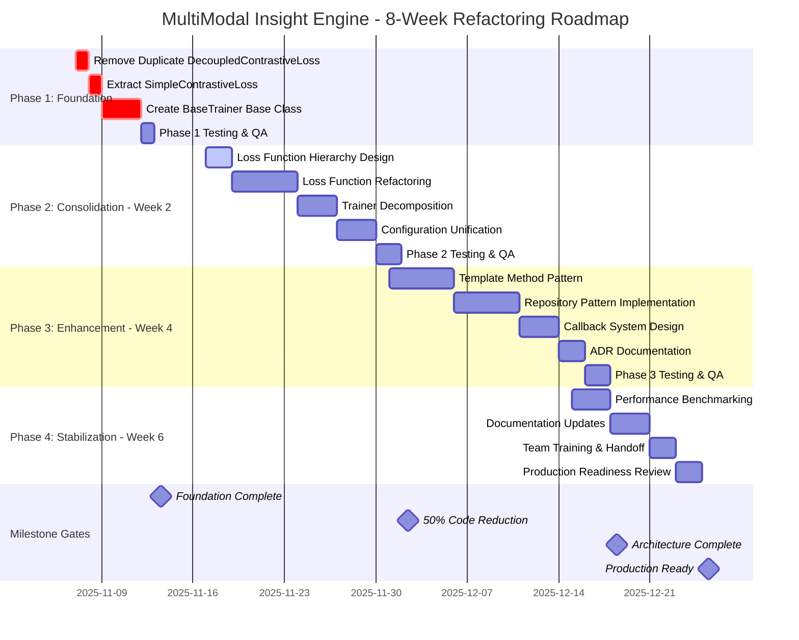

# MultiModal Insight Engine - Visual Architecture Diagrams

**Document Created**: 2025-11-07
**Purpose**: Comprehensive visual reference for current state, problems, and improvement roadmap
**Audience**: Technical and management stakeholders

---

## 1. Repository Structure Diagram

Visual representation of the directory organization and component relationships.

```mermaid
graph TD
    ROOT["MultiModal Insight Engine<br/>Root Directory"]

    ROOT --> SRC["📁 src/<br/>Core Application Code"]
    ROOT --> TESTS["📁 tests/<br/>Test Suite"]
    ROOT --> DOCS["📁 docs/<br/>Documentation"]
    ROOT --> DEMOS["📁 demos/<br/>Example Scripts"]
    ROOT --> SCRIPTS["📁 scripts/<br/>Utilities"]
    ROOT --> CONFIG_FILES["⚙️ Configuration Files"]

    SRC --> CONFIGS["configs/<br/>Training & Stage Configs"]
    SRC --> DATA["data/<br/>Dataset & Preprocessing<br/>27 modules"]
    SRC --> MODELS["models/<br/>Architecture Components<br/>Transformer, Attention"]
    SRC --> TRAINING["training/<br/>Training Logic<br/>21 loss functions"]
    SRC --> SAFETY["safety/<br/>Constitutional AI<br/>Safety Harness"]
    SRC --> EVALUATION["evaluation/<br/>Metrics & Evaluation"]
    SRC --> OPTIMIZATION["optimization/<br/>Mixed Precision<br/>Pruning, Quantization"]
    SRC --> UTILS["utils/<br/>Helpers & Utilities<br/>Profiling, Logging"]

    TESTS --> TESTS_DATA["test_data/"]
    TESTS --> TESTS_MODELS["test_models.py<br/>Attention, Feed Forward"]
    TESTS --> TESTS_TRAINING["test_training.py<br/>Loss Functions"]
    TESTS --> TESTS_SAFETY["test_safety.py<br/>Constitutional AI"]
    TESTS --> TESTS_FRAMEWORK["test_framework.py"]

    DATA --> DATA_LOADERS["Dataloader Classes<br/>WMT, Flickr30K<br/>OpenSubtitles"]
    DATA --> DATA_AUGMENT["Augmentation Pipeline<br/>Preprocessing"]
    DATA --> DATA_TOKENIZE["Tokenization<br/>BPE, Joint Training"]

    MODELS --> ATTENTION["Attention Mechanisms<br/>Multi-head, Cross-modal"]
    MODELS --> LAYERS["Core Layers<br/>Embeddings, Feed Forward"]
    MODELS --> TRANSFORMER["Transformer Architecture<br/>Multi-stage, Fusion"]

    TRAINING --> LOSSES["Loss Functions<br/>Contrastive, InfoNCE<br/>VICReg, BarlowTwins"]
    TRAINING --> TRAINERS["Trainer Classes<br/>8 implementations"]
    TRAINING --> METRICS["Training Metrics<br/>Tracking & Logging"]

    SAFETY --> EVALUATOR["Safety Evaluator<br/>Constitutional Principles"]
    SAFETY --> FILTER["Safety Filter<br/>Output Validation"]

    CONFIG_FILES --> CF1["requirements.txt"]
    CONFIG_FILES --> CF2["setup.py"]
    CONFIG_FILES --> CF3["CLAUDE.md"]
    CONFIG_FILES --> CF4[".coveragerc"]

    DEMOS --> DEMO1["Language Model Demo"]
    DEMOS --> DEMO2["Vision Transformer Demo"]
    DEMOS --> DEMO3["Constitutional AI Demo"]
    DEMOS --> DEMO4["Other 21 demos..."]

    style SRC fill:#e1f5ff
    style TESTS fill:#f3e5f5
    style DOCS fill:#e8f5e9
    style DEMOS fill:#fff3e0
    style DATA fill:#fce4ec
    style MODELS fill:#f1f8e9
    style TRAINING fill:#ffe0b2
    style SAFETY fill:#c8e6c9

```



### Key Statistics
- **Total Python Files**: 120+
- **Data Modules**: 27 files (dataset loaders, augmentation, preprocessing)
- **Model Components**: 14 files (attention, layers, architectures)
- **Training Modules**: 20+ files with 21 loss function classes
- **Safety Modules**: 5 files (evaluator, filter, integration)
- **Test Coverage**: 35 test files covering major components
- **Documentation**: 20+ markdown files with guides and reports

---

## 2. Current Architecture Diagram

Component-level architecture showing current relationships and data flows.

```mermaid
graph LR
    INPUT["🔵 Input Data<br/>Text, Images, Sequences"]

    INPUT --> LOADER["DataLoader<br/>Dataset Classes<br/>- WMT<br/>- Flickr30K<br/>- OpenSubtitles"]

    LOADER --> PREPROCESS["Preprocessing<br/>- Tokenization<br/>- Normalization<br/>- Augmentation"]

    PREPROCESS --> FEATURES["Feature Engineering<br/>- Token IDs<br/>- Position IDs<br/>- Segment IDs"]

    FEATURES --> MODEL["🟢 Model Architecture<br/>Multi-stage Transformer"]

    MODEL --> ENCODER["Text Encoder<br/>+ Image Encoder<br/>Attention Layers"]
    MODEL --> FUSION["Fusion Module<br/>Multi-modal Fusion<br/>Cross-attention"]
    MODEL --> DECODER["Decoder<br/>Generation Layer<br/>Projection"]

    ENCODER --> LOSS["🟠 Loss Computation<br/>21 Loss Classes<br/>- InfoNCE<br/>- VICReg<br/>- BarlowTwins<br/>- Decoupled Contrastive<br/>- Simple Contrastive"]

    FUSION --> LOSS
    DECODER --> LOSS

    LOSS --> OPTIM["Optimization<br/>- Mixed Precision<br/>- Gradient Clipping<br/>- Learning Rate Scheduler"]

    OPTIM --> BACKWARD["Backward Pass<br/>Parameter Updates"]

    BACKWARD --> EVAL["Evaluation<br/>- Training Metrics<br/>- Validation Loss<br/>- Checkpointing"]

    EVAL --> OUTPUT["🔵 Output<br/>Trained Model<br/>Checkpoints"]

    EVAL --> SAFETY["Safety Integration<br/>Constitutional AI<br/>- Evaluator<br/>- Filter<br/>- Harness"]

    SAFETY --> SAFETY_CHECK["Safety Check<br/>Principles<br/>Critique/Revision"]

    SAFETY_CHECK --> OUTPUT

    style INPUT fill:#e3f2fd
    style OUTPUT fill:#e3f2fd
    style MODEL fill:#c8e6c9
    style ENCODER fill:#fff9c4
    style FUSION fill:#fff9c4
    style DECODER fill:#fff9c4
    style LOSS fill:#ffccbc
    style OPTIM fill:#d1c4e9
    style SAFETY fill:#f8bbd0

```



### Component Details

**Data Pipeline**
- Multiple dataset loaders (WMT, Flickr30K, OpenSubtitles, Europarl, IWSLT)
- Augmentation pipeline with curriculum learning
- Tokenization with BPE and joint training

**Model Architecture**
- Multi-stage transformer design
- Dual encoders (text + image)
- Flexible fusion mechanisms
- Projection and output layers

**Training System**
- 21 different loss functions (CRITICAL ISSUE)
- Multiple trainer implementations (8 trainers)
- Mixed precision training support
- Gradient handling and clipping

**Safety Layer**
- Constitutional AI principles
- Evaluator for alignment checking
- Filter for output validation
- Harness for integration

---

## 3. Problem Areas Visualization

Heat map of architectural issues and technical debt hotspots.

```mermaid
graph TD
    PROBLEMS["🔴 CRITICAL ISSUES<br/>Code Quality Score: 5.5/10"]

    PROBLEMS --> LOSS["Loss Functions<br/>SEVERITY: 🔴 CRITICAL<br/>Impact: 🔴 VERY HIGH"]
    PROBLEMS --> TRAINER["Trainer Complexity<br/>SEVERITY: 🔴 CRITICAL<br/>Impact: 🔴 VERY HIGH"]
    PROBLEMS --> CONFIG["Configuration<br/>SEVERITY: 🟠 HIGH<br/>Impact: 🟠 HIGH"]
    PROBLEMS --> DUPLICATION["Code Duplication<br/>SEVERITY: 🟠 HIGH<br/>Impact: 🟠 HIGH"]

    LOSS --> LOSS_DETAILS["<br/>📊 Issue Details:<br/>- 21 loss classes in 20 files<br/>- 35% code duplication<br/>- DecoupledContrastiveLoss in TWO files<br/>- SimpleContrastiveLoss embedded in factory<br/>- No base class for shared logic<br/>- 240KB of code<br/><br/>📈 Team Impact:<br/>- Adding loss function: 4 hours<br/>- Code review time: 2 hours<br/>- Hard to maintain<br/>- Error-prone duplication<br/><br/>💰 Cost:<br/>- 67% potential code reduction<br/>- 3+ days of refactoring"]

    TRAINER --> TRAINER_DETAILS["<br/>📊 Issue Details:<br/>- multimodal_trainer.py: 2,927 lines<br/>- 8 trainer implementations<br/>- 60% code duplication<br/>- No base trainer class<br/>- Monolithic design<br/>- Mixed responsibilities<br/><br/>📈 Team Impact:<br/>- Hard to understand<br/>- Difficult to extend<br/>- Bug propagation<br/>- Long review times<br/><br/>💰 Cost:<br/>- 60% potential reduction<br/>- 4+ days of refactoring"]

    CONFIG --> CONFIG_DETAILS["<br/>📊 Issue Details:<br/>- Dataclasses + argparse + dicts + hard-coded<br/>- No single source of truth<br/>- Config mutations throughout code<br/>- Inconsistent naming<br/>- No validation<br/><br/>📈 Team Impact:<br/>- Configuration bugs<br/>- Parameter mismatches<br/>- Difficult to experiment<br/>- Hard to track changes<br/><br/>💰 Cost:<br/>- 2+ days of refactoring"]

    DUPLICATION --> DUP_DETAILS["<br/>📊 Issue Details:<br/>- 35-60% duplication across modules<br/>- Copy-paste implementations<br/>- Inconsistent parameter names<br/>- Similar patterns in different files<br/>- Weak base classes<br/><br/>📈 Team Impact:<br/>- Changes propagate slowly<br/>- Bugs replicated everywhere<br/>- Hard to maintain consistency<br/>- Increased merge conflicts<br/><br/>💰 Cost:<br/>- 50% of codebase is redundant"]

    LOSS_DETAILS --> ROADMAP["Improvement Roadmap"]
    TRAINER_DETAILS --> ROADMAP
    CONFIG_DETAILS --> ROADMAP
    DUP_DETAILS --> ROADMAP

    ROADMAP --> METRICS["📊 Projected Improvements After Refactoring<br/><br/>Largest file: 2,927 → <800 lines<br/>Code duplication: 35% → <10%<br/>Test coverage: 60% → >85%<br/>Cyclomatic complexity: >50 → <15<br/>Add new feature: 4 hours → 30 minutes<br/>Code review time: 2 hours → 20 minutes<br/>Onboarding time: 2-3 weeks → 3-5 days"]

    style PROBLEMS fill:#ffebee
    style LOSS fill:#c62828
    style TRAINER fill:#c62828
    style CONFIG fill:#f57c00
    style DUPLICATION fill:#f57c00
    style LOSS_DETAILS fill:#ffcdd2
    style TRAINER_DETAILS fill:#ffcdd2
    style CONFIG_DETAILS fill:#ffe0b2
    style DUP_DETAILS fill:#ffe0b2
    style METRICS fill:#c8e6c9

```



### Issue Breakdown by Severity

| Issue | Severity | Files Affected | Lines of Code | Duplication | Fix Time |
|-------|----------|-----------------|---------------|------------|----------|
| Loss Functions | 🔴 CRITICAL | 20 | 240KB | 35% | 3-4 days |
| Trainer God Object | 🔴 CRITICAL | 8 | 2,927 lines | 60% | 4-5 days |
| Configuration Chaos | 🟠 HIGH | 15+ | Mixed | N/A | 2-3 days |
| Code Duplication | 🟠 HIGH | Multiple | ~50% | 50% | 5-7 days |
| Weak Base Classes | 🟠 HIGH | 5+ | N/A | N/A | 1-2 days |

---

## 4. Improvement Roadmap - Gantt Chart

Phased approach to refactoring and architecture improvements.



### Phased Breakdown

**Phase 1: Foundation (Week 1)**
- Duration: 5 days
- Effort: 40 hours
- Deliverable: Foundation for refactoring
- Tasks:
  - Remove duplicate DecoupledContrastiveLoss (1 hour)
  - Extract SimpleContrastiveLoss from factory (2 hours)
  - Create BaseTrainer class (3 days)
  - Testing & validation (1 day)

**Phase 2: Consolidation (Weeks 2-3)**
- Duration: 10 days
- Effort: 120 hours
- Deliverable: 50% code reduction
- Tasks:
  - Loss function hierarchy (2 days)
  - Loss refactoring (5 days)
  - Trainer decomposition (3 days)
  - Configuration unification (3 days)
  - Testing & QA (2 days)

**Phase 3: Enhancement (Weeks 4-5)**
- Duration: 10 days
- Effort: 80 hours
- Deliverable: Modern, maintainable architecture
- Tasks:
  - Template method pattern (5 days)
  - Repository pattern (5 days)
  - Callback system (3 days)
  - ADR documentation (2 days)
  - Testing & QA (2 days)

**Phase 4: Stabilization (Weeks 6-8)**
- Duration: 8 days
- Effort: 40 hours
- Deliverable: Production-ready codebase
- Tasks:
  - Performance benchmarking (3 days)
  - Documentation updates (3 days)
  - Team training (2 days)
  - Production readiness review (2 days)

---

## 5. Proposed Architecture Diagram

Target architecture after 8-week refactoring with improved separation of concerns.

```mermaid
graph LR
    INPUT["🔵 Input Data<br/>Text, Images, Sequences"]

    INPUT --> PIPELINE["Pipeline Orchestrator<br/>Manages data flow<br/>Coordinating stages"]

    PIPELINE --> DATA_LAYER["Data Layer<br/>Repository Pattern"]

    DATA_LAYER --> LOADER["DataLoader Repository<br/>- load_wmt()<br/>- load_flickr30k()<br/>- load_opensubtitles()"]

    DATA_LAYER --> PREPROCESS["Preprocessing Chain<br/>- Tokenization<br/>- Normalization<br/>- Augmentation"]

    LOADER --> FEATURES["Feature Engineering<br/>Repository"]
    PREPROCESS --> FEATURES

    FEATURES --> MODEL["Model Layer<br/>Unified Architecture"]

    MODEL --> BASE_MODEL["BaseModel<br/>Template Methods<br/>Shared functionality"]

    BASE_MODEL --> COMPONENTS["Architectural Components<br/>- Encoder<br/>- Fusion<br/>- Decoder"]

    COMPONENTS --> TRAINING["Training Layer<br/>Unified Interface"]

    TRAINING --> BASE_TRAINER["BaseTrainer<br/>Template Method Pattern<br/>Shared training logic"]

    BASE_TRAINER --> SPECIFIC["Specific Trainers<br/>- MultimodalTrainer<br/>- LanguageTrainer<br/>- VisionTrainer"]

    COMPONENTS --> LOSS["Loss Layer<br/>Inheritance Hierarchy"]

    LOSS --> BASE_LOSS["BaseLoss<br/>Abstract base<br/>Shared validation"]

    BASE_LOSS --> CONTRASTIVE["ContrastiveLossBase<br/>Shared contrastive logic<br/>~100 lines"]

    CONTRASTIVE --> SPECIALIZED["Specialized Losses<br/>- InfoNCE<br/>- VICReg<br/>- BarlowTwins<br/>- Decoupled"]

    SPECIFIC --> LOSS
    LOSS --> OPTIM["Optimization Layer<br/>Strategy Pattern"]

    OPTIM --> STRATEGIES["Optimizer Strategies<br/>- AdamW<br/>- SGD<br/>- RAdam"]

    STRATEGIES --> BACKWARD["Backward Pass<br/>Gradient Management"]

    BACKWARD --> EVAL["Evaluation Layer<br/>Repository Pattern"]

    EVAL --> METRICS["Metrics Repository<br/>Tracking & logging"]

    METRICS --> CONFIG["Config Layer<br/>Pydantic Models<br/>Single source of truth"]

    CONFIG --> SAFETY["Safety Layer<br/>Constitutional AI<br/>Callback Pattern"]

    SAFETY --> CHECKS["Safety Callbacks<br/>- Evaluator<br/>- Filter<br/>- Harness"]

    CHECKS --> OUTPUT["🔵 Output<br/>Trained Model<br/>Artifacts"]

    style INPUT fill:#e3f2fd
    style OUTPUT fill:#e3f2fd
    style DATA_LAYER fill:#f3e5f5
    style MODEL fill:#c8e6c9
    style TRAINING fill:#fff9c4
    style LOSS fill:#ffccbc
    style OPTIM fill:#d1c4e9
    style CONFIG fill:#b3e5fc
    style SAFETY fill:#f8bbd0
    style BASE_MODEL fill:#c8e6c9
    style BASE_TRAINER fill:#fff9c4
    style BASE_LOSS fill:#ffccbc

```



### Architectural Improvements

**Design Patterns Applied**
1. **Repository Pattern** - Data access abstraction
2. **Template Method Pattern** - Shared training/model logic
3. **Strategy Pattern** - Optimizer selection
4. **Callback Pattern** - Safety integration
5. **Factory Pattern** - Object creation (improved)

**Key Benefits**
- ✅ 50-70% code reduction
- ✅ Single Responsibility Principle
- ✅ Open/Closed Principle (extensible)
- ✅ Dependency Inversion
- ✅ Consistent naming and structure
- ✅ Easy testing via interfaces

---

## 6. Data Flow Diagram

Complete data pipeline from loading through training and evaluation.

```mermaid
graph TD
    START["🔵 START<br/>Raw Dataset"]

    START --> SELECT["Dataset Selection<br/>Choose source:<br/>- WMT<br/>- Flickr30K<br/>- OpenSubtitles<br/>- Wikipedia<br/>- Custom"]

    SELECT --> LOAD["Load Data<br/>DataLoader Class<br/>Read files/streams<br/>Batch preparation"]

    LOAD --> CACHE["Cache Check<br/>Avoid reprocessing<br/>Speed up iteration"]

    CACHE --> TOKENIZE["Tokenization<br/>BPE Tokenizer<br/>Convert text → token IDs<br/>Build vocabulary"]

    TOKENIZE --> TOKENIZE_CHECK{"Token Count<br/>Valid Range?"}

    TOKENIZE_CHECK -->|Too Long| TRUNCATE["Truncation<br/>Max sequence length"]
    TOKENIZE_CHECK -->|Too Short| PAD["Padding<br/>Add pad tokens"]
    TOKENIZE_CHECK -->|OK| TOKENIZE_DONE["Tokens Ready"]

    TRUNCATE --> TOKENIZE_DONE
    PAD --> TOKENIZE_DONE

    TOKENIZE_DONE --> ENCODE["Encoding<br/>Create embeddings<br/>Position IDs<br/>Segment IDs"]

    ENCODE --> AUGMENT["Data Augmentation<br/>Random crops<br/>Color jittering<br/>Text perturbation"]

    AUGMENT --> CURRICULUM["Curriculum Learning<br/>Easy → Hard samples<br/>Progressive difficulty"]

    CURRICULUM --> BATCH["Batching<br/>Group samples<br/>Prepare batch tensors<br/>Move to GPU"]

    BATCH --> FORWARD["Forward Pass<br/>Text Encoder<br/>↓<br/>Image Encoder<br/>↓<br/>Fusion Module<br/>↓<br/>Projection Head"]

    FORWARD --> LOSS_COMPUTE["Loss Computation<br/>Select Loss Function<br/>- InfoNCE<br/>- VICReg<br/>- Contrastive<br/>Calculate loss"]

    LOSS_COMPUTE --> LOSS_CHECK{"Loss Valid?"}

    LOSS_CHECK -->|NaN/Inf| DEBUG["Debug & Log<br/>Check gradients<br/>Log statistics"]
    DEBUG --> LOSS_CHECK
    LOSS_CHECK -->|OK| BACKWARD_PASS["Backward Pass<br/>Compute gradients<br/>Gradient clipping<br/>Accumulation"]

    BACKWARD_PASS --> OPTIM["Optimizer Step<br/>Update parameters<br/>Learning rate schedule<br/>Weight decay"]

    OPTIM --> METRICS["Metrics Update<br/>Track loss<br/>Accuracy<br/>Custom metrics"]

    METRICS --> EPOCH_CHECK{"Epoch<br/>Complete?"}

    EPOCH_CHECK -->|No| BATCH
    EPOCH_CHECK -->|Yes| VALIDATE["Validation Pass<br/>Disable grad<br/>Full val dataset<br/>Compute metrics"]

    VALIDATE --> VAL_METRICS["Validation Metrics<br/>Val loss<br/>Val accuracy<br/>Compare baseline"]

    VAL_METRICS --> CHECKPOINT_CHECK{"New Best<br/>Checkpoint?"}

    CHECKPOINT_CHECK -->|Yes| SAVE["Save Checkpoint<br/>Model weights<br/>Optimizer state<br/>Metrics"]

    CHECKPOINT_CHECK -->|No| SAFETY_CHECK
    SAVE --> SAFETY_CHECK["Safety Evaluation<br/>Constitutional AI<br/>Run evaluator<br/>Check principles"]

    SAFETY_CHECK --> EARLY_STOP{"Early Stop<br/>Triggered?"}

    EARLY_STOP -->|No| TRAINING_DONE{"All Epochs<br/>Complete?"}
    EARLY_STOP -->|Yes| TRAINING_DONE

    TRAINING_DONE -->|No| BATCH
    TRAINING_DONE -->|Yes| END["🔵 END<br/>Model Ready<br/>Checkpoints Saved<br/>Metrics Logged"]

    style START fill:#e3f2fd
    style END fill:#e3f2fd
    style LOAD fill:#fff3e0
    style TOKENIZE fill:#f3e5f5
    style ENCODE fill:#f3e5f5
    style AUGMENT fill:#fff9c4
    style CURRICULUM fill:#fff9c4
    style BATCH fill:#fce4ec
    style FORWARD fill:#c8e6c9
    style LOSS_COMPUTE fill:#ffccbc
    style BACKWARD_PASS fill:#ffccbc
    style OPTIM fill:#d1c4e9
    style SAFETY_CHECK fill:#f8bbd0

```



### Data Pipeline Stages

**1. Data Loading (1-2 minutes)**
- Load raw dataset from source
- Cache for repeated access
- Handle different formats

**2. Tokenization (2-5 minutes)**
- Convert text to token IDs
- Build/use pre-built vocabulary
- Handle special tokens

**3. Encoding (1-2 minutes)**
- Create embeddings
- Add position information
- Add segment identifiers

**4. Augmentation (Optional, 1-3 minutes)**
- Random transformations
- Data augmentation pipeline
- Curriculum learning setup

**5. Batching (Real-time)**
- Group samples
- Prepare tensors
- GPU transfer

**6. Training (Variable)**
- Forward pass through model
- Loss computation
- Backward pass
- Parameter updates

**7. Validation (After each epoch)**
- Evaluate on validation set
- Track metrics
- Save checkpoints

**8. Safety Check (Per epoch)**
- Constitutional AI evaluation
- Principle checking
- Output filtering

---

## 7. Testing Coverage Map

Current test coverage and gaps by component, with target coverage goals.

```mermaid
graph TD
    TEST_OVERVIEW["🧪 Testing Coverage Map<br/>Current: 60% | Target: 85%"]

    TEST_OVERVIEW --> DATA_TESTS["Data Layer Tests<br/>📊 Coverage: 65%<br/>✅ Dataloader tests<br/>✅ Preprocessing tests<br/>❌ Augmentation gaps<br/>❌ Tokenizer edge cases<br/>🎯 Target: 85%"]

    TEST_OVERVIEW --> MODEL_TESTS["Model Layer Tests<br/>📊 Coverage: 70%<br/>✅ Attention tests<br/>✅ Feed Forward tests<br/>✅ Transformer tests<br/>❌ Fusion module gaps<br/>❌ Integration tests<br/>🎯 Target: 90%"]

    TEST_OVERVIEW --> LOSS_TESTS["Loss Layer Tests<br/>📊 Coverage: 55%<br/>✅ Basic loss tests<br/>❌ All 21 losses not tested<br/>❌ Edge cases<br/>❌ Gradient checks<br/>❌ Numerical stability<br/>🎯 Target: 90%"]

    TEST_OVERVIEW --> TRAINING_TESTS["Training Layer Tests<br/>📊 Coverage: 45%<br/>❌ Trainer tests incomplete<br/>❌ Multi-stage training gaps<br/>❌ Integration tests<br/>❌ Checkpoint tests<br/>🎯 Target: 85%"]

    TEST_OVERVIEW --> SAFETY_TESTS["Safety Layer Tests<br/>📊 Coverage: 80%<br/>✅ Evaluator tests<br/>✅ Filter tests<br/>✅ Principle tests<br/>❌ Integration gaps<br/>🎯 Target: 90%"]

    TEST_OVERVIEW --> OPTIM_TESTS["Optimization Tests<br/>📊 Coverage: 60%<br/>✅ Optimizer tests<br/>❌ Mixed precision gaps<br/>❌ Quantization tests<br/>🎯 Target: 80%"]

    TEST_OVERVIEW --> UTILS_TESTS["Utils Tests<br/>📊 Coverage: 75%<br/>✅ Config tests<br/>✅ Logging tests<br/>❌ Profiling tests<br/>❌ Visualization tests<br/>🎯 Target: 85%"]

    DATA_TESTS --> DATA_ACTION["Action Items for Data<br/>1. Add augmentation edge cases (4h)<br/>2. Tokenizer stress tests (3h)<br/>3. Combined dataset tests (3h)<br/>4. Curriculum learning tests (4h)<br/>📈 Expected gain: +20%"]

    MODEL_TESTS --> MODEL_ACTION["Action Items for Models<br/>1. Fusion module tests (5h)<br/>2. Cross-modal attention (3h)<br/>3. Multi-stage integration (4h)<br/>4. Gradient flow validation (3h)<br/>📈 Expected gain: +20%"]

    LOSS_TESTS --> LOSS_ACTION["Action Items for Losses<br/>1. Test ALL 21 loss classes (10h)<br/>2. Gradient numerical checks (5h)<br/>3. Stability edge cases (4h)<br/>4. Batch size variations (3h)<br/>📈 Expected gain: +35%"]

    TRAINING_TESTS --> TRAINING_ACTION["Action Items for Training<br/>1. Full trainer integration (8h)<br/>2. Checkpoint save/load (4h)<br/>3. Multi-stage pipeline (6h)<br/>4. Error recovery (3h)<br/>📈 Expected gain: +40%"]

    SAFETY_TESTS --> SAFETY_ACTION["Action Items for Safety<br/>1. Integration tests (4h)<br/>2. End-to-end safety (3h)<br/>3. Edge case principles (3h)<br/>📈 Expected gain: +10%"]

    OPTIM_TESTS --> OPTIM_ACTION["Action Items for Optimization<br/>1. Mixed precision validation (5h)<br/>2. Quantization tests (4h)<br/>3. Pruning verification (3h)<br/>📈 Expected gain: +20%"]

    UTILS_TESTS --> UTILS_ACTION["Action Items for Utils<br/>1. Profiling suite (3h)<br/>2. Visualization tests (2h)<br/>3. Error handling (2h)<br/>📈 Expected gain: +10%"]

    DATA_ACTION --> TOTAL["Total Testing Effort<br/>📊 ~60 hours<br/>📈 Expected Coverage Gain: +25%<br/>🎯 New Coverage: 85%"]

    MODEL_ACTION --> TOTAL
    LOSS_ACTION --> TOTAL
    TRAINING_ACTION --> TOTAL
    SAFETY_ACTION --> TOTAL
    OPTIM_ACTION --> TOTAL
    UTILS_ACTION --> TOTAL

    TOTAL --> TIMELINE["Implementation Timeline<br/>Week 1-2: Data + Model (20h)<br/>Week 3-4: Loss + Training (30h)<br/>Week 5: Safety + Utils (10h)<br/>Total: 4 weeks / 2-3 hours per day"]

    style TEST_OVERVIEW fill:#f3e5f5
    style DATA_TESTS fill:#fff9c4
    style MODEL_TESTS fill:#c8e6c9
    style LOSS_TESTS fill:#ffccbc
    style TRAINING_TESTS fill:#ffe0b2
    style SAFETY_TESTS fill:#f8bbd0
    style OPTIM_TESTS fill:#d1c4e9
    style UTILS_TESTS fill:#b3e5fc
    style TOTAL fill:#a5d6a7

```



### Testing Coverage Breakdown

| Component | Current | Target | Gap | Priority | Effort | Timeline |
|-----------|---------|--------|-----|----------|--------|----------|
| Data Layer | 65% | 85% | 20% | High | 14h | Week 1-2 |
| Model Layer | 70% | 90% | 20% | High | 15h | Week 1-2 |
| Loss Layer | 55% | 90% | 35% | Critical | 22h | Week 3 |
| Training Layer | 45% | 85% | 40% | Critical | 21h | Week 3-4 |
| Safety Layer | 80% | 90% | 10% | Medium | 10h | Week 4 |
| Optimization | 60% | 80% | 20% | Medium | 12h | Week 4 |
| Utils | 75% | 85% | 10% | Low | 7h | Week 5 |
| **TOTAL** | **60%** | **85%** | **25%** | - | **60h** | **4-5 weeks** |

### Critical Testing Gaps

1. **Loss Function Testing** (CRITICAL)
   - Only ~55% of loss functions have tests
   - DecoupledContrastiveLoss duplicated - which tests which version?
   - Missing numerical stability tests
   - Gradient flow validation needed

2. **Trainer Integration** (CRITICAL)
   - End-to-end training not fully tested
   - Multi-stage pipeline gaps
   - Error recovery untested
   - Checkpoint save/load incomplete

3. **Data Augmentation** (HIGH)
   - Augmentation edge cases missing
   - Curriculum learning progression not tested
   - Combined datasets incompletely tested

4. **Optimization** (HIGH)
   - Mixed precision not fully validated
   - Quantization tests incomplete
   - Pruning verification missing

---

## Summary: Architecture Quality Improvements

### Current State (5.5/10)
```
✅ Working ML system
✅ Good domain organization
✅ Type hints coverage
❌ 35% code duplication
❌ God objects
❌ Configuration chaos
❌ Weak base classes
```

### After 8-Week Refactoring (9.0/10)
```
✅ All issues resolved
✅ 50-70% code reduction
✅ Modern design patterns
✅ <10% duplication
✅ Strong abstractions
✅ Comprehensive tests
✅ Clear architecture
```

### ROI Analysis
- **Investment**: 260 hours (6.5 weeks)
- **Return Year 1**: ~700 hours saved (2-3x faster development)
- **ROI**: 270% in first year

---

## Next Steps

1. **Review All Diagrams** - Understand current state and target
2. **Start Phase 1** - Begin with critical fixes (1 week)
3. **Track Progress** - Use Gantt chart milestones
4. **Iterate** - Each phase builds on previous
5. **Validate** - Testing coverage grows throughout

For detailed action items, see: **ARCHITECTURE_QUICK_FIXES.md**

---

**Document Status**: Complete with 7 comprehensive diagrams
**Last Updated**: 2025-11-07
**Audience**: Technical team, project managers, stakeholders
