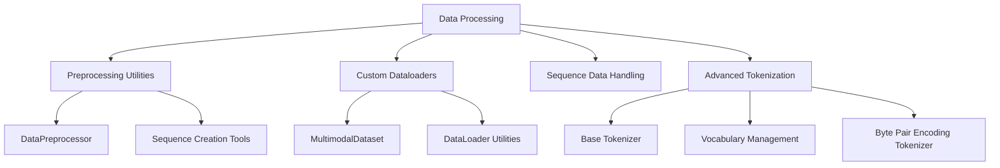

# MultiModal Insight Engine: Data Processing Architecture

## Overview

The `data` directory provides a comprehensive suite of data processing utilities designed to support complex machine learning workflows, with a particular focus on transformer and sequence-based models.

## Architecture Diagram



## Core Modules

### 1. Data Preprocessing (`preprocessing.py`)

#### Purpose
Provide robust data preprocessing and transformation utilities.

#### Key Components
1. `DataPreprocessor`
   - Flexible data scaling and normalization
   - Supports multiple scaling methods (standard, min-max)
   - Handles both NumPy arrays and PyTorch tensors

#### Example Instantiation
```python
# Create a data preprocessor
preprocessor = DataPreprocessor(method='standard')

# Prepare data
data = torch.randn(100, 5)  # Sample dataset

# Fit and transform
preprocessor.fit(data)
normalized_data = preprocessor.transform(data)

# Inverse transform if needed
original_data = preprocessor.inverse_transform(normalized_data)
```

#### Key Methods
- `fit()`: Compute scaling parameters
- `transform()`: Apply scaling
- `inverse_transform()`: Revert to original scale
- `fit_transform()`: Combine fitting and transformation

2. Sequence Utility Functions
   - `create_sequences()`: Convert time series to sequence data
   - `split_data()`: Split data into train/validation/test sets

#### Example Usage
```python
# Create sequences from time series data
sequences, targets = create_sequences(data, seq_length=10)

# Split data into train/val/test sets
train_data, val_data, test_data = split_data(
    data, 
    train_ratio=0.7, 
    val_ratio=0.15
)
```

### 2. DataLoader Utilities (`dataloader.py`)

#### Purpose
Provide flexible data loading capabilities for multimodal machine learning tasks.

#### Key Components
1. `MultimodalDataset`
   - Supports datasets with multiple modalities
   - Ensures consistent length across modalities
   - Flexible data handling

#### Example Instantiation
```python
# Create a multimodal dataset
multimodal_data = {
    'text': torch.randn(1000, 512),   # Text embeddings
    'image': torch.randn(1000, 3, 224, 224),  # Image data
    'labels': torch.randint(0, 10, (1000,))   # Classification labels
}

dataset = MultimodalDataset(multimodal_data)

# Create dataloader
dataloader = create_dataloader(
    dataset, 
    batch_size=32, 
    shuffle=True
)
```

2. DataLoader Creation Utilities
   - `create_dataloader()`: Flexible DataLoader creation
   - `get_dataloaders()`: Create train/val/test dataloaders

### 3. Sequence Data Handling (`sequence_data.py`)

#### Purpose
Provide specialized tools for sequence-based machine learning tasks.

#### Key Components
1. `TransformerDataset`
   - Designed for sequence-to-sequence tasks
   - Handles tokenized source and target sequences
   - Supports BOS/EOS token management

#### Example Instantiation
```python
# Create a transformer dataset for translation
dataset = TransformerDataset(
    source_sequences=[[1, 2, 3], [4, 5, 6]],  # Source token sequences
    target_sequences=[[7, 8, 9], [10, 11, 12]],  # Target token sequences
    max_src_len=10,
    max_tgt_len=10,
    pad_idx=0,
    bos_idx=1,
    eos_idx=2
)
```

2. Collation Functions
   - `transformer_collate_fn()`: Custom batching for transformer models
   - Handles variable-length sequences
   - Applies padding and masking

### 4. Europarl Dataset (`europarl_dataset.py`)

#### Purpose
Specialized dataset loader for multilingual parallel corpora.

#### Example Instantiation
```python
# Load Europarl parallel corpus
dataset = EuroparlDataset(
    data_dir="data/europarl",
    src_lang="de",  # Source language
    tgt_lang="en",  # Target language
    max_examples=10000,  # Limit number of examples
    random_seed=42
)
```

## Design Principles

1. **Modularity**: Separate concerns for different data processing tasks
2. **Flexibility**: Support for multiple data types and machine learning workflows
3. **Efficiency**: Optimized data loading and preprocessing
4. **Extensibility**: Easy to add new dataset types or preprocessing methods

## Recommendations for Future Development

1. Add more comprehensive data validation
2. Implement more advanced data augmentation techniques
3. Create more specialized dataset loaders
4. Enhance error handling and logging
5. Add support for streaming large datasets

## Anthropic Research Alignment

The data processing architecture supports:
- Multimodal data handling
- Efficient sequence processing
- Flexible tokenization strategies
- Robust preprocessing techniques
- Support for research-oriented dataset management

