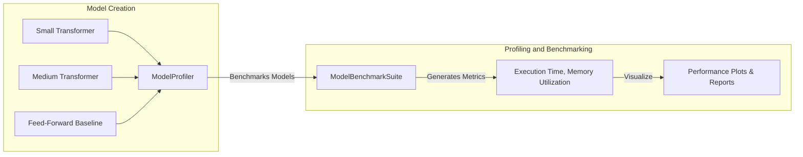

# Hardware Profiling Demo

## Purpose

This demo script demonstrates hardware profiling and benchmarking of Transformer and baseline feed-forward neural network models, focusing on analyzing resource utilization and execution performance.

## Detailed Architecture



## Data Flow Explained

- **Model Initialization:** Three models (small Transformer, medium Transformer, feed-forward neural network) are created to benchmark against each other.
- **ModelProfiler:** Conducts systematic hardware profiling.
- **BenchmarkSuite:** Aggregates performance metrics such as execution time and memory usage.
- **Visualization:** Results are visualized to illustrate hardware performance clearly.

## Component Configurations

### Model Creation

**Small Transformer Encoder**

- Vocabulary: 10,000 tokens
- Model dimension (`d_model`): 256
- Attention Heads: 4
- Layers: 2
- Feed-Forward Dimension: 512

**Medium Transformer Encoder**

- Vocabulary: 30,000 tokens
- Model dimension (`d_model`): 512
- Attention Heads: 8
- Layers: 6
- Feed-Forward Dimension: 2048

**Feed-Forward Baseline Model**

- Input Size: 512
- Hidden Layers: `[1024, 1024, 512]`
- Output Size: 512

### Input Generation

Random token indices for Transformers, numeric tensors for feed-forward networks:

```python
def generate_input(batch_size, seq_length, vocab_size):
    return torch.randint(0, vocab_size, (batch_size, seq_length))
```

### Profiling (`ModelProfiler`)

- Profiles execution time, CPU/GPU utilization, memory usage per model.

Example setup:

```python
profiler = ModelProfiler()
profiler.profile_model(model, input_generator)
```

### Benchmark Suite (`ModelBenchmarkSuite`)

- Benchmarks multiple models systematically, outputs comparative metrics.

Example:

```python
benchmark_suite = ModelBenchmarkSuite([model1, model2], profiler)
benchmark_suite.run()
benchmark_suite.generate_report()
```

## Running Instructions

### Step 1: Environment setup

```shell
pip install -r requirements.txt
```

### Step 2: Execute hardware profiling demo

```shell
python demos/hardware_profiling_demo.py
```

### Step 3: Analyze Results

Performance metrics and visualization plots will be outputted, illustrating:

- Model execution times
- Memory and hardware utilization

## Extensibility

Easy extension with additional models or profiling metrics:

```python
new_model = create_custom_transformer(...)
benchmark_suite.add_model(new_model)
```

## Integration

Designed to seamlessly integrate into model optimization workflows, aiding informed decisions about deployment and hardware selection.