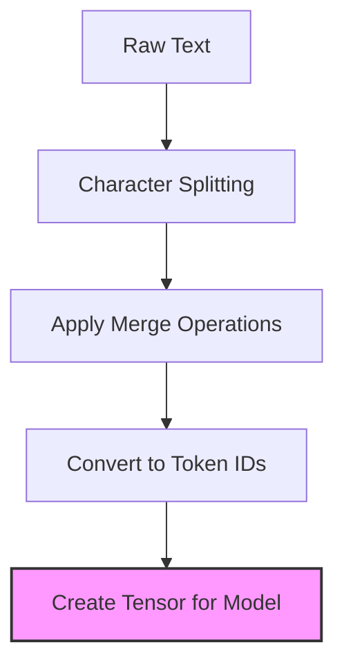
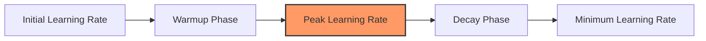
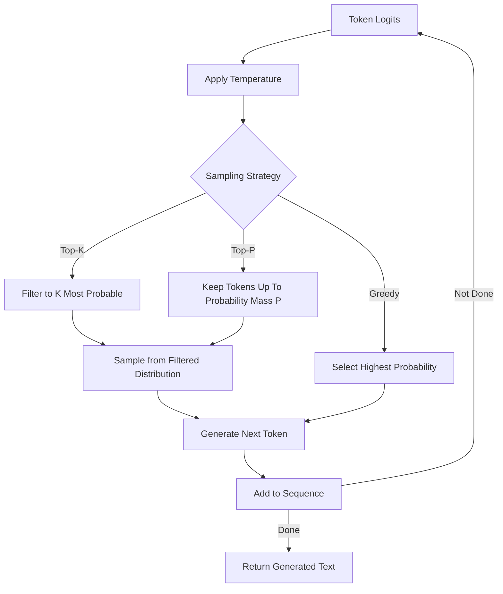

# Language Model Training & Optimization: Comprehensive Guide

This guide covers the essential theoretical concepts for language model training and optimization, building on your transformer implementation and preparing you for the transition to multimodal systems in Week 5.

## 1. Autoregressive Language Modeling

### What It Is
Autoregressive language modeling is a fundamental approach where models predict the next token based on all previous tokens in the sequence. It's the core paradigm behind generative language models like GPT and Claude.

Mathematically, autoregressive models factorize the joint probability of a sequence into a product of conditional probabilities:

$$p(x_1, x_2, ..., x_n) = \prod_{i=1}^{n} p(x_i | x_1, x_2, ..., x_{i-1})$$

### How It's Used
In transformer architectures, autoregressive modeling is typically implemented using causal attention masks in decoder blocks, ensuring each position can only attend to previous positions.

```python
# From src/training/transformer_utils.py
def create_causal_mask(seq_len: int, device: torch.device) -> torch.Tensor:
    """Creates a causal mask to prevent attending to future tokens."""
    # Create a lower triangular matrix (including the diagonal)
    mask = torch.tril(torch.ones(seq_len, seq_len, device=device))
    
    # Convert to boolean mask where True means "attend to this position"
    mask = mask.bool()
    
    return mask
```

### Why It's Important
Autoregressive modeling is what enables your transformer to generate coherent text by predicting one token at a time. It's the fundamental capability that will later be extended to incorporate visual information in a multimodal setting. For your Anthropic-focused project, this is crucial as Claude's core text generation abilities rely on this principle.

## 2. Tokenization Approaches

### What It Is
Tokenization is the process of converting raw text into discrete tokens that serve as input to language models. Different approaches include:

- **Byte-Pair Encoding (BPE)**: Iteratively merges the most frequent character pairs
- **WordPiece**: Similar to BPE but uses likelihood improvement as the merge criterion
- **SentencePiece**: Unigram language model that treats text as a character stream

### How It's Used
Your project implements BPE tokenization for efficient processing of text inputs:

```python
# From src/data/tokenization/bpe_tokenizer.py
def tokenize(self, text: str) -> List[str]:
    """Convert text into subword tokens based on learned merge operations."""
    # Preprocess text (lowercase, normalize, etc.)
    text = self.preprocessor.preprocess(text)
    
    # Start with characters
    tokens = list(text)
    
    # Apply merge operations in order
    for pair, idx in self.merges.items():
        i = 0
        while i < len(tokens) - 1:
            if tokens[i] == pair[0] and tokens[i + 1] == pair[1]:
                tokens[i:i+2] = [pair[0] + pair[1]]
            else:
                i += 1
                
    return tokens
```

### Why It's Important
The choice of tokenization approach significantly impacts model performance, training efficiency, and generalization capabilities. A good tokenizer balances vocabulary size with token frequency to efficiently represent text. As you move toward multimodal systems, understanding tokenization will help you conceptualize how to discretize other modalities like images.



## 3. Training Dynamics for Transformers

### What It Is
Training dynamics refers to the specialized techniques needed to train transformer models effectively, including learning rate schedules, optimization strategies, and techniques to manage the computational demands of large models.

### How It's Used
Your project implements several of these techniques:

```python
# From src/training/language_model_trainer.py
def configure_optimizer_and_scheduler(self):
    """Setup optimizer with warmup and learning rate scheduling."""
    # Create optimizer
    self.optimizer = torch.optim.AdamW(
        self.model.parameters(),
        lr=self.learning_rate,
        betas=(0.9, 0.999),
        eps=1e-8,
        weight_decay=0.01
    )
    
    # Create learning rate scheduler with warmup
    def lr_lambda(current_step):
        if current_step < self.warmup_steps:
            # Linear warmup
            return float(current_step) / float(max(1, self.warmup_steps))
        else:
            # Cosine decay
            progress = float(current_step - self.warmup_steps) / float(
                max(1, self.total_steps - self.warmup_steps)
            )
            return max(0.1, 0.5 * (1.0 + math.cos(math.pi * progress)))
    
    self.scheduler = torch.optim.lr_scheduler.LambdaLR(
        self.optimizer, lr_lambda
    )
```

Learning rate scheduling visualization:



### Why It's Important
Proper training dynamics are crucial for successful transformer training. Without appropriate learning rate schedules, models may fail to converge or get stuck in poor local minima. As your models grow in complexity for multimodal tasks, these considerations become even more critical. Anthropic's models use sophisticated training regimes to achieve their performance.

## 4. Language Model Loss Functions

### What It Is
Loss functions quantify how well the model is performing and guide the optimization process. For language models, cross-entropy loss is the standard approach, with variations like label smoothing to improve robustness.

### How It's Used
Your implementation uses cross-entropy loss with label smoothing:

```python
# Implementation of cross-entropy loss with label smoothing
class LabelSmoothing(nn.Module):
    """Implements label smoothing loss for improved model generalization."""
    def __init__(self, smoothing: float = 0.1, ignore_index: int = -100):
        super().__init__()
        self.smoothing = smoothing
        self.ignore_index = ignore_index
        self.confidence = 1.0 - smoothing
        
    def forward(self, pred: torch.Tensor, target: torch.Tensor) -> torch.Tensor:
        """Computes smoothed loss with proper handling of padding tokens."""
        logprobs = F.log_softmax(pred, dim=-1)
        
        # Create smoothed targets
        smoothed_targets = torch.zeros_like(logprobs).fill_(self.smoothing / (logprobs.size(-1) - 1))
        smoothed_targets.scatter_(-1, target.unsqueeze(-1), self.confidence)
        
        # Zero out ignored indices
        mask = (target != self.ignore_index).unsqueeze(-1)
        smoothed_targets = smoothed_targets * mask
        
        # Calculate loss
        loss = -torch.sum(logprobs * smoothed_targets, dim=-1)
        
        # Average over non-ignored tokens
        return loss.sum() / mask.sum()
```

### Why It's Important
The loss function directly impacts what your model learns. Cross-entropy loss encourages the model to assign high probability to the correct next token. Label smoothing prevents the model from becoming overconfident and improves generalization. For multimodal systems, understanding these principles will help you design appropriate loss functions for combined modalities.

## 5. Evaluation Metrics for Language Models

### What It Is
Evaluation metrics quantify model performance. For language models, key metrics include:
- **Perplexity**: Exponential of the average negative log-likelihood (lower is better)
- **BLEU/ROUGE/METEOR**: N-gram overlap metrics for evaluating generated text against references
- **Model-based evaluation**: Using stronger models to evaluate outputs

### How It's Used
Your project implements perplexity calculation:

```python
# From src/evaluation/language_model_evaluation.py
def calculate_perplexity(self, text: str) -> float:
    """Calculates perplexity score for a given text under the model."""
    self.model.eval()
    tokens = self.tokenizer.encode(text)
    
    # Add special tokens
    input_ids = torch.tensor([[self.tokenizer.special_tokens["bos_token_idx"]] + tokens])
    target_ids = torch.tensor([tokens + [self.tokenizer.special_tokens["eos_token_idx"]]])
    
    input_ids = input_ids.to(self.device)
    target_ids = target_ids.to(self.device)
    
    with torch.no_grad():
        outputs = self.model(input_ids)
        log_probs = F.log_softmax(outputs, dim=-1)
        
        # Get log probabilities of target tokens
        token_log_probs = torch.gather(
            log_probs[:, :-1], 
            dim=2, 
            index=target_ids.unsqueeze(2)
        ).squeeze(2)
        
        # Calculate perplexity from log probabilities
        avg_log_prob = token_log_probs.sum() / target_ids.size(1)
        perplexity = torch.exp(-avg_log_prob).item()
        
    return perplexity
```

### Why It's Important
Evaluation metrics provide the quantitative basis for model improvement. Perplexity is particularly important as it directly measures how well your model predicts the next token. As you move to multimodal systems, you'll need to consider both text-specific metrics and modality-specific metrics (like visual quality for images). Anthropic places heavy emphasis on thorough evaluation, especially for alignment and safety.

## 6. Generation Strategies

### What It Is
Generation strategies control how models produce text during inference. They include:
- **Greedy decoding**: Always selecting the highest probability token
- **Beam search**: Maintaining k most probable sequences
- **Sampling techniques**: Temperature, top-k, and nucleus (top-p) sampling

### How It's Used
Your project implements multiple generation strategies:

```python
# From src/models/text_generation.py
def generate(self, prompt: str, max_new_tokens: int = 50, 
             temperature: float = 1.0, top_k: Optional[int] = None, 
             top_p: Optional[float] = None, do_sample: bool = True,
             num_return_sequences: int = 1) -> List[str]:
    """Generate text from a prompt using various sampling strategies."""
    # Tokenize prompt
    input_ids = self.tokenizer.encode(prompt)
    
    # Add BOS token if needed
    if not input_ids or input_ids[0] != self.bos_token_id:
        input_ids = [self.bos_token_id] + input_ids
        
    input_ids = torch.tensor([input_ids]).to(self.device)
    batch_size = input_ids.shape[0]
    
    # Set up for multiple return sequences
    if num_return_sequences > 1:
        input_ids = input_ids.repeat(num_return_sequences, 1)
    
    # Start generation loop
    for _ in range(max_new_tokens):
        # Create attention mask (causal)
        attention_mask = torch.ones(input_ids.shape).to(self.device)
        
        # Get model predictions
        with torch.no_grad():
            outputs = self.model(input_ids, attention_mask=attention_mask)
            next_token_logits = outputs[:, -1, :]
        
        # Apply temperature
        if temperature != 1.0:
            next_token_logits = next_token_logits / temperature
            
        # Apply top-k filtering
        if top_k is not None:
            top_k_logits, top_k_indices = torch.topk(next_token_logits, top_k, dim=-1)
            next_token_logits = torch.full_like(next_token_logits, float('-inf'))
            next_token_logits.scatter_(-1, top_k_indices, top_k_logits)
            
        # Apply top-p (nucleus) filtering
        if top_p is not None and top_p < 1.0:
            sorted_logits, sorted_indices = torch.sort(next_token_logits, descending=True, dim=-1)
            cumulative_probs = torch.cumsum(F.softmax(sorted_logits, dim=-1), dim=-1)
            
            # Remove tokens with cumulative probability above the threshold
            sorted_indices_to_remove = cumulative_probs > top_p
            sorted_indices_to_remove[:, 1:] = sorted_indices_to_remove[:, :-1].clone()
            sorted_indices_to_remove[:, 0] = 0
            
            for batch_idx in range(batch_size):
                indices_to_remove = sorted_indices[batch_idx][sorted_indices_to_remove[batch_idx]]
                next_token_logits[batch_idx, indices_to_remove] = float('-inf')
        
        # Convert to probabilities
        probs = F.softmax(next_token_logits, dim=-1)
        
        # Sample or select greedily
        if do_sample:
            next_tokens = torch.multinomial(probs, num_samples=1)
        else:
            next_tokens = torch.argmax(probs, dim=-1, keepdim=True)
            
        # Append to input_ids
        input_ids = torch.cat([input_ids, next_tokens], dim=-1)
        
        # Stop if EOS token is generated
        if (next_tokens == self.eos_token_id).any():
            break
    
    # Decode generated sequences
    generated_texts = []
    for output in input_ids:
        output_tokens = output.cpu().tolist()
        # Remove special tokens and decode
        output_text = self.tokenizer.decode(output_tokens)
        generated_texts.append(output_text)
        
    return generated_texts
```

Visualization of sampling strategies:



### Why It's Important
Generation strategies dramatically impact the quality, diversity, and coherence of model outputs. Different strategies are suitable for different tasks: beam search for precision-focused tasks, nucleus sampling for creative generation. In multimodal systems, these strategies will extend to generating or reasoning about visual content. Anthropic's Claude uses sophisticated decoding strategies to balance creativity with coherence and safety.

## 7. KV-Cache Optimization

### What It Is
KV-Cache optimization is a technique to speed up autoregressive generation by storing key-value pairs from previous positions to avoid redundant computation. It's a critical optimization for production-grade language models.

### How It's Used
Here's how KV-caching might be implemented in your project:

```python
# Example implementation of KV-caching for generation
def _generate_with_kv_cache(self, prompt: str, max_new_tokens: int = 50, 
                            temperature: float = 1.0, do_sample: bool = True) -> str:
    """Generate text with key-value caching for faster inference."""
    # Tokenize prompt
    input_ids = self.tokenizer.encode(prompt)
    input_ids = torch.tensor([input_ids]).to(self.device)
    
    # Initialize KV cache
    # Structure: {layer_idx: {'k': key_cache, 'v': value_cache}}
    batch_size = input_ids.shape[0]
    seq_len = input_ids.shape[1]
    n_layers = len(self.model.decoder.layers)
    d_model = self.model.d_model
    n_heads = self.model.decoder.layers[0].self_attn.num_heads
    head_dim = d_model // n_heads
    
    kv_cache = {}
    for i in range(n_layers):
        kv_cache[i] = {
            'k': torch.zeros(batch_size, n_heads, 0, head_dim).to(self.device),
            'v': torch.zeros(batch_size, n_heads, 0, head_dim).to(self.device)
        }
    
    # Process the entire prompt first
    with torch.no_grad():
        # Get model outputs and update KV cache
        outputs, kv_cache = self.model.forward_with_kv_cache(
            input_ids, kv_cache=None, return_kv_cache=True
        )
        next_token_logits = outputs[:, -1, :]
        
        if temperature != 1.0:
            next_token_logits = next_token_logits / temperature
            
        probs = F.softmax(next_token_logits, dim=-1)
        
        if do_sample:
            next_token = torch.multinomial(probs, num_samples=1)
        else:
            next_token = torch.argmax(probs, dim=-1, keepdim=True)
            
        generated_ids = [next_token.item()]
        
        # Start generation loop with KV cache
        for _ in range(max_new_tokens - 1):
            # Forward pass with only the new token and cached KV
            outputs, kv_cache = self.model.forward_with_kv_cache(
                next_token, kv_cache=kv_cache, return_kv_cache=True
            )
            next_token_logits = outputs[:, -1, :]
            
            if temperature != 1.0:
                next_token_logits = next_token_logits / temperature
                
            probs = F.softmax(next_token_logits, dim=-1)
            
            if do_sample:
                next_token = torch.multinomial(probs, num_samples=1)
            else:
                next_token = torch.argmax(probs, dim=-1, keepdim=True)
                
            next_token_id = next_token.item()
            generated_ids.append(next_token_id)
            
            # Stop if EOS token is generated
            if next_token_id == self.eos_token_id:
                break
    
    # Decode generated tokens
    all_ids = input_ids[0].cpu().tolist() + generated_ids
    generated_text = self.tokenizer.decode(all_ids)
    
    return generated_text
```

Visualization of KV-cache:


### Why It's Important
KV-caching dramatically improves inference speed, making real-time text generation feasible. It reduces the computational complexity from O(n²) to O(n) for generation (where n is sequence length). This is critical for production systems like Claude that need to respond quickly. As your project evolves to handle multimodal inputs, efficient inference will become even more important due to the increased computational demands.

## 8. Optimization Techniques

### What It Is
Optimization techniques improve model efficiency, reducing memory footprint and increasing inference speed without significantly impacting performance. Key techniques include:
- **Quantization**: Reducing precision of weights (INT8, FP16)
- **Pruning**: Removing unimportant weights based on magnitude or other criteria
- **Knowledge distillation**: Training smaller models to mimic larger ones
- **Model merging**: Combining weights from multiple models

### How It's Used
Your project implements several optimization techniques:

```python
# From src/optimization/quantization.py
class DynamicQuantizer(ModelOptimizer):
    """Implements dynamic quantization for PyTorch models."""
    
    def optimize(self) -> nn.Module:
        """Apply dynamic quantization to the model."""
        # Create a copy of the model for quantization
        model_to_quantize = copy.deepcopy(self.model)
        
        # Define quantization configuration
        qconfig_mapping = torch.quantization.QConfig(
            activation=torch.quantization.default_dynamic_quant_observer,
            weight=torch.quantization.default_weight_observer
        )
        
        # Prepare model for quantization
        if self._fuse_modules_supported():
            model_to_quantize = self._fuse_modules(model_to_quantize)
            
        # Specify modules to quantize
        if self.qconfig_spec:
            qconfig_dict = {
                "": None,  # Global config (none by default)
            }
            # Add specific module types to quantize
            for module_type, config in self.qconfig_spec.items():
                qconfig_dict[module_type] = qconfig_mapping
        else:
            # Default: quantize Linear and Conv layers
            qconfig_dict = {
                "": None,
                nn.Linear: qconfig_mapping,
                nn.Conv1d: qconfig_mapping,
                nn.Conv2d: qconfig_mapping
            }
            
        # Apply dynamic quantization
        quantized_model = torch.quantization.quantize_dynamic(
            model_to_quantize,
            qconfig_dict,
            dtype=self.dtype
        )
        
        # Store the quantized model and update size info
        self.optimized_model = quantized_model
        self._update_size_info()
        
        return self.optimized_model
```

### Why It's Important
Optimization techniques are crucial for deploying large language models in production environments with limited computational resources. They reduce memory usage, decrease inference latency, and lower power consumption. As you develop more complex multimodal models, these techniques will become increasingly important. Anthropic's production systems likely employ numerous optimizations to serve Claude efficiently to millions of users.

## Integration with MultiModal Systems

As you transition to Week 5's focus on image processing, these language model concepts provide the foundation for multimodal integration. The same principles of tokenization, attention, and generation will extend to visual data, but with modality-specific considerations.

Key bridge concepts for your project's evolution include:

1. **Unified Embedding Space**: Language tokens and image tokens will need to share a common representational space
2. **Cross-Modal Attention**: Extending attention mechanisms to work across modalities
3. **Multi-Task Training**: Optimizing for both language modeling and visual understanding
4. **Multimodal Generation**: Extending generation strategies to incorporate visual context

By mastering these Week 4 concepts, you're building the necessary foundation for the multimodal extension phase of your project, aligning well with Anthropic's research direction in developing systems like Claude that can reason across different modalities.
