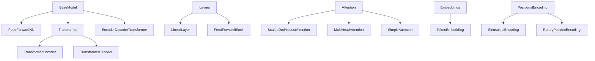

# MultiModal Insight Engine: Models Architecture

## Overview

The `models` directory provides a comprehensive implementation of neural network architectures, with a primary focus on transformer-based models and their core components. The design emphasizes modularity, flexibility, and extensibility.

## Architecture Diagram



## Core Modules

### 1. Base Model (`base_model.py`)

#### Purpose
Provides a foundational class for all neural network models in the project.

#### Key Features
- Unified model saving and loading mechanism
- Parameter counting
- Device management
- Extensible base for custom model implementations

#### Example Instantiation
```python
# Extending BaseModel for a custom model
class MyCustomModel(BaseModel):
    def __init__(self, input_dim, output_dim):
        super().__init__()
        self.linear = nn.Linear(input_dim, output_dim)
    
    def forward(self, x):
        return self.linear(x)

# Create an instance
model = MyCustomModel(input_dim=10, output_dim=5)
```

#### Key Methods
- `save()`: Serialize model state and configuration
- `load()`: Restore model from saved state
- `count_parameters()`: Calculate trainable parameters
- `get_device()`: Determine model's current device

### 2. Feed Forward Networks (`feed_forward.py`)

#### Purpose
Implement flexible feed-forward neural network architectures for various tasks.

#### Key Classes
1. `FeedForwardNN`
   - Configurable multi-layer neural network
   - Supports various activation functions
   - Optional layer normalization and dropout

   #### Example Instantiation
   ```python
   # Create a feed-forward network with custom configuration
   model = FeedForwardNN(
       input_size=784,  # e.g., MNIST input
       hidden_sizes=[128, 64],  # two hidden layers
       output_size=10,  # number of classes
       activation='relu',
       dropout=0.3,
       use_layer_norm=True,
       use_residual=True
   )
   ```

2. `FeedForwardClassifier`
   - Specialized classifier with prediction methods
   - Extends `FeedForwardNN` with classification-specific functionality

   #### Example Instantiation
   ```python
   # Create a classifier for MNIST
   classifier = FeedForwardClassifier(
       input_size=784,
       hidden_sizes=[256, 128],
       num_classes=10,
       dropout=0.5
   )
   ```

3. `MultiLayerPerceptron`
   - Flexible multi-layer perceptron implementation
   - Supports complex layer configurations

   #### Example Instantiation
   ```python
   # Create a multi-layer perceptron
   mlp = MultiLayerPerceptron(
       input_dim=100,  # input feature dimension
       hidden_dims=[50, 25],  # two hidden layers
       output_dim=10,  # output dimension
       activation='gelu',
       dropout=0.2,
       use_layer_norm=True
   )
   ```

### 3. Transformer Architecture (`transformer.py`)

#### Purpose
Comprehensive implementation of transformer models with full encoder-decoder capabilities.

#### Key Components
1. `TransformerEncoderLayer`
   - Single transformer encoder layer
   - Implements self-attention and feed-forward mechanisms
   - Supports multiple positional encoding strategies

   #### Example Instantiation
   ```python
   # Create an encoder layer
   encoder_layer = TransformerEncoderLayer(
       d_model=512,  # embedding dimension
       num_heads=8,  # number of attention heads
       d_ff=2048,  # feed-forward network dimension
       dropout=0.1,
       use_rotary_embeddings=False
   )
   ```

2. `TransformerEncoder`
   - Stack of encoder layers
   - Flexible configuration for various transformer variants

   #### Example Instantiation
   ```python
   # Create a full transformer encoder
   encoder = TransformerEncoder(
       vocab_size=10000,
       d_model=512,
       num_heads=8,
       num_layers=6,
       d_ff=2048,
       dropout=0.1,
       max_seq_length=512,
       positional_encoding='sinusoidal'
   )
   ```

3. `TransformerDecoderLayer`
   - Single transformer decoder layer
   - Implements masked self-attention and cross-attention
   - Supports complex decoding strategies

   #### Example Instantiation
   ```python
   # Create a decoder layer
   decoder_layer = TransformerDecoderLayer(
       d_model=512,
       num_heads=8,
       d_ff=2048,
       dropout=0.1,
       use_rotary_embeddings=False
   )
   ```

4. `EncoderDecoderTransformer`
   - Complete transformer implementation
   - Supports sequence-to-sequence tasks
   - Advanced generation and inference capabilities

   #### Example Instantiation
   ```python
   # Create a full encoder-decoder transformer
   transformer = EncoderDecoderTransformer(
       src_vocab_size=10000,
       tgt_vocab_size=10000,
       d_model=512,
       num_heads=8,
       num_encoder_layers=6,
       num_decoder_layers=6,
       d_ff=2048,
       dropout=0.1,
       max_seq_length=512,
       positional_encoding='sinusoidal',
       share_embeddings=True
   )
   ```

### 4. Attention Mechanisms (`attention.py`)

#### Purpose
Implement various attention computation strategies.

#### Key Attention Classes
1. `ScaledDotProductAttention`
   - Core attention computation
   - Supports masking and dropout
   - Implements scaled dot-product attention from "Attention is All You Need"

   #### Example Instantiation
   ```python
   # Create scaled dot-product attention
   attention = ScaledDotProductAttention(dropout=0.1)
   
   # Example usage
   query = torch.randn(32, 10, 64)  # [batch_size, seq_len, features]
   key = torch.randn(32, 10, 64)
   value = torch.randn(32, 10, 64)
   
   context, attn_weights = attention(query, key, value)
   ```

2. `MultiHeadAttention`
   - Parallel attention processing
   - Configurable number of attention heads
   - Supports rotary and traditional positional embeddings

   #### Example Instantiation
   ```python
   # Create multi-head attention
   multi_head_attn = MultiHeadAttention(
       input_dim=512,  # model dimension
       num_heads=8,    # number of attention heads
       dropout=0.1     # dropout probability
   )
   
   # Example usage
   x = torch.randn(32, 10, 512)  # [batch_size, seq_len, model_dim]
   output, attn_weights = multi_head_attn(x, x, x)
   ```

3. Advanced Attention Variants
   - `GroupedQueryAttention`
   
   #### Example Instantiation
   ```python
   # Create grouped query attention
   gqa = GroupedQueryAttention(
       d_model=512,        # model dimension
       num_heads=8,        # total number of heads
       num_key_value_heads=4  # fewer key/value heads
   )
   
   # Example usage
   x = torch.randn(32, 10, 512)  # [batch_size, seq_len, model_dim]
   output = gqa(x)
   ```

   - `ALiBiAttention` (Attention with Linear Biases)

   #### Example Instantiation
   ```python
   # Create ALiBi attention
   alibi_attn = ALiBiAttention(
       hidden_size=512,    # model dimension
       num_heads=8,        # number of attention heads
       max_seq_length=2048 # maximum sequence length
   )
   
   # Example usage
   x = torch.randn(32, 10, 512)  # [batch_size, seq_len, model_dim]
   output = alibi_attn(x)
   ```

### 5. Embeddings (`embeddings.py`)

#### Purpose
Convert token indices to dense vector representations.

#### Key Features
- Token-to-vector conversion
- Embedding scaling
- Xavier uniform initialization

#### Example Instantiation
```python
# Create a token embedding layer
token_embedding = TokenEmbedding(
    vocab_size=10000,  # Total number of unique tokens
    d_model=512        # Dimension of embedding space
)

# Example usage
# Convert token indices to embeddings
token_indices = torch.randint(0, 10000, (32, 20))  # [batch_size, seq_length]
embeddings = token_embedding(token_indices)
# Result shape: [32, 20, 512]

# Scaling is automatically applied:
# - Embeds tokens into a vector space
# - Scales embeddings by sqrt(d_model)
# - Initialized with Xavier uniform initialization
```

#### Key Characteristics
- Converts discrete token indices to continuous vector representations
- Scales embeddings to prevent vanishing/exploding gradients
- Consistent with transformer embedding approaches
- Flexible for various vocabulary sizes and embedding dimensions

### 6. Positional Encoding (`positional.py`)

#### Purpose
Provide position information to transformer models.

#### Encoding Strategies
1. `PositionalEncoding`
   - Sinusoidal and learned positional encodings
   - Supports various embedding types

   #### Example Instantiation
   ```python
   # Create a positional encoding
   pos_encoding = PositionalEncoding(
       d_model=512,          # Embedding dimension
       max_seq_length=5000,  # Maximum sequence length
       dropout=0.1,          # Dropout probability
       encoding_type='sinusoidal'  # Can be 'sinusoidal' or 'learned'
   )
   
   # Example usage
   inputs = torch.randn(32, 20, 512)  # [batch_size, seq_length, embedding_dim]
   encoded_inputs = pos_encoding(inputs)
   
   # Visualization of encodings
   pos_encoding.visualize_encodings()  # Creates a heatmap of position encodings
   ```

2. `RotaryPositionEncoding`
   - Rotary Position Embedding (RoPE)
   - Advanced position representation technique

   #### Example Instantiation
   ```python
   # Create a rotary position embedding
   rotary_emb = RotaryPositionEncoding(
       head_dim=64,          # Dimension of each attention head
       max_seq_length=5000,  # Maximum sequence length
       base=10000            # Base for frequency computation
   )
   
   # Example usage in multi-head attention
   query = torch.randn(32, 20, 8, 64)  # [batch_size, seq_length, num_heads, head_dim]
   key = torch.randn(32, 20, 8, 64)
   
   # Apply rotary embeddings
   query_rotated, key_rotated = rotary_emb(query, key)
   
   # Visualization of rotary embeddings
   rotary_emb.visualize_rotation()  # Creates a visualization of embedding rotation
   ```

#### Key Characteristics
- Provide learnable position information to transformer models
- Multiple strategies for encoding positional information
- Support for both static (sinusoidal

### 7. Layers (`layers.py`)

#### Purpose
Provide reusable neural network layer components with advanced configuration options.

#### Key Components
1. `LinearLayer`
   - Advanced linear layer with:
     - Multiple initialization strategies
     - Optional dropout
     - Layer normalization support

   #### Example Instantiation
   ```python
   # Create a linear layer with custom configuration
   linear_layer = LinearLayer(
       in_features=512,        # Input feature dimension
       out_features=256,       # Output feature dimension
       bias=True,              # Include bias term
       init_type='xavier_uniform',  # Weight initialization strategy
       dropout=0.3,            # Dropout probability
       use_layer_norm=True     # Apply layer normalization
   )
   
   # Example usage
   input_tensor = torch.randn(32, 512)  # [batch_size, input_features]
   output = linear_layer(input_tensor)
   ```

2. `FeedForwardBlock`
   - Configurable feed-forward block
   - Supports residual connections
   - Multiple activation functions

   #### Example Instantiation
   ```python
   # Create a feed-forward block
   ff_block = FeedForwardBlock(
       input_dim=512,          # Input dimension
       hidden_dim=2048,        # Hidden layer dimension
       output_dim=512,         # Output dimension
       activation='relu',      # Activation function
       dropout=0.2,            # Dropout probability
       use_layer_norm=True,    # Apply layer normalization
       use_residual=True       # Add residual connection
   )
   
   # Example usage
   input_tensor = torch.randn(32, 512)  # [batch_size, input_dim]
   output = ff_block(input_tensor)
   ```

#### Key Characteristics
- Highly configurable neural network layers
- Support for various initialization strategies
- Flexible activation and normalization options
- Built-in regularization techniques (dropout, layer normalization)
- Residual connection support for deeper networks

### Layer Initialization Strategies

The layers support multiple initialization strategies:
- `kaiming_uniform`: Recommended for ReLU activations
- `kaiming_normal`: Alternative to kaiming uniform
- `xavier_uniform`: Good for tanh activations
- `xavier_normal`: Alternative to xavier uniform

### Activation Function Support
- ReLU
- GELU
- Tanh
- Sigmoid

### Regularization Techniques
- Dropout
- Layer Normalization
- Residual Connections

## Design Principles Applied

1. **Modularity**: Each layer is a self-contained, configurable component
2. **Flexibility**: Extensive configuration options
3. **Performance**: Optimized for both training and inference
4. **Extensibility**: Easy to add new layer types or modify existing ones

## Design Principles

1. **Modularity**: Each module has a single, well-defined responsibility
2. **Flexibility**: Extensive configuration options
3. **Extensibility**: Easy to add new model types or attention mechanisms
4. **Performance**: Optimized for both training and inference

## Recommendations for Future Development

1. Enhance type hinting
2. Expand docstring documentation
3. Develop comprehensive unit test suite
4. Add more interpretability tools
5. Implement more advanced position encoding techniques

## Anthropic Research Alignment

The design emphasizes:
- Multimodal capabilities
- Model interpretability
- Flexible architecture for research exploration
- Safety-conscious design patterns
