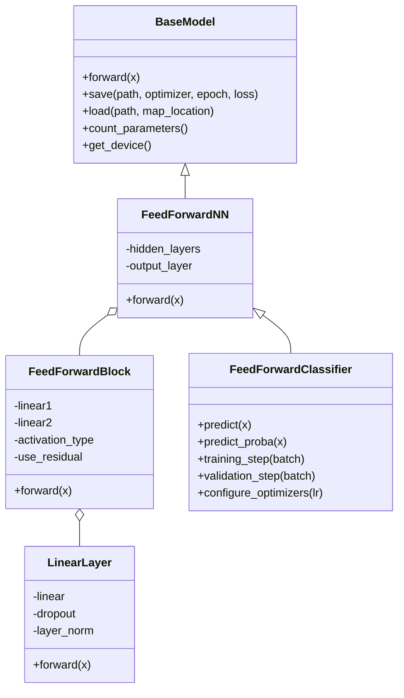
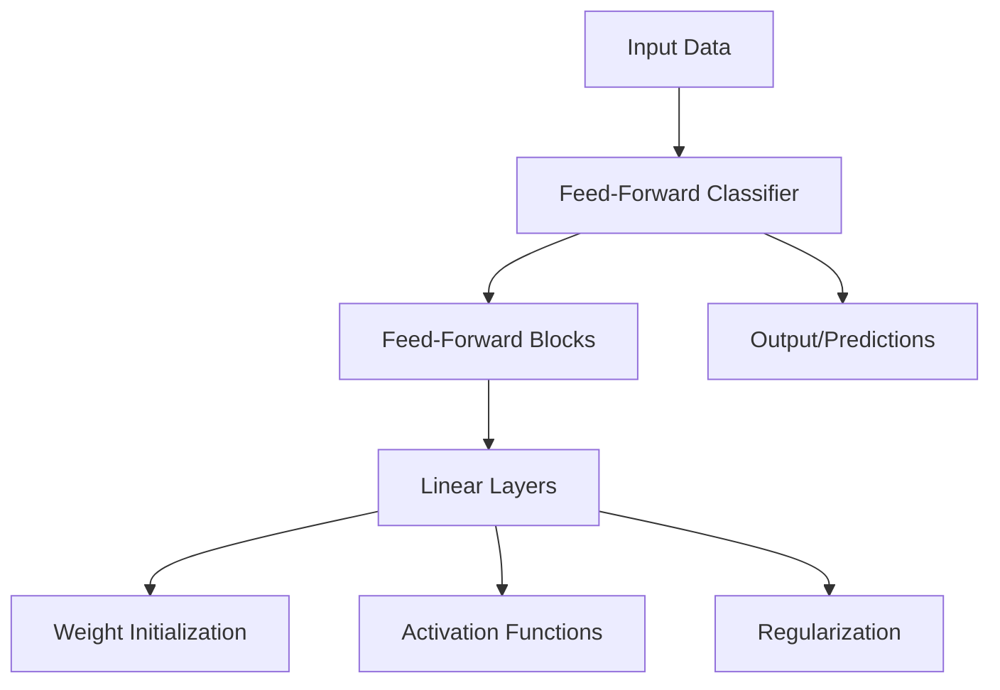
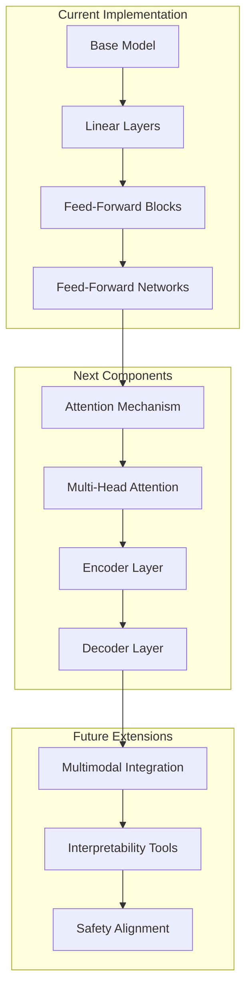

# MultiModal Insight Engine: Neural Network Foundation

## 1. Project Overview

The MultiModal Insight Engine is a progressive project aimed at building a multimodal transformer-based system with interpretability features. This document describes the neural network foundation implementation that serves as the backbone for the larger transformer architecture we will develop over the coming weeks.

Our implementation follows a modular, component-based design that prioritizes:
- **Flexibility**: Components can be combined in various ways
- **Extensibility**: New functionality can be added with minimal changes to existing code
- **Clarity**: Code is well-documented and follows consistent patterns
- **Testability**: Components can be tested independently

This foundation will enable us to incrementally build toward a full transformer architecture with multimodal capabilities, interpretability tools, and safety features aligned with Anthropic's research focus.

## 2. Neural Network Components

### 2.1 Architecture Overview



### 2.2 Component Descriptions

#### 2.2.1 BaseModel

The `BaseModel` class serves as the foundation for all models in our project. It extends PyTorch's `nn.Module` with additional functionality for saving/loading model states, parameter counting, and device management.

Key features:
- Model state persistence with training context
- Device management utilities
- Parameter counting and model introspection

#### 2.2.2 Layer Components

**LinearLayer**: A customizable linear layer that extends PyTorch's `nn.Linear` with additional features:
- Configurable weight initialization strategies
- Optional dropout for regularization
- Optional layer normalization
- Proper parameter initialization based on activation functions

**FeedForwardBlock**: A standard feed-forward block consisting of two linear transformations with an activation function in between:
- Configurable activation functions (ReLU, GELU, tanh, sigmoid)
- Optional residual connections
- Dropout and layer normalization options
- Hidden dimension scaling (default 4x input dimension following transformer convention)

This implementation follows the pattern described in "Attention Is All You Need" (Vaswani et al., 2017), where feed-forward networks in transformer blocks consist of two linear transformations with a ReLU activation in between.

#### 2.2.3 Models

**FeedForwardNN**: A configurable feed-forward neural network model:
- Variable depth through configurable hidden layer sizes
- Customizable activation functions
- Regularization through dropout and layer normalization
- Optional residual connections

**FeedForwardClassifier**: A specialized version of `FeedForwardNN` for classification tasks:
- Standard classification interface (predict, predict_proba)
- Training and validation utilities
- Optimizer configuration
- Metrics calculation (accuracy)

### 2.3 Training Utilities

We've implemented a generic training loop in `train_model` that supports:
- Training and validation phases
- Early stopping to prevent overfitting
- Learning rate scheduling
- Device management (CPU/GPU)
- Training history tracking
- Custom callbacks

## 3. Design Principles

Our implementation follows several key design principles:

### 3.1 Component-Based Architecture



We've designed our system with a component-based architecture where complex models are built from simpler building blocks. This approach:
- Enhances code reusability
- Simplifies maintenance
- Facilitates incremental development
- Enables independent testing of components

### 3.2 Inheritance vs. Composition

We use inheritance for model specialization (e.g., `FeedForwardClassifier` inherits from `FeedForwardNN`) and composition for component assembly (e.g., `FeedForwardNN` contains `FeedForwardBlock` instances).

This balanced approach leverages the strengths of both paradigms:
- Inheritance for organizing model variants
- Composition for building complex functionality from simpler parts

### 3.3 Configuration over Convention

Our components are highly configurable through constructor parameters, allowing users to customize behavior without modifying code. This follows the "configuration over convention" principle advocated in modern software design.

### 3.4 PyTorch Best Practices

We follow PyTorch best practices:
- Proper model and parameter registration using `nn.Module` and `nn.ModuleList`
- Efficient device management
- Gradient handling through `zero_grad()` and `backward()`
- Proper weight initialization for different activation functions

## 4. Implementation Details

### 4.1 Weight Initialization

Weight initialization is crucial for proper neural network training. Following research by He et al. (2015) and Glorot & Bengio (2010), we implement appropriate initialization strategies:

- **Kaiming initialization**: For ReLU-based activations (`kaiming_uniform_`, `kaiming_normal_`)
- **Xavier/Glorot initialization**: For sigmoid/tanh activations (`xavier_uniform_`, `xavier_normal_`)

These strategies help prevent vanishing/exploding gradients and enable efficient training of deep networks.

### 4.2 Regularization Techniques

We've implemented multiple regularization techniques to prevent overfitting:

- **Dropout**: Randomly zeros elements during training
- **Layer Normalization**: Normalizes inputs across features
- **Early Stopping**: Halts training when validation metrics stop improving

Layer normalization, introduced by Ba et al. (2016), is particularly important for transformer architectures, as it helps stabilize training regardless of batch size.

### 4.3 Residual Connections

Residual connections, introduced by He et al. (2016) in "Deep Residual Learning for Image Recognition," are critical for training very deep networks. Our implementation allows for these connections when input and output dimensions match, helping with gradient flow during backpropagation.

## 5. Usage Example: MNIST Classification

The following example demonstrates using our neural network foundation to classify handwritten digits from the MNIST dataset:

```python
import torch
from torch.utils.data import DataLoader
from torchvision import datasets, transforms
from src.models.feed_forward import FeedForwardClassifier
from src.training.trainer import train_model

# Data preprocessing
transform = transforms.Compose([
    transforms.ToTensor(),
    transforms.Normalize((0.1307,), (0.3081,))
])

# Load MNIST dataset
train_dataset = datasets.MNIST('./data', train=True, download=True, transform=transform)
test_dataset = datasets.MNIST('./data', train=False, download=True, transform=transform)

# Create dataloaders
def collate_fn(batch):
    images = torch.stack([item[0] for item in batch])
    labels = torch.tensor([item[1] for item in batch])
    images = images.view(images.size(0), -1)  # Flatten
    return {'inputs': images, 'targets': labels}

train_dataloader = DataLoader(
    train_dataset, 
    batch_size=64, 
    shuffle=True,
    collate_fn=collate_fn
)

val_dataloader = DataLoader(
    test_dataset, 
    batch_size=64,
    collate_fn=collate_fn
)

# Create model
model = FeedForwardClassifier(
    input_size=28 * 28,
    hidden_sizes=[128, 64],
    num_classes=10,
    activation='relu',
    dropout=0.2,
    use_layer_norm=True
)

# Train model
history = train_model(
    model=model,
    train_dataloader=train_dataloader,
    val_dataloader=val_dataloader,
    epochs=10,
    learning_rate=0.001,
    early_stopping_patience=3
)

# Save model
model.save('models/mnist_classifier.pt')
```

This example demonstrates the complete workflow from data loading to model training and saving, showcasing how our components work together.

## 6. Connection to Transformer Architecture



Our neural network foundation serves as the building block for the transformer architecture we'll develop in the coming weeks. The connections include:

1. **Feed-Forward Blocks**: These are direct components of transformer encoder and decoder layers, as described in "Attention Is All You Need" (Vaswani et al., 2017).

2. **Linear Layers**: Used throughout the transformer architecture, including for query/key/value projections in attention mechanisms.

3. **Layer Normalization**: Essential for transformer stability, applied before or after attention and feed-forward blocks.

4. **Residual Connections**: Critical for gradient flow in deep transformer networks.

In the next phase, we'll implement attention mechanisms, the core innovation that enables transformers to capture long-range dependencies in sequential data.

## 7. Next Steps

### 7.1 Immediate Next Steps

1. **Attention Mechanism Implementation**: Develop the core attention mechanism that will form the basis of the transformer architecture.

2. **Transformer Core Components**: Implement transformer encoder blocks with multi-head attention and position-wise feed-forward networks.

3. **Position Encoding**: Implement position encoding to provide sequence order information to the transformer.

### 7.2 Medium-Term Goals

1. **Complete Transformer Implementation**: Finish building the encoder-decoder transformer architecture.

2. **Training Infrastructure**: Develop data pipelines and training procedures for sequence tasks.

3. **Evaluation Metrics**: Implement appropriate evaluation measures for transformer model performance.

### 7.3 Long-Term Vision

Working toward a complete MultiModal Insight Engine that includes:

1. **Multimodal Integration**: Combining text and image processing capabilities.

2. **Interpretability Tools**: Building visualization and explanation systems for model decisions.

3. **Safety Features**: Implementing alignment mechanisms and safety evaluation tools.

4. **Performance Optimization**: Enhancing efficiency through hardware-aware optimizations.

## 8. References

1. Vaswani, A., Shazeer, N., Parmar, N., Uszkoreit, J., Jones, L., Gomez, A. N., ... & Polosukhin, I. (2017). "Attention is all you need." *Advances in Neural Information Processing Systems*, 30.

2. He, K., Zhang, X., Ren, S., & Sun, J. (2016). "Deep residual learning for image recognition." *Proceedings of the IEEE Conference on Computer Vision and Pattern Recognition*.

3. Ba, J. L., Kiros, J. R., & Hinton, G. E. (2016). "Layer normalization." *arXiv preprint arXiv:1607.06450*.

4. Glorot, X., & Bengio, Y. (2010). "Understanding the difficulty of training deep feedforward neural networks." *Proceedings of the Thirteenth International Conference on Artificial Intelligence and Statistics*.

5. He, K., Zhang, X., Ren, S., & Sun, J. (2015). "Delving deep into rectifiers: Surpassing human-level performance on ImageNet classification." *Proceedings of the IEEE International Conference on Computer Vision*.

6. Amodei, D., Olah, C., Steinhardt, J., Christiano, P., Schulman, J., & Mané, D. (2016). "Concrete problems in AI safety." *arXiv preprint arXiv:1606.06565*.

7. Anthropic. (2022). "Constitutional AI: Harmlessness from AI Feedback." *arXiv preprint arXiv:2212.08073*.
