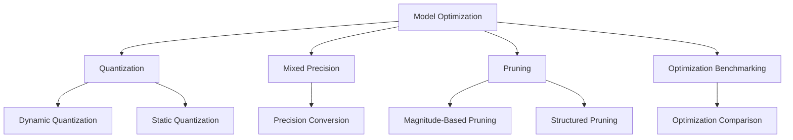

# MultiModal Insight Engine: Optimization Architecture

## Overview

The `optimization` directory provides a comprehensive suite of model optimization techniques designed to improve model efficiency, reduce computational requirements, and enhance inference performance.

## Architecture Diagram



## Core Modules

### 1. Quantization (`quantization.py`)

#### Purpose
Implement advanced model quantization techniques to reduce model size and improve inference efficiency.

#### Key Components
1. `QuantizationConfig`
   - Configuration class for quantization settings
   - Supports dynamic and static quantization

2. `DynamicQuantizer`
   - Quantizes weights to int8 during inference
   - Keeps activations in floating-point

#### Example Instantiation
```python
# Configure quantization
config = QuantizationConfig(
    quantization_type='dynamic',
    dtype=torch.qint8,
    bits=8,
    quantize_weights=True,
    quantize_activations=False
)

# Create dynamic quantizer
quantizer = DynamicQuantizer(model, config)

# Quantize the model
quantized_model = quantizer.optimize()

# Get size reduction information
size_info = quantizer.get_size_info()
print(f"Model size reduced by {size_info['compression_ratio']}x")
```

3. `StaticQuantizer`
   - Quantizes both weights and activations
   - Requires calibration data
   - Supports per-channel quantization

#### Example Usage
```python
# Static quantization with calibration
static_quantizer = StaticQuantizer(
    model,
    calibration_loader=calib_dataloader
)

# Optimize the model
optimized_model = static_quantizer.optimize()
```

### 2. Mixed Precision (`mixed_precision.py`)

#### Purpose
Enable efficient training and inference using lower precision formats.

#### Key Components
1. `MixedPrecisionConverter`
   - Convert models to use FP16 or BF16
   - Optimize for different hardware (CUDA, MPS)

#### Example Instantiation
```python
# Convert model to mixed precision
converter = MixedPrecisionConverter(
    model,
    dtype=torch.float16,
    use_auto_cast=True
)

# Get mixed precision model
mp_model = converter.convert_to_mixed_precision()
```

2. `MixedPrecisionWrapper`
   - Automatic mixed precision inference
   - Hardware-aware precision management

### 3. Pruning (`pruning.py`)

#### Purpose
Remove less important weights to reduce model complexity.

#### Key Components
1. `PruningConfig`
   - Configure pruning strategy
   - Support for various pruning methods

2. `ModelPruner`
   - Implement magnitude-based pruning
   - Supports structured and unstructured pruning

#### Example Instantiation
```python
# Configure pruning
pruning_config = PruningConfig(
    method='magnitude',
    amount=0.3,  # Prune 30% of weights
    pruning_dims=['weight'],
    n_iterations=3
)

# Create and apply pruner
pruner = ModelPruner(model, pruning_config)
pruned_model = pruner.prune_model()

# Get pruning information
pruning_info = pruner.get_pruning_info()
print(f"Model sparsity: {pruning_info['final_sparsity']}")
```

### 4. Benchmarking (`benchmarking.py`)

#### Purpose
Compare and evaluate different optimization techniques.

#### Key Components
1. `OptimizationBenchmark`
   - Measure performance across optimization techniques
   - Generate comprehensive reports
   - Visualize optimization impacts

#### Example Usage
```python
# Create benchmark suite
benchmark = OptimizationBenchmark(
    model=original_model,
    input_generator=input_gen_fn
)

# Benchmark original and optimized models
benchmark.benchmark_original_model()
benchmark.benchmark_optimized_model(quantized_model, "Quantization")
benchmark.benchmark_optimized_model(pruned_model, "Pruning")

# Generate comparison report
report = benchmark.generate_report()
comparison = benchmark.compare_optimizations()
```

### 5. Convenience Functions (`__init__.py`)

#### Purpose
Provide easy-to-use wrappers for common optimization tasks

#### Key Functions
- `quantize_model()`
- `prune_model()`
- `convert_to_mixed_precision()`
- `benchmark_optimizations()`

#### Example Usage
```python
# Quick model optimization
quantized_model = quantize_model(
    model, 
    quantization_type='static', 
    bits=8
)

pruned_model = prune_model(
    model, 
    method='magnitude', 
    amount=0.4
)

mixed_precision_model = convert_to_mixed_precision(
    model, 
    dtype=torch.float16
)
```

## Design Principles

1. **Modularity**: Separate optimization techniques
2. **Flexibility**: Support multiple optimization strategies
3. **Hardware-Awareness**: Adapt to different computing environments
4. **Minimal Performance Impact**: Preserve model accuracy

## Recommendations for Future Development

1. Add more advanced pruning techniques
2. Implement neural architecture search
3. Develop more sophisticated quantization methods
4. Create hardware-specific optimization strategies
5. Enhance benchmarking and visualization tools

## Anthropic Research Alignment

The optimization architecture supports:
- Efficient model compression
- Performance optimization
- Hardware-aware model adaptation
- Systematic model evaluation
- Research-driven optimization techniques

