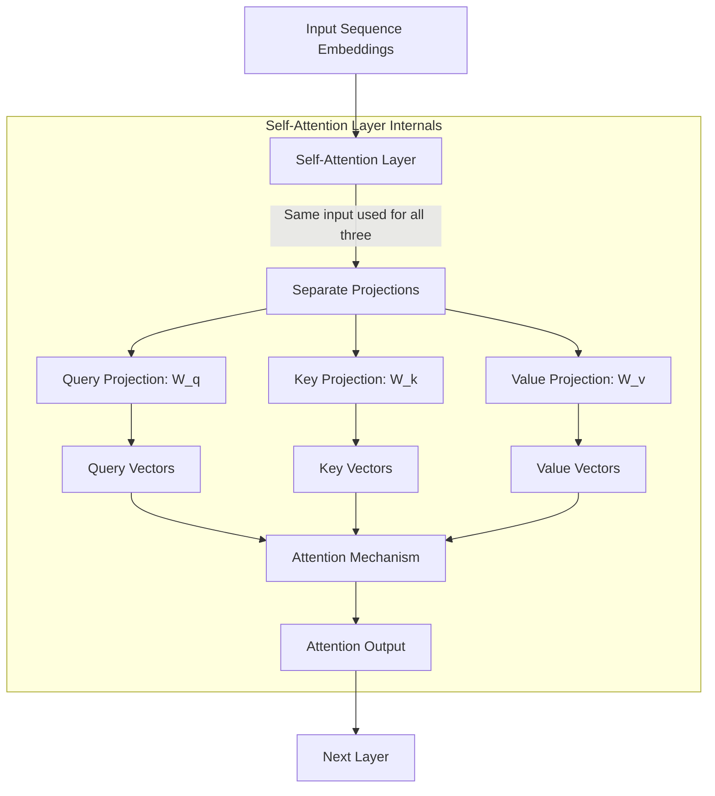
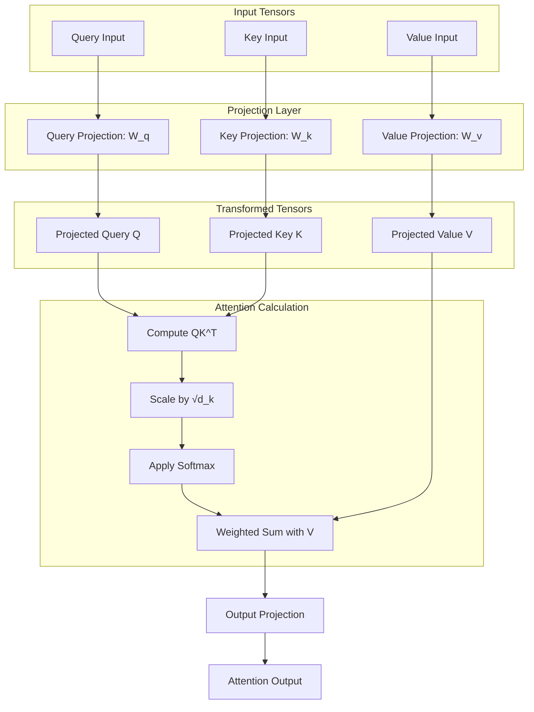
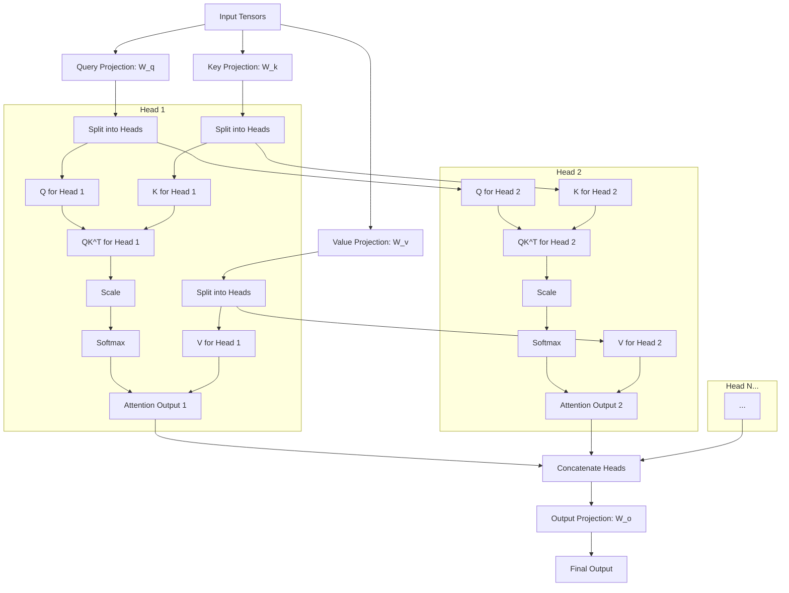

# Understanding Q, K, V Projections and their Source in Attention Mechanisms

## Introduction

Attention mechanisms form the backbone of modern transformer architectures, including those used by models like Claude. However, the source and nature of the Query (Q), Key (K), and Value (V) projections in these mechanisms often cause confusion. This document aims to clarify these concepts with clear explanations and visual diagrams.

## The Conceptual Basis of Q, K, V

Attention mechanisms are inspired by information retrieval systems, where:

- **Query (Q)**: What you're looking for (like a search query)
- **Key (K)**: What you're matching against (like indexes in a database)
- **Value (V)**: What you retrieve when you find a match (like the actual content)

In attention mechanisms, this analogy is implemented through learned projections that transform input embeddings into different representation spaces.

## The Source of Q, K, V in Transformers

A common point of confusion is where Q, K, and V actually come from in a transformer architecture. Here's the crucial insight:

1. **Q, K, V are not inputs to the transformer**; they are derived from input embeddings through learned projections
2. These projections transform the same input embeddings into different representation spaces
3. The attention mechanism then computes compatibility between queries and keys to determine how to weight values

## The Flow from Inputs to Attention Output

Let's trace the complete flow from raw inputs to attention output:



In a self-attention layer, the same input embeddings are used as the source for all three projections. In cross-attention (such as in encoder-decoder attention), queries come from one source (e.g., decoder) while keys and values come from another (e.g., encoder).

## The Projection Process in Detail

The projections themselves are simply learned linear transformations (matrices):

- **W_q**: Query projection matrix
- **W_k**: Key projection matrix
- **W_v**: Value projection matrix

These projections transform the input embeddings into the query, key, and value spaces:

```
Q = Input × W_q
K = Input × W_k
V = Input × W_v
```

Where × represents matrix multiplication.

## Simple Attention Flow

Here's a detailed view of the simple attention mechanism:



## Multi-Head Attention

In multi-head attention, the projection process is extended to create multiple sets of queries, keys, and values that operate in parallel, allowing the model to attend to different aspects of the input simultaneously:



## Implementation Details

In code, the projection and attention processes are typically implemented as follows:

```python
# Initialize projections
self.query_projection = nn.Linear(input_dim, attention_dim)
self.key_projection = nn.Linear(input_dim, attention_dim)
self.value_projection = nn.Linear(input_dim, attention_dim)

# Apply projections in forward pass
def forward(self, query, key=None, value=None):
    # For self-attention, key and value are the same as query if not provided
    if key is None:
        key = query
    if value is None:
        value = query
    
    # Project inputs to attention space
    q = self.query_projection(query)  # Transform to query space
    k = self.key_projection(key)      # Transform to key space
    v = self.value_projection(value)  # Transform to value space
    
    # Compute attention
    # ...
```

## Usage in a Transformer Architecture

In a complete transformer architecture, the attention mechanism is typically used as follows:

```python
# For self-attention in an encoder
encoder_output = self_attention_layer(
    query=input_embeddings,
    key=input_embeddings,
    value=input_embeddings
)

# For cross-attention in a decoder
decoder_output = cross_attention_layer(
    query=decoder_embeddings,        # From decoder
    key=encoder_embeddings,          # From encoder
    value=encoder_embeddings         # From encoder
)
```

Or more compactly:

```python
# Self-attention (all from same source)
encoder_output = self_attention_layer(input_embeddings)

# Cross-attention (query from decoder, key/value from encoder)
decoder_output = cross_attention_layer(
    decoder_embeddings,
    encoder_embeddings,
    encoder_embeddings
)
```

## Common Points of Confusion

### Confusion 1: "Where do Q, K, V come from?"

The Q, K, V values are not external inputs to the transformer. They are internal transformations of the input embeddings. The attention mechanism's `forward` method takes these embeddings as parameters and transforms them internally using the learned projection matrices.

### Confusion 2: "Why pass the same input three times?"

In self-attention, we pass the same input embeddings for query, key, and value because we want the sequence to attend to itself. However, these inputs are projected differently by the three projection matrices (W_q, W_k, W_v), resulting in different representations that serve different roles in the attention computation.

### Confusion 3: "What's the difference between projections and heads?"

- **Projections** transform the input embeddings into the query, key, and value spaces
- **Heads** split these projections into multiple subspaces, allowing the model to attend to different aspects of the input simultaneously

## Key Takeaways

1. **Projections create Q, K, V**: The Q, K, V values are created by projecting input embeddings through learned matrices
2. **Self vs. Cross Attention**: In self-attention, Q, K, V all come from the same source; in cross-attention, Q comes from one source while K, V come from another
3. **Multiple Heads**: Multi-head attention splits the projections into multiple subspaces that operate in parallel
4. **Learned Representations**: The projections (W_q, W_k, W_v) are learned during training, enabling the model to develop effective attention patterns

By understanding these concepts, you can better grasp how attention mechanisms work and how they contribute to the remarkable capabilities of transformer models like those used at Anthropic.
