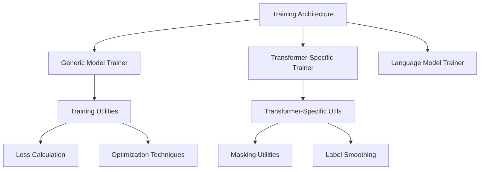

# MultiModal Insight Engine: Training Architecture

## Overview

The `training` directory provides a comprehensive set of training utilities and specialized trainers for different machine learning scenarios, with a focus on flexibility, extensibility, and advanced training techniques.

## Architecture Diagram



## Core Modules

### 1. Generic Model Trainer (`trainer.py`)

#### Purpose
Provide a flexible, generic training loop for PyTorch models with extensive configuration options.

#### Key Features
- Supports various model types
- Configurable optimization strategies
- Early stopping
- Comprehensive training history tracking

#### Example Instantiation
```python
# Generic model training
def train_model(
    model: nn.Module,
    train_dataloader: DataLoader,
    val_dataloader: Optional[DataLoader] = None,
    epochs: int = 10,
    learning_rate: float = 0.001,
    device: Optional[str] = None
):
    # Configurable training loop with multiple options
    history = train_model(
        model=my_model,
        train_dataloader=train_loader,
        val_dataloader=val_loader,
        epochs=20,
        learning_rate=1e-4,
        early_stopping_patience=3,
        device='cuda'
    )
    
    # Returns training history with metrics
    print(history['train_loss'])
    print(history['val_accuracy'])
```

### 2. Transformer Trainer (`transformer_trainer.py`)

#### Purpose
Specialized trainer for transformer models with advanced training techniques.

#### Key Features
- Learning rate scheduling with warmup
- Label smoothing
- Perplexity tracking
- Advanced masking for transformer architectures

#### Example Instantiation
```python
# Transformer-specific training
transformer_trainer = TransformerTrainer(
    model=transformer_model,
    train_dataloader=train_loader,
    val_dataloader=val_loader,
    lr=0.0001,
    warmup_steps=4000,
    label_smoothing=0.1,
    early_stopping_patience=5
)

# Train the model
history = transformer_trainer.train(epochs=50)

# Visualization of training metrics
trainer.plot_training_history()
trainer.plot_learning_rate()
```

### 3. Transformer Utilities (`transformer_utils.py`)

#### Purpose
Provide utility functions for transformer model training and evaluation.

#### Key Components
1. Masking Utilities
   - `create_padding_mask()`: Generate masks for padded sequences
   - `create_causal_mask()`: Create masks to prevent attending to future tokens
   - `create_combined_mask()`: Combine padding and causal masks

2. Label Smoothing
   - Implements regularization technique to prevent overfitting
   - Smooths one-hot encoded labels

#### Example Usage
```python
# Create masks for transformer training
src_mask = create_padding_mask(src_tokens, pad_idx=0)
tgt_mask = create_causal_mask(tgt_tokens.size(1), device)

# Apply label smoothing
loss_fn = LabelSmoothing(
    smoothing=0.1,  # Smoothing factor
    pad_idx=0       # Padding token index
)
```

### 4. Language Model Trainer (`language_model_trainer.py`)

#### Purpose
Specialized trainer for causal language modeling tasks.

#### Key Features
- Perplexity tracking
- Learning rate scheduling
- Generation capabilities
- Comprehensive training and evaluation metrics

#### Example Instantiation
```python
# Language model training
lm_trainer = LanguageModelTrainer(
    model=language_model,
    train_dataloader=train_loader,
    val_dataloader=val_loader,
    learning_rate=5e-5,
    warmup_steps=1000,
    max_grad_norm=1.0
)

# Train the model
training_stats = lm_trainer.train(
    num_epochs=30,
    save_dir="models/language",
    model_name="multimodal_lm"
)

# Generate text
generated_text = lm_trainer.generate(
    prompt="Once upon a time",
    max_length=100,
    temperature=0.7
)
```

### 5. Loss Calculation (`losses.py`)

#### Purpose
Provide advanced loss calculation techniques for various model architectures.

#### Key Loss Functions
1. `CrossEntropyLoss`: Enhanced cross-entropy with label smoothing
2. `MeanSquaredError`: Advanced MSE implementation with additional features

#### Example Usage
```python
# Custom loss functions
cross_entropy_loss = CrossEntropyLoss(
    label_smoothing=0.1,  # Smoothing factor
    reduction='mean'      # Reduction method
)

mse_loss = MeanSquaredError(
    reduction='sum',      # Reduction method
    weight=None           # Optional weighting
)
```

### 6. Joint BPE Training (`joint_bpe_training.py`)

#### Purpose
Implement joint Byte Pair Encoding (BPE) tokenizer training for multilingual models.

#### Example Usage
```python
# Train joint BPE tokenizer for multilingual translation
joint_tokenizer = train_joint_bpe_tokenizer(
    src_texts=german_texts,
    tgt_texts=english_texts,
    vocab_size=8000,
    min_frequency=2,
    save_dir="models/tokenizers"
)
```

## Design Principles

1. **Modularity**: Separate concerns for different training scenarios
2. **Flexibility**: Support for various model architectures and training strategies
3. **Extensibility**: Easy to add new training techniques
4. **Performance**: Optimized training loops with advanced scheduling

## Recommendations for Future Development

1. Add more comprehensive logging
2. Implement distributed training support
3. Create more advanced learning rate schedulers
4. Enhance error handling and diagnostics
5. Develop more sophisticated early stopping criteria

## Anthropic Research Alignment

The training architecture supports:
- Advanced transformer training techniques
- Multimodal model training
- Safety-aware training strategies
- Comprehensive model evaluation
- Flexible optimization approaches

